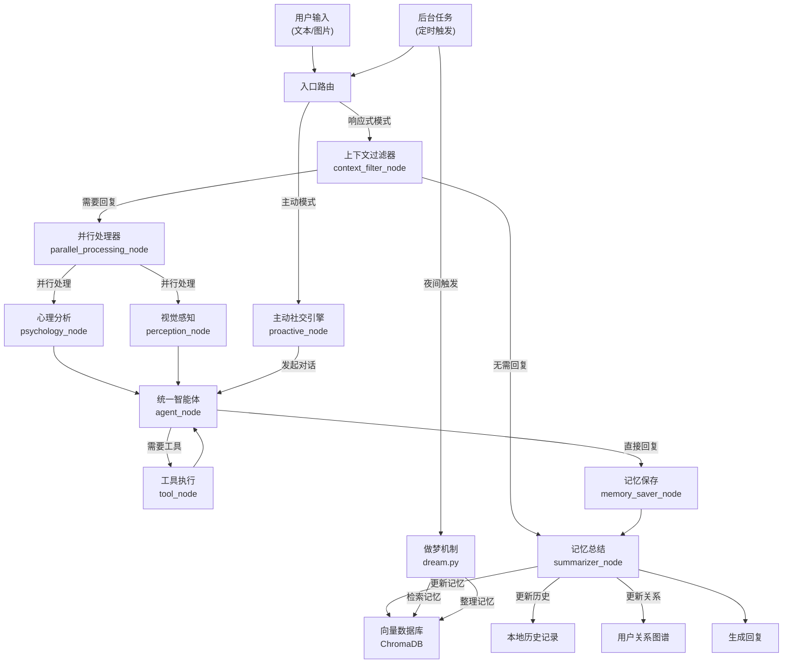

# AliceBot 智能体项目技术开发说明书

## 1. 项目整体架构介绍

### 1.1 项目概述
Project Alice 是一个基于 LangGraph 与 FastAPI 构建的，具备情感模拟、主动社交意识与多模态感知能力的拟人化 AI Agent。她不仅能进行基本的聊天交互，还拥有长期记忆、视觉感知、潜意识心理活动以及主动社交意愿。

### 1.2 核心技术栈
- **框架**: LangGraph (智能体工作流)、FastAPI (API 服务)
- **语言模型**: 支持多种大语言模型 (主要使用 Qwen 系列)
- **记忆系统**: ChromaDB (向量数据库) + 本地历史记录
- **通信协议**: OneBot v11 (用于与 QQ 客户端集成)

### 1.3 模块架构

| 模块名称 | 主要功能 | 核心文件位置 |
|---------|---------|-------------|
| **core** | 核心配置、状态管理、提示词管理 | `app/core/` |
| **graph** | LangGraph 工作流节点定义 | `app/graph/` |
| **memory** | 混合记忆系统 (短期+长期+关系记忆) | `app/memory/` |
| **background** | 后台任务 (做梦机制、记忆整理) | `app/background/` |
| **tools** | 工具集 (搜索、画图、代码解释等) | `app/tools/` |
| **plugins** | 插件系统 (表情包处理等) | `app/plugins/` |
| **utils** | 辅助工具 (QQ 协议解析、缓存等) | `app/utils/` |

### 1.4 整体工作流程

1. **输入处理**: 接收用户消息 (文本/图片)
2. **上下文过滤**: 判断是否需要回复
3. **并行处理**: 同时进行视觉感知和心理分析
4. **智能体生成**: 生成回复内容
5. **工具调用**: 如有需要，调用外部工具
6. **记忆保存**: 更新长期记忆和短期记忆
7. **输出回复**: 将回复发送给用户

## 2. 功能介绍与数据流图

### 2.1 功能概览

| 功能模块 | 主要功能 | 数据流路径 |
|---------|---------|-----------|
| **响应式对话** | 接收并回复用户消息 | 用户输入 → 上下文过滤 → 并行处理 → 智能体生成 → 回复输出 |
| **主动社交** | 主动发起对话 | 定时触发 → 主动社交引擎 → 智能体生成 → 回复输出 |
| **视觉感知** | 理解图片内容 | 用户图片 → 视觉感知节点 → 智能体生成 → 回复输出 |
| **情感系统** | 模拟情绪变化 | 用户交互 → 心理分析 → 情绪更新 → 影响回复风格 |
| **记忆管理** | 长期记忆与关系维护 | 交互内容 → 记忆保存 → 向量数据库 → 检索增强生成 |
| **工具调用** | 调用外部工具 | 智能体请求 → 工具处理 → 结果返回 → 智能体生成 |
| **后台做梦** | 整理和固化记忆 | 定时触发 → 记忆检索 → 记忆整理 → 更新向量数据库 |

### 2.2 详细数据流图



### 2.3 功能模块详细介绍

#### 2.3.1 上下文过滤器 (Context Filter)
- **功能**: 判断是否需要对用户消息进行回复，避免机械式应答
- **工作原理**: 分析消息内容、发送者关系、上下文等因素
- **影响**: 决定后续流程是否继续执行

#### 2.3.2 并行处理器 (Parallel Processor)
- **功能**: 同时处理视觉信息和心理分析，提高响应效率
- **工作原理**: 利用 LangGraph 的并行执行能力，将视觉感知和心理分析并行处理
- **影响**: 减少整体响应时间，提高多模态交互体验

#### 2.3.3 视觉感知 (Perception)
- **功能**: 理解用户发送的图片内容
- **支持类型**: 普通图片、表情包、屏幕截图
- **工作原理**: 将图片转换为描述性文本，作为智能体生成回复的输入

#### 2.3.4 心理分析 (Psychology)
- **功能**: 模拟情感变化，更新情绪状态
- **情感模型**: PAD (Pleasure-Arousal-Dominance) 模型
- **影响**: 回复风格会根据当前情绪状态动态调整

#### 2.3.5 统一智能体 (Unified Agent)
- **功能**: 生成最终回复内容
- **工作原理**: 结合上下文、视觉信息、心理状态和记忆，生成符合人设的回复
- **特点**: 支持工具调用，能根据需要获取外部信息

#### 2.3.6 记忆保存 (Memory Saver)
- **功能**: 将重要信息保存到长期记忆中
- **工作原理**: 提取对话中的关键信息，转换为向量并存储到 ChromaDB
- **影响**: 使智能体能够记住长期对话内容，提供更连贯的交互体验

#### 2.3.7 主动社交引擎 (Proactive Agent)
- **功能**: 主动发起对话，增强社交互动
- **触发条件**: 长时间沉默、特定时间点、特定事件
- **工作原理**: 分析用户关系和历史交互，生成合适的主动对话内容

#### 2.3.8 做梦机制 (Dream Cycle)
- **功能**: 整理和固化碎片化记忆
- **触发时间**: 通常在夜间或低活跃时段
- **工作原理**: 检索近期记忆，进行总结和关联，更新长期记忆

## 3. 代码文件详细说明

### 3.1 核心配置文件

#### app/core/config.py
```python
class Config:
    # LLM 配置
    LLM_MODEL_NAME = "Qwen/Qwen3-VL-30B-A3B-Instruct"  # 主模型名称
    SMALL_LLM_MODEL_NAME = "Qwen/Qwen3-VL-8B-Instruct"  # 小模型名称
    EMBEDDING_MODEL_NAME = "Qwen/Qwen3-Embedding-8B"  # 嵌入模型名称
    
    # 情绪初始值
    DEFAULT_VALENCE = 0.1  # 略微积极
    DEFAULT_AROUSAL = 0.5  # 平静且专注
    
    # 其他配置...
```
- **功能**: 集中管理项目配置，包括模型设置、API 密钥、情绪初始值等
- **设计思路**: 使用单例模式，方便全局访问配置
- **影响范围**: 整个项目，修改配置会影响智能体的整体行为

#### app/core/state.py
```python
class AgentState(TypedDict):
    messages: List[BaseMessage]  # 消息列表
    conversation_summary: str  # 对话摘要
    session_id: str  # 会话 ID
    sender_qq: str  # 发送者 QQ
    should_reply: bool  # 是否需要回复
    # 其他状态字段...
```
- **功能**: 定义智能体的状态结构，用于在 LangGraph 节点间传递数据
- **设计思路**: 使用 TypedDict 确保类型安全，包含所有需要在节点间共享的信息
- **影响范围**: 所有 LangGraph 节点，是节点间通信的核心数据结构

#### app/core/prompts.py
```python
# 系统提示词
SYSTEM_PROMPT = """
你是 Alice，一个聪明、友好、有爱心的智能助手。
你的目标是与用户建立良好的关系，提供有帮助的回答。
"""

# 上下文过滤器提示词
CONTEXT_FILTER_PROMPT = """
请判断是否需要对以下消息进行回复：

用户消息：{message}

回复 YES 或 NO
"""

# 其他提示词...
```
- **功能**: 管理智能体使用的所有提示词，包括系统提示词、节点提示词等
- **设计思路**: 
  - 将所有提示词集中管理，方便修改和维护
  - 使用模板字符串支持动态参数
  - 针对不同的任务设计专门的提示词，提高任务完成质量
- **影响范围**: 
  - 智能体的人格和行为模式
  - 各个节点的决策质量和准确性
  - 用户体验和交互效果

#### app/core/persona_manager.py
```python
class PersonaManager:
    def __init__(self):
        # 加载人设配置
        pass
    
    def get_persona(self):
        # 获取当前人设
        pass
    
    def update_persona(self, new_persona):
        # 更新人设
        pass
```
- **功能**: 管理智能体的人设，包括性格、喜好、背景等
- **设计思路**: 
  - 支持动态加载和更新人设
  - 提供统一的人设访问接口
  - 支持多个人设切换
- **影响范围**: 
  - 智能体的回复风格和内容
  - 用户对智能体的感知和印象
  - 交互的个性化程度

#### app/core/global_store.py
```python
class GlobalStore:
    """
    全局状态存储
    用于存储和访问全局状态信息
    """
    
    def __init__(self):
        # 初始化全局存储
        pass
    
    def get(self, key):
        # 获取全局状态值
        pass
    
    def set(self, key, value):
        # 设置全局状态值
        pass
    
    def remove(self, key):
        # 移除全局状态值
        pass
```
- **功能**: 提供全局状态存储，用于跨组件共享数据
- **设计思路**: 
  - 实现单例模式，确保全局唯一
  - 提供简单的键值对接口
  - 支持线程安全的访问
- **影响范围**: 
  - 跨组件的数据共享
  - 系统的状态管理
  - 组件间的协作效率

#### app/core/database.py
```python
class Database:
    """
    数据库管理类
    用于管理用户信息、关系数据等结构化数据
    """
    
    def __init__(self, db_path):
        # 初始化数据库连接
        pass
    
    async def get_user(self, user_qq):
        # 获取用户信息
        pass
    
    async def update_user(self, user_qq, user_info):
        # 更新用户信息
        pass
    
    async def get_relation(self, user1_qq, user2_qq):
        # 获取用户间的关系
        pass
    
    async def update_relation(self, user1_qq, user2_qq, relation_info):
        # 更新用户间的关系
        pass
```
- **功能**: 管理结构化数据，如用户信息、关系数据等
- **设计思路**: 
  - 使用SQLite或其他轻量级数据库
  - 提供异步接口，支持高并发访问
  - 实现数据模型和ORM映射
- **影响范围**: 
  - 用户信息的存储和检索
  - 关系数据的管理
  - 智能体的个性化服务

#### app/core/vision_router.py
```python
class VisionRouter:
    """
    视觉路由器
    用于判断是否需要对图片进行分析，以及分析的深度
    """
    
    def __init__(self):
        # 初始化视觉路由器
        pass
    
    async def should_analyze(self, image_urls):
        # 判断是否需要分析图片
        pass
    
    async def analyze_image(self, image_url):
        # 分析图片内容
        pass
```
- **功能**: 管理视觉分析任务，判断图片的重要性并决定分析深度
- **设计思路**: 
  - 实现图片重要性评估算法
  - 支持不同深度的图片分析
  - 优化视觉分析的性能和成本
- **影响范围**: 
  - 视觉分析的成本和性能
  - 对图片内容的理解深度
  - 用户体验和响应速度

### 3.2 LangGraph 工作流

#### app/graph/graph_builder.py
```python
def build_graph():
    workflow = StateGraph(AgentState)
    
    # 添加节点
    workflow.add_node("filter", context_filter_node)  # 上下文过滤器
    workflow.add_node("parallel_processor", parallel_processing_node)  # 并行处理器
    workflow.add_node("agent", agent_node)  # 统一智能体
    # 添加其他节点...
    
    # 设置边和路由
    workflow.set_conditional_entry_point(route_root, {
        "filter": "filter",
        "proactive": "proactive"
    })
    # 设置其他边...
    
    return workflow.compile()
```
- **功能**: 构建完整的 LangGraph 工作流，定义节点间的连接关系
- **设计思路**: 使用模块化设计，将不同功能拆分为独立节点，通过路由函数控制流程
- **影响范围**: 整个智能体的工作流程，修改此文件会改变智能体的行为逻辑

#### app/graph/nodes/context_filter.py
```python
async def context_filter_node(state: AgentState) -> AgentState:
    # 分析消息内容，判断是否需要回复
    # 设置 should_reply 字段
    # 如果不需要回复，设置 filter_reason
    return state
```
- **功能**: 决定是否对用户消息进行回复
- **设计思路**: 结合多种因素 (消息内容、发送者关系、上下文) 进行判断，避免不必要的回复
- **影响范围**: 智能体的响应策略，影响回复率和用户体验

#### app/graph/nodes/parallel_processor.py
```python
# app/graph/nodes/parallel_processor.py

import asyncio
import logging

# 配置日志
logger = logging.getLogger("ParallelProcessor")
from app.core.state import AgentState
from app.graph.nodes.perception import perception_node
from app.graph.nodes.psychology import psychology_node
from app.core.vision_router import vision_router  # <--- 新增导入


async def parallel_processing_node(state: AgentState) -> dict:
    """
    并行执行节点：同时运行 [视觉感知] 和 [心理分析]。
    优化：引入 Vision Router，仅在必要时启动视觉感知，节省时间和 Token。
    """

    # 1. 决定是否需要启动视觉感知
    should_see = False
    image_urls = state.get("image_urls", [])

    if image_urls:
        # A. 如果当前消息直接包含图片，必须看
        should_see = True
        logger.info("⚡ [Parallel] New image detected. Vision activated.")
    else:
        # B. 如果是纯文本，询问 Router 是否需要回溯看图
        # 注意：这里传入 messages 历史，Router 会判断是否有 "看看这个" 之类的指代词
        should_see = await vision_router.should_see(state.get("messages", []))
        if should_see:
            logger.info("⚡ [Parallel] Vision Router decided to look at context.")

    # 2. 构造任务列表
    tasks = []

    # 任务A: 心理分析 (总是运行)
    tasks.append(psychology_node(state))

    # 任务B: 视觉感知 (按需运行)
    if should_see:
        logger.info("⚡ [Parallel] Running Perception & Psychology concurrently...")
        tasks.append(perception_node(state))
    else:
        logger.info("⚡ [Parallel] Running Psychology ONLY (Vision skipped).")

    # 3. 并发执行
    results = await asyncio.gather(*tasks, return_exceptions=True)

    # 4. 合并结果
    merged_update = {}

    # 处理结果列表
    # 结果顺序取决于 append 的顺序
    psychology_res = results[0]

    # 处理心理分析结果
    if isinstance(psychology_res, dict):
        merged_update.update(psychology_res)
    else:
        logger.warning(f"⚠️ [Parallel] Psychology failed: {psychology_res}")

    # 处理视觉结果 (如果运行了的话)
    if should_see:
        perception_res = results[1]  # 因为 Perception 是第二个 append 的
        if isinstance(perception_res, dict):
            merged_update.update(perception_res)
        else:
            logger.warning(f"⚠️ [Parallel] Perception failed: {perception_res}")
    else:
        # 如果没运行视觉，显式重置视觉状态，防止上一轮的残留干扰
        merged_update.update({
            "visual_type": "none",
            "current_image_artifact": None
        })

    return merged_update
```
- **功能**: 并行执行视觉感知和心理分析任务，通过视觉路由机制优化资源使用，仅在必要时启动视觉感知
- **设计思路**: 
  - 使用异步并发机制，同时处理心理分析和视觉感知任务
  - 引入Vision Router智能判断是否需要进行视觉分析，避免不必要的资源消耗
  - 实现智能任务调度，根据消息内容动态决定执行流程
  - 采用结果合并策略，确保不同任务的结果正确整合
  - 添加详细的日志记录，便于调试和性能监控
- **影响范围**: 
  - 系统响应速度和资源利用率
  - LLM Token消耗和成本控制
  - 视觉和心理分析的协同效果
  - 用户交互的流畅性和智能感
  - 系统的可扩展性和维护性

#### app/graph/nodes/perception.py
```python
import base64
import httpx
import io
import re  
import logging
from PIL import Image
from langchain_core.messages import HumanMessage, SystemMessage
from app.core.state import AgentState
from app.core.config import config
from app.plugins.emoji_plugin.emoji_manager import get_emoji_manager
from app.utils.cache import cached_llm_invoke
from langchain_openai import ChatOpenAI
from typing import List, Optional, Dict, Tuple, Any

# 初始化LLM实例
llm = ChatOpenAI(
    model=config.MODEL_NAME,
    temperature=0.3,  # 使用较低的temperature以获得更稳定的分类结果
    api_key=config.MODEL_API_KEY,
    base_url=config.MODEL_URL
)

# 配置日志
logger = logging.getLogger("Perception")

# 用于在内存中临时缓存已处理的图片尺寸信息，避免重复下载
_IMG_CACHE = {}


async def _process_image_with_llm(base64_data: str) -> tuple[bool, dict]:
    """
    使用大模型同时完成图片是否为表情包的判断和分析
    """
    try:
        logger.info(f"🎨 [Perception] 开始使用大模型判断和分析图片")
        
        # 构造系统提示词 - 整合判断和分析功能
        system_prompt = ("你是一个专业的表情包分析专家，具有丰富的网络文化知识和情感分析能力。\n" 
                        "请仔细观察图片内容，完成以下任务：\n" 
                        "\n" 
                        "1. 首先判断这张图片是否为表情包（sticker）\n" 
                        "   - 表情包的定义：\n" 
                        "     * 通常是具有夸张表情、动作或文字的图片\n" 
                        "     * 用于在聊天中表达情感或调侃\n" 
                        "     * 通常具有卡通风格或经过特殊处理\n" 
                        "     * 尺寸通常较小，比例接近正方形\n" 
                        "   - 普通图片的定义：\n" 
                        "     * 真实的照片（如风景、人物、食物等）\n" 
                        "     * 没有明显的夸张表情或动作\n" 
                        "     * 通常用于记录真实场景\n" 
                        "\n" 
                        "2. 如果是表情包，请从以下几个方面分析：\n" 
                        "   - 情绪标签：精确识别表情包传达的核心情绪，使用中文关键词，最多5个，按情绪强度排序\n" 
                        "   - 描述：简洁明了地描述表情包的视觉内容和核心元素，不超过50字\n" 
                        "   - 分类：从以下选项中选择唯一最合适的：表情符号、人物形象、动物植物、场景生活、文字梗图、其他\n" 
                        "\n" 
                        "请严格按照以下JSON格式输出，不要添加任何额外内容、解释或说明：\n" 
                        '{"is_emoji": true/false, "emotions": ["情绪标签1", "情绪标签2"], "description": "描述内容", "category": "分类名称"}')
        
        # 构造用户消息，使用正确的多模态格式
        message_content: list[str | dict[str, Any]] = [
            {"type": "image_url", "image_url": {"url": f"data:image/jpeg;base64,{base64_data}"}},
            {"type": "text", "text": "请判断这张图片是否为表情包，如果是，请生成情绪标签、描述和分类信息。"}
        ]
        
        # 构造消息列表
        messages = [
            SystemMessage(content=system_prompt),
            HumanMessage(content=message_content)
        ]
        
        # 调用LLM
        response = await cached_llm_invoke(
            llm, 
            messages, 
            temperature=0.2,  # 适中的温度以获得精确且丰富的分析结果
            query_type="image_classification_and_analysis"
        )
        
        # 处理响应
        response_content: str
        if isinstance(response, str):
            response_content = response.strip()
        else:
            response_content = response.content.strip()
        
        logger.info(f"🎨 [Perception] LLM响应: {response_content[:150]}...")
        
        # 解析JSON响应
        import json
        import re
        
        # 提取Markdown JSON
        match = re.search(r"```(?:json)?\s*(\{.*?\})\s*```", response_content, re.DOTALL)
        if match:
            json_content = match.group(1)
        else:
            # 尝试找到JSON的开始和结束位置
            start = response_content.find("{")
            end = response_content.rfind("}")
            if start != -1 and end != -1:
                json_content = response_content[start: end + 1]
            else:
                json_content = response_content
        
        try:
            result = json.loads(json_content)
            
            # 验证并清理结果
            is_emoji = result.get("is_emoji", False)
            valid_result: dict[str, Any] = {}
            
            # 如果是表情包，验证情绪标签、描述和分类
            if is_emoji:
                allowed_categories = ["表情符号", "人物形象", "动物植物", "场景生活", "文字梗图", "其他"]
                
                # 处理情绪标签
                emotions = result.get("emotions", [])
                if isinstance(emotions, list) and emotions:
                    # 过滤空标签并确保是字符串类型
                    valid_emotions = [str(e).strip() for e in emotions if e and isinstance(e, (str, int, float))]
                    # 限制最多5个标签
                    valid_result["emotions"] = valid_emotions[:5]
                else:
                    valid_result["emotions"] = ["未知"]
                
                # 处理描述
                description = result.get("description", "")
                if isinstance(description, str) and description.strip():
                    valid_result["description"] = description.strip()[:50]  # 限制50字
                else:
                    valid_result["description"] = ""
                
                # 处理分类
                category = result.get("category", "其他")
                if isinstance(category, str) and category in allowed_categories:
                    valid_result["category"] = category
                else:
                    valid_result["category"] = "其他"
            
            logger.info(f"🎨 [Perception] LLM判断结果: {'是表情包' if is_emoji else '不是表情包'}")
            if is_emoji:
                logger.info(f"🎨 [Perception] LLM分析结果 (已验证): {valid_result}")
            
            return is_emoji, valid_result
            
        except json.JSONDecodeError as e:
            logger.error(f"❌ [Perception] JSON解析失败: {e}, 处理后的内容: {json_content[:100]}...")
            # 失败时返回默认值
            return False, {
                "emotions": ["未知"],
                "description": "",
                "category": "其他"
            }
            
    except Exception as e:
        logger.error(f"❌ [Perception] LLM判断和分析图片失败: {e}")
        # 失败时返回默认值
        return False, {
            "emotions": ["未知"],
            "description": "",
            "category": "其他"
        }


async def _classify_image(image: Image.Image, file_size_kb: float) -> str:
    """
    对图片进行分类：sticker、icon 或 photo
    """
    width, height = image.size
    ratio = width / height if height > 0 else 0
    
    # 小图标判断 - 仍然使用本地规则，因为小图标明显不是表情包
    if width < 50 or height < 50:
        logger.info(f"👁️ -> Classified as ICON ({width}x{height}, {file_size_kb:.1f}KB)")
        return "icon"
    
    # 将图片转换为base64，用于大模型判断
    try:
        import io
        import base64
        
        # 保存图片到字节流
        buffer = io.BytesIO()
        image_format = image.format or "JPEG"
        if image.mode in ('RGBA', 'LA'):
            # 对于有透明通道的图片，使用PNG格式
            image_format = "PNG"
        image.save(buffer, format=image_format)
        buffer.seek(0)
        
        # 转换为base64
        base64_data = base64.b64encode(buffer.read()).decode('utf-8')
        
        # 使用大模型同时进行判断和分析
        is_emoji, _ = await _process_image_with_llm(base64_data)
        
        if is_emoji:
            logger.info(f"👁️ -> LLM Classified as STICKER ({width}x{height}, {file_size_kb:.1f}KB, ratio: {ratio:.2f})")
            return "sticker"
        else:
            logger.info(f"👁️ -> LLM Classified as PHOTO ({width}x{height}, {file_size_kb:.1f}KB, ratio: {ratio:.2f})")
            return "photo"
            
    except Exception as e:
        logger.error(f"❌ 大模型分类失败，使用本地备份规则: {e}")
        # 出错时使用本地备份逻辑
        try:
            has_transparency = image.mode in ('RGBA', 'LA') or ('transparency' in image.info)
            is_square_ish = 0.5 < ratio < 1.6
            is_small_to_medium = 100 <= width <= 1024 and 100 <= height <= 1024
            is_small_file = file_size_kb < 1024  # 小于1MB
            has_sticker_characteristics = (is_square_ish and (has_transparency or is_small_file or is_small_to_medium))
            
            if has_sticker_characteristics:
                logger.info(f"👁️ -> Backup Rule Classified as STICKER ({width}x{height}, {file_size_kb:.1f}KB, ratio: {ratio:.2f})")
                return "sticker"
            else:
                logger.info(f"👁️ -> Backup Rule Classified as PHOTO ({width}x{height}, {file_size_kb:.1f}KB, ratio: {ratio:.2f})")
                return "photo"
        except Exception as backup_e:
            logger.error(f"❌ 本地备份规则也失败: {backup_e}")
            return "photo"


def _compress_image(image: Image.Image, max_dimension: int = 1536, quality: int = 85) -> str:
    """
    图片压缩逻辑
    """
    if image.mode in ("RGBA", "P"):
        image = image.convert("RGB")
    width, height = image.size
    max_side = max(width, height)
    if max_side > max_dimension:
        scale_ratio = max_dimension / max_side
        image = image.resize((int(width * scale_ratio), int(height * scale_ratio)), Image.Resampling.LANCZOS)
    output_buffer = io.BytesIO()
    image.save(output_buffer, format="JPEG", quality=quality)
    return base64.b64encode(output_buffer.getvalue()).decode('utf-8')


async def _download_and_process_image(target_url: str) -> tuple:
    """
    下载并处理图片
    """
    logger.info(f"👁️ [Perception] Downloading: {target_url[:50]}...")
    
    try:
        async with httpx.AsyncClient() as client:
            resp = await client.get(target_url, timeout=(3.0, 10.0))
            
            if resp.status_code == 200:
                try:
                    img_bytes = resp.content
                    image = Image.open(io.BytesIO(img_bytes))
                    width, height = image.size
                    file_size_kb = len(img_bytes) / 1024
                    
                    visual_type = await _classify_image(image, file_size_kb)
                    
                    # 只对照片进行压缩
                    final_image_data = _compress_image(image) if visual_type == "photo" else None
                    
                    # 更新缓存
                    _IMG_CACHE[target_url] = (visual_type, width, height, file_size_kb)
                    
                    return visual_type, final_image_data
                    
                except Exception as img_err:
                    logger.warning(f"⚠️ [Perception] Image processing error: {img_err}")
                    _IMG_CACHE[target_url] = ("failed", 0, 0, 0)
                    return "error", None
            else:
                logger.warning(f"⚠️ [Perception] Download Failed: HTTP {resp.status_code}.")
                _IMG_CACHE[target_url] = ("failed", 0, 0, 0)
                return "failed", None
                
    except httpx.TimeoutException:
        logger.warning("⚠️ [Perception] Download TIMEOUT. Skipping.")
        _IMG_CACHE[target_url] = ("failed", 0, 0, 0)
        return "timeout", None
    except Exception as e:
        logger.warning(f"⚠️ [Perception] Network error: {e}")
        return "error", None


async def perception_node(state: AgentState) -> dict:
    """
    感知节点：增加缓存与超时优化，支持智能处理多张图片
    """
    # 查找图片URLs
    image_urls = state.get("image_urls", [])
    if not image_urls:
        # 历史回溯
        msgs = state.get("messages", [])
        for m in reversed(msgs):
            if isinstance(m, HumanMessage):
                hist_urls = m.additional_kwargs.get("image_urls", [])
                if hist_urls:
                    image_urls = hist_urls
                    break
    
    if not image_urls:
        return {"visual_type": "none", "current_image_artifact": None}
    
    # 过滤非法URL
    valid_image_urls = [url for url in image_urls if url.startswith("http")]
    if not valid_image_urls:
        return {"visual_type": "none", "current_image_artifact": None}
    
    # 智能选择需要处理的图片
    processed_images = []
    photos = []
    stickers = []
    
    # 首先对所有图片进行初步分类（使用缓存或快速分类）
    for url in valid_image_urls:
        if url in _IMG_CACHE:
            cached_type, w, h, size = _IMG_CACHE[url]
            if cached_type == "photo":
                photos.append((url, cached_type))
            elif cached_type == "sticker":
                stickers.append((url, cached_type))
        else:
            # 对于未缓存的图片，先快速下载并分类
            visual_type, _ = await _download_and_process_image(url)
            if visual_type == "photo":
                photos.append((url, visual_type))
            elif visual_type == "sticker":
                stickers.append((url, visual_type))
    
    # 决定处理哪些图片
    # 1. 优先处理所有照片类型的图片（通常包含重要信息）
    # 2. 对于表情包，最多处理2张代表性的
    # 3. 总处理图片数不超过5张，避免性能问题
    target_images = []
    
    # 添加所有照片
    for photo_url, _ in photos:
        target_images.append(photo_url)
    
    # 添加最多2张表情包
    for sticker_url, _ in stickers[:2]:
        target_images.append(sticker_url)
    
    # 限制总数量
    target_images = target_images[:5]
    
    # 处理选中的图片
    processed_image_data: list[dict[str, Any]] = []
    main_visual_type = "none"
    main_image_artifact = None
    all_image_artifacts = []
    
    for i, target_url in enumerate(target_images):
        # 缓存检查
        if target_url in _IMG_CACHE:
            cached_type, w, h, size = _IMG_CACHE[target_url]
            logger.info(f"⚡ [Perception] Cache Hit: {cached_type} ({w}x{h}) - Image {i+1}/{len(target_images)}")
            if cached_type == "photo":
                # 下载并处理照片，获取完整的image_artifact
                _, final_image_data = await _download_and_process_image(target_url)
                all_image_artifacts.append({
                    "type": cached_type,
                    "data": final_image_data
                })
                if not main_image_artifact:
                    main_image_artifact = final_image_data
                    main_visual_type = cached_type
            elif cached_type == "sticker":
                if not main_visual_type:
                    main_visual_type = cached_type
        else:
            # 下载并处理图片
            visual_type, final_image_data = await _download_and_process_image(target_url)
            
            if visual_type == "photo":
                all_image_artifacts.append({
                    "type": visual_type,
                    "data": final_image_data
                })
                if not main_image_artifact:
                    main_image_artifact = final_image_data
                    main_visual_type = visual_type
            elif visual_type == "sticker" and not main_visual_type:
                main_visual_type = visual_type
        
        # 记录处理的图片
        processed_images.append({
            "url": target_url,
            "type": visual_type if 'visual_type' in locals() else _IMG_CACHE.get(target_url, ("unknown",))[0]
        })
    
    # 记录处理信息
    logger.info(f"📸 [Perception] Processed {len(processed_images)}/{len(valid_image_urls)} images")
    
    # 构造返回
    updates = {
        "visual_type": main_visual_type,
        "current_image_artifact": main_image_artifact,
        "all_image_artifacts": all_image_artifacts,  # 包含所有处理过的图片数据
        "processed_images": processed_images  # 记录所有处理过的图片信息
    }
    
    return updates
```
- **功能**: 负责图片内容的感知和分析，包括图片分类、内容识别和情感分析，支持智能处理多张图片
- **设计思路**: 
  - 集成LLM进行图片分类和分析，提高判断准确率
  - 实现图片缓存机制，避免重复下载和处理
  - 支持历史消息回溯，处理用户的指代性图片请求
  - 采用图片分类策略，区分表情包和普通照片，优化处理逻辑
  - 实现智能图片选择算法，优先处理重要图片，控制处理数量
  - 添加超时和错误处理机制，提高系统稳定性
- **影响范围**: 
  - 智能体对图片内容的理解能力
  - 多模态交互的质量和用户体验
  - 系统性能和资源利用率
  - 视觉信息在对话中的应用效果

#### app/graph/nodes/psychology.py
```python
import json
import re
import logging
from datetime import datetime

from langchain_openai import ChatOpenAI
from langchain_core.messages import SystemMessage
from app.core.state import AgentState
from app.core.config import config
from app.core.prompts import PSYCHOLOGY_ANALYSIS_PROMPT
from app.core.global_store import global_store
from app.memory.relation_db import relation_db
from app.utils.cache import cached_llm_invoke

llm = ChatOpenAI(
    model=config.SMALL_MODEL,
    temperature=0.3,
    api_key=config.SMALL_MODEL_API_KEY,
    base_url=config.SMALL_MODEL_URL
)

# 配置日志
logger = logging.getLogger("PsychologyNode")


async def psychology_node(state: AgentState):
    ts = datetime.now().strftime("%Y-%m-%d %H:%M:%S")
    logger.info(f"[{ts}]--- [Psychology] Analyzing Subconscious... ---")

    # 1. 身份锚定：只认 QQ 号作为数据库主键
    user_id = state.get("sender_qq", "unknown_user")
    # 2. 称呼适配：Prompt 中使用当前昵称
    user_display_name = state.get("sender_name", "Stranger")

    msgs = state.get("messages", [])
    if not msgs: return {}

    # 获取最后一条消息内容
    last_msg = msgs[-1].content
    if isinstance(last_msg, list): last_msg = "[多模态图片/文件]"

    # 构建对话历史（最近5条消息）
    conversation_history = ""
    for i, msg in enumerate(msgs[-5:], 1):
        role = "User" if hasattr(msg, "type") and msg.type == "human" else "Alice"
        content = msg.content
        if isinstance(content, list): content = "[多模态图片/文件]"
        conversation_history += f"{i}. {role}: {content}\n"

    g_emotion = global_store.get_emotion_snapshot()

    # 3. 从 DB 获取关系 (Key 必须是 Unique ID)
    profile = await relation_db.get_user_profile(user_id)
    rel = profile.relationship

    # 4. 丰富关系描述
    def get_relation_desc(intimacy, familiarity, trust, interest_match):
        if intimacy < 20:
            return "讨厌的人"
        elif intimacy < 40:
            if trust < 30:
                return "不怎么信任的人"
            else:
                return "普通路人"
        elif intimacy < 60:
            if familiarity > 70:
                return "熟悉的朋友"
            elif trust > 70:
                return "值得信任的朋友"
            else:
                return "普通的朋友"
        elif intimacy < 80:
            if familiarity > 80 and trust > 80:
                return "亲密的朋友"
            elif interest_match > 80:
                return "志同道合的朋友"
            else:
                return "值得信赖的朋友"
        else:
            if familiarity > 90 and trust > 90:
                return "最亲密的朋友"
            else:
                return "非常要好的朋友"

    rel_desc = get_relation_desc(rel.intimacy, rel.familiarity, rel.trust, rel.interest_match)

    # 5. 构造 Prompt - 添加对话历史和用户关系的更多维度
    prompt = PSYCHOLOGY_ANALYSIS_PROMPT.format(
        current_mood=g_emotion.primary_emotion,
        valence=g_emotion.valence,
        arousal=g_emotion.arousal,
        stress=g_emotion.stress,
        fatigue=g_emotion.fatigue,
        user_name=user_display_name,
        intimacy=rel.intimacy,
        familiarity=rel.familiarity,
        trust=rel.trust,
        interest_match=rel.interest_match,
        relation_desc=rel_desc,
        user_input=last_msg,
        conversation_history=conversation_history,
        communication_style=rel.communication_style,
        favorite_topics=", ".join(rel.favorite_topics) if rel.favorite_topics else "无",
        avoid_topics=", ".join(rel.avoid_topics) if rel.avoid_topics else "无"
    )

    try:
        response = await cached_llm_invoke(
            llm, 
            [SystemMessage(content=prompt)],
            temperature=0.3,  # 保持原有温度设置
            query_type="psychology_analysis"
        )
        raw_content = response.content.strip()

        data = {}
        match = re.search(r"\{.*\}", raw_content, re.DOTALL)
        if match:
            try:
                data = json.loads(match.group())
            except Exception as e:
                logger.error(f"[{ts}]❌ [Psychology JSON Parse Error] {str(e)}")
                logger.error(f"[{ts}]❌ Raw content: {raw_content[:100]}...")
                pass

        if not data:
            logger.error(f"[{ts}]❌ [Psychology Parse Error] Raw: {raw_content[:30]}...")
            return {}

        # 5. 执行全局情绪更新
        global_store.update_emotion(
            valence_delta=data.get("valence_delta", 0),
            arousal_delta=data.get("arousal_delta", 0),
            stress_delta=data.get("stress_delta", 0),
            fatigue_delta=data.get("fatigue_delta", 0),
            new_primary=data.get("primary_emotion"),
            new_secondary=data.get("secondary_emotion")
        )

        # 6. 执行关系维度更新 (使用唯一 ID)
        relation_deltas = data.get("relation_deltas", {})
        if relation_deltas:
            # 保存更新前的关系维度值
            old_dimensions = {
                "intimacy": getattr(rel, "intimacy", 50),
                "familiarity": getattr(rel, "familiarity", 50),
                "trust": getattr(rel, "trust", 50),
                "interest_match": getattr(rel, "interest_match", 50)
            }
            
            # 更新关系维度
            updated_dimensions = await relation_db.update_relationship_dimensions(user_id, relation_deltas)
            
            # 记录日志
            if updated_dimensions:
                log_msg = f"[{ts}]❤️ [Relation] {user_display_name}({user_id}):"
                for dim, new_value in updated_dimensions.items():
                    # 使用更新前保存的旧值
                    old_value = old_dimensions.get(dim, 50)
                    delta = new_value - old_value
                    log_msg += f" {dim}: {old_value} -> {new_value} (Delta: {delta})"
                logger.info(log_msg)
        else:
            # 兼容旧格式
            i_delta = data.get("intimacy_delta", 0)
            if i_delta != 0:
                # 保存更新前的好感度值
                old_intimacy = getattr(rel, "intimacy", 50)
                new_intimacy = relation_db.update_intimacy(user_id, i_delta)
                logger.info(f"[{ts}]❤️ [Relation] {user_display_name}({user_id}): {old_intimacy} -> {new_intimacy} (Delta: {i_delta})")

        # 7. 获取更新后的情绪和关系数据
        updated_emotion = global_store.get_emotion_snapshot()
        updated_profile = await relation_db.get_user_profile(user_id)
        updated_rel = updated_profile.relationship

        return {
            "psychological_context": {
                "internal_thought": data.get("internal_thought", "Thinking..."),
                "style_instruction": data.get("style_instruction", "Normal"),
                "primary_emotion": updated_emotion.primary_emotion,
                "secondary_emotion": updated_emotion.secondary_emotion,
                "current_intimacy": updated_rel.intimacy,
                "current_familiarity": updated_rel.familiarity,
                "current_trust": updated_rel.trust,
                "current_interest_match": updated_rel.interest_match
            },
            "global_emotion_snapshot": updated_emotion.model_dump()
        }

    except Exception as e:
        logger.error(f"[{ts}]❌ [Psychology Error] {e}")
        return {}
```
- **功能**: 实现智能体的心理分析和情感管理功能，包括用户消息的潜意识分析、全局情绪状态更新、关系维度调整和心理上下文生成
- **设计思路**: 
  - 基于PAD (Pleasure-Arousal-Dominance) 情感模型，分析用户消息并更新智能体的情绪状态
  - 实现多维度关系分析，根据对话内容动态调整亲密感、熟悉度、信任度和兴趣匹配度
  - 采用大模型进行心理分析，生成内部思考和风格指导，影响后续回复
  - 支持情绪状态的全局更新和持久化存储，保持情感连贯性
- **影响范围**: 
  - 智能体的情感表达和个性化回复风格
  - 用户关系的动态演化和深度发展
  - 情绪状态的全局一致性和持久化
  - 心理上下文对后续决策的影响

#### app/graph/nodes/unified_agent.py
```python
async def agent_node(state: AgentState) -> AgentState:
    # 生成回复内容
    # 可能触发工具调用
    # 更新 state 中的 messages 字段
    return state
```
- **功能**: 生成智能体的回复内容，是核心的决策节点
- **设计思路**: 结合上下文、视觉信息、心理状态和记忆，生成符合人设的回复
- **影响范围**: 智能体的回复质量和风格，是用户体验的核心

#### app/graph/nodes/tool_handler.py
```python
import logging
from datetime import datetime

from langchain_core.messages import ToolMessage  # 引入 ToolMessage
from app.core.state import AgentState
from app.tools.tool_registry import tool_registry
from app.utils.cache import cached_tool_result_get, cached_tool_result_set
import uuid

# 配置日志
logger = logging.getLogger("ToolHandler")


async def tool_node(state: AgentState):
    """
    执行工具调用，并将结果作为 ToolMessage 注入历史
    """
    current_messages = state.get("messages", [])
    ts = datetime.now().strftime("%Y-%m-%d %H:%M:%S")
    tool_data = state.get("tool_call", {})
    tool_name = tool_data.get("name")
    tool_args = tool_data.get("args") or {}

    # 生成一个随机的 tool_call_id，这对于某些模型（如 GPT/Claude）保持对话结构很重要
    # 虽然这里我们是通过 prompt 模拟的调用，但保持结构一致性有好处
    tool_call_id = str(uuid.uuid4())

    logger.info(f"[{ts}] --- [Tools] Executing: {tool_name} with {tool_args} --- ")

    result = "Tool execution failed."

    try:
        # 检查工具是否存在
        if not tool_registry.is_tool_available(tool_name):
            result = f"Unknown tool: {tool_name}"
            logger.error(f"[{ts}] [Tool Error] {result}")
        else:
            # 标准化参数格式
            if not isinstance(tool_args, dict):
                # 尝试获取工具的主要参数
                tool_class = tool_registry.get_tool(tool_name)
                if tool_class and tool_class.parameters:
                    primary_param = tool_class.parameters[0].name
                    tool_args = {primary_param: str(tool_args)}
                else:
                    tool_args = {}
            
            # 检查工具调用结果缓存
            cache_key_args = tool_args.copy()
            cached_result = await cached_tool_result_get(tool_name, cache_key_args)
            
            if cached_result:
                logger.info(f"[{ts}] [Tools Cache Hit] {tool_name}: {str(tool_args)[:30]}... ")
                result = cached_result
            else:
                # 缓存未命中，执行工具调用
                tool_instance = tool_registry.get_tool_instance(tool_name)
                if tool_instance:
                    # 使用新的工具API执行
                    execute_result = await tool_instance.execute(**tool_args)
                    
                    if execute_result["success"]:
                        if tool_name == "generate_image":
                            result = f"IMAGE_GENERATED: {execute_result['result']}"
                        else:
                            result = execute_result["result"]
                    else:
                        result = execute_result["error"]
                        logger.error(f"[{ts}] [Tool Execution Error] {result}")
                else:
                    result = f"Failed to create tool instance: {tool_name}"
                
                # 将结果存入缓存
                await cached_tool_result_set(tool_name, cache_key_args, result)
                logger.info(f"[{ts}] [Tools Cache Set] {tool_name}: {str(tool_args)[:30]}... ")

    except Exception as e:
        logger.error(f"[{ts}] [Tool Error] {e}")
        result = f"Tool Error: {str(e)}"

    # --- 改进点：使用 ToolMessage ---
    # content 前加上标识，帮助 LLM 识别
    tool_msg = ToolMessage(
        content=f"[System: Tool '{tool_name}' Result]\n{str(result)}",
        tool_call_id=tool_call_id,
        name=tool_name
    )

    # 兼容性处理：如果你之前的 Agent Prompt 极度依赖 SystemMessage，可以保持 SystemMessage
    # 但 ToolMessage 是 LangChain 标准。这里我保留 SystemMessage 风格的内容但用 ToolMessage 类

    return {
        "messages": current_messages + [tool_msg],
        "tool_call": {}
    }
```
- **功能**: 实现工具调用的执行、结果处理和缓存管理，将工具执行结果作为ToolMessage注入对话历史
- **设计思路**: 
  - 采用工具注册表机制，统一管理和调用各种工具
  - 实现工具调用结果缓存，避免重复执行相同工具请求
  - 支持参数标准化处理，确保工具调用的兼容性
  - 使用LangChain标准的ToolMessage格式，保持对话结构一致性
  - 为图像生成等特殊工具提供结果格式定制
- **影响范围**: 
  - 智能体使用外部工具的能力和效率
  - 系统资源利用和性能优化
  - 工具执行结果的准确性和可靠性
  - 与各种外部服务的集成能力

#### app/graph/nodes/memory_saver.py
```python
async def memory_saver_node(state: AgentState) -> AgentState:
    """
    长期记忆保存节点
    将重要信息保存到长期记忆
    """
    # 提取对话中的重要信息
    # 保存到长期记忆
    return state
```
- **功能**: 将重要信息保存到长期记忆
- **设计思路**: 提取对话中的重要信息，转换为向量并存储到ChromaDB
- **影响范围**: 
  - 智能体的长期记忆能力
  - 回复的连贯性和个性化
  - 用户体验

#### app/graph/nodes/summarizer.py
```python
import logging
from langchain_openai import ChatOpenAI
from langchain_core.prompts import ChatPromptTemplate
from langchain_core.messages import HumanMessage

# 配置日志
logger = logging.getLogger("Summarizer")
from app.core.state import AgentState
from app.core.config import config
from app.memory.local_history import LocalHistoryManager
from app.graph.nodes.memory_saver import extract_and_save_memories

MAX_HISTORY_LEN = 15
PRUNE_COUNT = 10

SUMMARY_PROMPT = """
You are a Conversation Summarizer.
Update the running summary with new lines.

【Current Summary】
{current_summary}

【New Lines】
{new_lines}

Output ONLY the updated summary text.
"""

llm = ChatOpenAI(
    model=config.SMALL_MODEL,
    temperature=0.1,
    api_key=config.SMALL_MODEL_API_KEY,
    base_url=config.SMALL_MODEL_URL
)


async def summarizer_node(state: AgentState):
    messages = state.get("messages", [])
    current_summary = state.get("conversation_summary", "")

    # 获取 Session ID (用于隔离不同群/私聊的历史文件)
    # 如果上游未传 session_id，则回退到 sender_qq (仅兼容旧逻辑，建议上游必传)
    session_key = state.get("session_id") or state.get("sender_qq")
    
    # 获取用户信息
    real_user_id = state.get("sender_qq", "unknown")
    user_nickname = state.get("sender_name", "User")

    # 1. 剪枝逻辑
    if len(messages) > MAX_HISTORY_LEN:
        to_prune = messages[:PRUNE_COUNT]
        remaining = messages[PRUNE_COUNT:]
        
        # 在总结前，先从要剪枝的消息中提取重要信息保存到长期记忆
        logger.info(f"📝 [Summarizer] 正在从 {len(to_prune)} 条消息中提取重要信息到长期记忆")
        
        # 对每条要剪枝的消息调用记忆提取函数
        for i, msg in enumerate(to_prune):
            # 构建包含当前消息的上下文
            context_messages = to_prune[max(0, i-1):i+1]  # 包含当前消息和前一条消息
            await extract_and_save_memories(context_messages, real_user_id, user_nickname)

        text_lines = []
        for m in to_prune:
            role = "User" if isinstance(m, HumanMessage) else "AI"
            content = m.content
            if isinstance(content, list): content = "[MultiModal/Image]"
            text_lines.append(f"{role}: {content}")

        input_text = "\n".join(text_lines)

        try:
            prompt = ChatPromptTemplate.from_template(SUMMARY_PROMPT)
            chain = prompt | llm
            response = await chain.ainvoke({
                "current_summary": current_summary if current_summary else "Start of log.",
                "new_lines": input_text
            })
            current_summary = response.content.strip()
            messages = remaining

        except Exception as e:
            logger.error(f"❌ [Summarizer Error] {e}")

    # 2. 核心修复：调用异步保存方法，传入 session_key
    # 假设 LocalHistoryManager.save_state 签名支持 session_id 参数
    # 如果您的 LocalHistoryManager 是基于全局单例的，请务必修改它以接受 session_id 作为文件路径的一部分
    if session_key:
        await LocalHistoryManager.save_state(messages, current_summary, session_id=session_key)
    else:
        logger.warning("⚠️ [Summarizer] No session_id found, history might not persist correctly.")

    return {
        "messages": messages,
        "conversation_summary": current_summary
    }
```
- **功能**: 实现对话历史管理、记忆提取和摘要生成功能，负责维护会话上下文并将重要信息保存到长期记忆
- **设计思路**: 
  - 采用对话历史剪枝机制，当消息数量超过阈值时自动修剪早期消息
  - 在剪枝前从消息中提取重要信息并保存到长期记忆，避免信息丢失
  - 使用LLM生成和更新对话摘要，保持对整个对话的理解
  - 支持多会话隔离，使用session_id确保不同群聊/私聊的历史正确保存
  - 实现异步保存机制，提高系统响应性能
- **影响范围**: 
  - 对话上下文的管理和维护
  - 长期记忆的形成和积累
  - 系统性能和内存使用优化
  - 多会话场景下的历史记录隔离
  - 后续对话理解的准确性

#### app/graph/nodes/proactive_agent.py
```python
import json
import time
import logging
import random
from datetime import datetime
from typing import List, Any, Dict
from langchain_openai import ChatOpenAI
from langchain_core.messages import SystemMessage, HumanMessage, AIMessage
from app.core.state import AgentState
from app.core.config import config
from app.core.global_store import global_store
from app.memory.relation_db import relation_db
from app.core.prompts import ALICE_CORE_PERSONA, SOCIAL_VOLITION_PROMPT
from app.utils.cache import cached_llm_invoke
from app.memory.vector_store import vector_db as vector_store

# 配置日志
logger = logging.getLogger("ProactiveAgent")

# 主动交互配置
PROACTIVE_CONFIG = {
    # 活跃时间窗口（小时）
    "active_time_windows": [
        (9, 12),    # 上午
        (14, 17),   # 下午
        (19, 22)    # 晚上
    ],
    # 最小沉默时长（小时）
    "min_silence_hours": 1,
    # 最大沉默时长（小时）
    "max_silence_hours": 24,
    # 基础触发概率
    "base_chance": 0.3,
    # 用户反馈影响因子
    "feedback_factor": 0.2,
    # 个性化话题权重
    "topic_relevance_weight": 0.7,
    # 人设一致性过滤阈值
    "persona_consistency_threshold": 0.8
}

# 初始化LLM实例
llm = ChatOpenAI(
    model=config.MODEL_NAME,
    temperature=0.6,  # 降低温度，让主动发言更符合人设，避免过于活泼
    api_key=config.MODEL_API_KEY,
    base_url=config.MODEL_URL
)

class ProactiveInteractionManager:
    def __init__(self):
        self.logger = logger
        self.feedback_store = {}
        
    def is_in_active_time_window(self) -> bool:
        """
        检查当前时间是否在活跃窗口内
        """
        current_hour = datetime.now().hour
        for start, end in PROACTIVE_CONFIG["active_time_windows"]:
            if start <= current_hour < end:
                return True
        return False
    
    def should_initiate_interaction(self, user_id: str, last_interaction_time: float, user_feedback_score: float, intimacy: int, familiarity: int, trust: int, interest_match: int, stamina: float, interaction_patterns: Dict[str, Any]) -> bool:
        """
        判断是否应该发起主动交互
        """
        # 1. 检查当前时间是否在活跃窗口内
        if not self.is_in_active_time_window():
            self.logger.debug("不在活跃时间窗口内，跳过主动交互")
            return False
        
        # 2. 检查体力值
        if stamina < 20:
            self.logger.debug(f"体力值过低 ({stamina:.1f})，跳过主动交互")
            return False
        
        # 3. 计算沉默时长
        silence_hours = (time.time() - last_interaction_time) / 3600
        
        # 4. 检查沉默时长是否在合理范围内
        if silence_hours < PROACTIVE_CONFIG["min_silence_hours"] or silence_hours > PROACTIVE_CONFIG["max_silence_hours"]:
            self.logger.debug(f"沉默时长 ({silence_hours:.1f}小时) 不在合理范围，跳过主动交互")
            return False
        
        # 5. 获取用户交互模式偏好
        preferred_response_time = interaction_patterns.get("preferred_response_time", None)
        current_hour = datetime.now().hour
        
        # 检查是否在用户偏好的回复时间段内
        if preferred_response_time:
            # 假设preferred_response_time格式为 [start_hour, end_hour]
            if not (preferred_response_time[0] <= current_hour < preferred_response_time[1]):
                self.logger.debug(f"当前时间不在用户偏好的回复时间段内，跳过主动交互")
                return False
        
        # 6. 计算触发概率
        base_probability = PROACTIVE_CONFIG["base_chance"]
        
        # 基于关系亲密度的调整
        intimacy_factor = 0.5 + (intimacy / 100)  # 0.5-1.5
        
        # 基于熟悉度的调整
        familiarity_factor = 0.8 + (familiarity / 500)  # 0.8-1.0
        
        # 基于信任度的调整
        trust_factor = 0.8 + (trust / 500)  # 0.8-1.0
        
        # 基于兴趣匹配度的调整
        interest_factor = 0.5 + (interest_match / 100)  # 0.5-1.5
        
        # 基于沉默时长的概率调整（更智能的曲线）
        if silence_hours < 6:
            # 短时间沉默：概率随时间线性增加，但受亲密度影响
            silence_factor = min(1.5, (silence_hours / PROACTIVE_CONFIG["min_silence_hours"]) * intimacy_factor)
        elif silence_hours < 12:
            # 中等时间沉默：保持较高概率
            silence_factor = 1.2 * intimacy_factor
        else:
            # 长时间沉默：概率逐渐降低，但受熟悉度和信任度影响
            silence_factor = max(0.5, (1 - (silence_hours - 12) / 24) * (familiarity_factor + trust_factor) / 2)
        
        # 用户反馈调整，权重更高
        feedback_factor = 1 + (user_feedback_score * PROACTIVE_CONFIG["feedback_factor"] * 1.5)
        
        # 综合所有因子
        final_probability = base_probability * silence_factor * feedback_factor * interest_factor
        
        # 根据关系阶段调整最终概率
        if intimacy < 30:
            # 低亲密度用户：降低触发概率
            final_probability *= 0.7
        elif intimacy > 70:
            # 高亲密度用户：适当提高触发概率
            final_probability *= 1.2
        
        # 限制概率范围
        final_probability = max(0.03, min(0.85, final_probability))
        
        # 7. 随机判断是否触发
        if random.random() < final_probability:
            self.logger.debug(f"触发主动交互，概率: {final_probability:.2f}")
            return True
        
        return False
    
    async def get_personalized_topics(self, user_id: str, limit: int = 5) -> List[str]:
        """
        获取个性化话题列表
        """
        try:
            # 获取用户关系数据
            profile = await relation_db.get_user_profile(user_id)
            rel = profile.relationship
            
            # 优先使用用户感兴趣的话题
            favorite_topics = rel.favorite_topics.copy()
            avoid_topics = rel.avoid_topics.copy()
            
            # 获取用户记忆点
            memory_points = rel.memory_points
            memory_topics = []
            
            # 解析记忆点，过滤出兴趣爱好和日常话题相关的内容
            for mp in memory_points:
                if isinstance(mp, str):
                    parts = mp.split(":")
                    if len(parts) >= 3:
                        category, content, weight = parts[0], ":".join(parts[1:-1]), float(parts[-1])
                        # 只保留高权重的记忆点
                        if weight > 0.5 and category in ["兴趣爱好", "共同经历", "日常话题"]:
                            memory_topics.append((content.strip(), weight))
            
            # 对记忆点按权重排序
            memory_topics.sort(key=lambda x: x[1], reverse=True)
            memory_topic_texts = [topic for topic, weight in memory_topics]
            
            # 从向量存储中获取相关记忆点，使用用户的兴趣作为查询
            vector_query = " ".join(favorite_topics[:3]) if favorite_topics else "日常话题"
            vector_memories = await vector_store.search(
                query=vector_query,
                k=10,
                categories=["兴趣爱好", "共同经历", "日常话题"]
            )
            
            vector_topics = []
            if vector_memories:
                for memory in vector_memories:
                    if memory.content and len(memory.content) > 5:
                        vector_topics.append(memory.content)
            
            # 合并所有话题源并打分
            all_topic_candidates = []
            
            # 1. 优先添加用户感兴趣的话题
            for topic in favorite_topics:
                if topic:
                    all_topic_candidates.append((topic, 0.9, "favorite"))
            
            # 2. 添加记忆点话题
            for topic in memory_topic_texts:
                if topic:
                    all_topic_candidates.append((topic, 0.8, "memory"))
            
            # 3. 添加向量存储话题
            for topic in vector_topics:
                if topic:
                    all_topic_candidates.append((topic, 0.7, "vector"))
            
            # 4. 如果话题不够，使用默认话题
            default_topics = [
                "最近有没有读到什么有意思的书？",
                "旧书店打折，你有想去看看吗？",
                "今天天气不错，适合出门散步呢",
                "最近总是睡不够，你也这样吗？",
                "听说有部老电影重映了，好像还不错",
                "昨天在咖啡馆看到一只很可爱的猫",
                "最近在听一些老歌，突然觉得以前的歌更有味道",
                "你平时喜欢去哪些安静的地方？",
                "今天尝试做了手冲咖啡，虽然味道一般..."
            ]
            
            # 添加默认话题候选
            for topic in default_topics:
                all_topic_candidates.append((topic, 0.5, "default"))
            
            # 去重
            seen_topics = set()
            unique_candidates = []
            for topic, score, source in all_topic_candidates:
                if topic not in seen_topics:
                    seen_topics.add(topic)
                    unique_candidates.append((topic, score, source))
            
            # 按相关性分数排序
            unique_candidates.sort(key=lambda x: x[1], reverse=True)
            
            # 选择前limit个话题
            result_topics = [topic for topic, score, source in unique_candidates[:limit]]
            
            return result_topics[:limit]
        except Exception as e:
            self.logger.error(f"获取个性化话题失败: {e}")
            return []

# 初始化主动交互管理器
interaction_manager = ProactiveInteractionManager()

def _ensure_alice_persona(content: str, intimacy: int) -> str:
    """
    确保内容符合Alice的人设
    """
    # Alice的核心特点：简短、云淡风轻、避免麻烦、不刻意
    
    # 1. 移除过于正式的表达
    formal_phrases = [
        "很高兴认识你", "乐意效劳", "根据我的知识", "我认为", "我觉得",
        "你好", "在吗", "请问", "感谢", "谢谢", "对不起", "抱歉"
    ]
    
    filtered_content = content
    for phrase in formal_phrases:
        if phrase in filtered_content:
            filtered_content = filtered_content.replace(phrase, "")
    
    # 2. 移除过于亲密的表达
    intimate_phrases = [
        "亲爱的", "宝贝", "老公", "老婆", "哥哥", "姐姐", "弟弟", "妹妹",
        "我爱你", "我想你", "思念你", "喜欢你", "抱抱", "亲亲"
    ]
    
    for phrase in intimate_phrases:
        if phrase in filtered_content:
            filtered_content = filtered_content.replace(phrase, "")
    
    # 3. 移除刻意引导对话的表达
    guiding_phrases = [
        "那你呢", "你觉得呢", "有什么想法", "分享给我听听",
        "有什么感受", "觉得怎么样", "随时来找我聊聊哦"
    ]
    
    for phrase in guiding_phrases:
        if phrase in filtered_content:
            filtered_content = filtered_content.replace(f" {phrase}", "")
    
    # 4. 移除感叹号和问号（Alice很少用强烈的标点）
    filtered_content = filtered_content.replace("!", "...")
    filtered_content = filtered_content.replace("?", "...")
    
    # 5. 根据亲密度调整语气
    if intimacy > 85:
        # 极高亲密度：可以稍微随意一点
        filtered_content = filtered_content.replace("...", "~")
    elif intimacy < 35:
        # 低亲密度：保持距离感，更冷淡
        filtered_content = filtered_content.replace("~", "...")
    
    # 6. 确保内容不是刻意的提问或引导
    if any(filtered_content.endswith(ending) for ending in ["...?", "?", "呢", "吗", "吧"]):
        # 转换为陈述句
        filtered_content = filtered_content[:-1] + "..."
    
    return filtered_content

async def _generate_proactive_content(user_id: str, topics: List[str], intimacy: int, current_time: str, silence_duration: str, stamina: float, chat_type: str, user_name: str, familiarity: int, trust: int, interest_match: int, communication_style: str) -> str:
    """
    生成符合人设的主动交互内容
    """
    if not topics:
        return ""
    
    try:
        # 随机选择一个话题
        selected_topic = random.choice(topics)
        
        # 填充SOCIAL_VOLITION_PROMPT所需的参数
        prompt = SOCIAL_VOLITION_PROMPT.format(
            alice_core_persona=ALICE_CORE_PERSONA,
            current_time=current_time,
            time_period="上午" if 9 <= int(current_time.split(":")[0]) < 12 else "下午" if 12 <= int(current_time.split(":")[0]) < 18 else "晚上",
            silence_duration=silence_duration,
            mood="平静",
            stamina=stamina,
            chat_type=chat_type,
            user_name=user_name,
            intimacy=intimacy,
            familiarity=familiarity,
            trust=trust,
            interest_match=interest_match,
            relation_tags="",
            relation_notes="",
            vision_desc="无",
            personalized_info=f"感兴趣的话题: {selected_topic}，用户沟通风格: {communication_style}",
            conversation_summary=f"最近的话题: {selected_topic}"
        )
        
        # 根据沟通风格调整temperature
        temperature = 0.5
        if communication_style == "playful":
            temperature = 0.7
        elif communication_style == "formal":
            temperature = 0.3
        
        response = await cached_llm_invoke(
            llm, 
            [SystemMessage(content=prompt)],
            temperature=temperature,
            query_type="proactive_content",
            conversation_type=chat_type
        )
        
        content = response.content.strip()
        if content:
            try:
                # 解析JSON响应
                import json
                result = json.loads(content)
                proactive_content = result.get("content", "")
                if proactive_content:
                    # 确保内容符合Alice人设
                    return _ensure_alice_persona(proactive_content, intimacy)
            except json.JSONDecodeError:
                # 如果不是JSON格式，直接使用内容
                return _ensure_alice_persona(content, intimacy)
        
        return ""
    except Exception as e:
        logger.error(f"生成主动内容失败: {e}")
        return ""

async def proactive_node(state: AgentState):
    """
    主动交互节点 - 自然触发版本
    """
    ts = datetime.now().strftime("%Y-%m-%d %H:%M:%S")
    logger.info(f"[{ts}] --- [Proactive] Checking interaction opportunity... ---")
    
    # 1. 获取基本上下文
    try:
        user_id = state.get("sender_qq", "unknown")
        user_display_name = state.get("sender_name", "User")
        is_group = state.get("is_group", False)
        session_id = state.get("session_id", "unknown")
        msgs = state.get("messages", [])
        
        if not user_id or user_id == "unknown":
            logger.warning(f"[{ts}] 缺少用户ID，跳过主动交互")
            return {"next_step": "silent"}
    except Exception as e:
        logger.error(f"[{ts}] 获取上下文失败: {e}")
        return {"next_step": "silent"}
    
    # 2. 获取用户关系数据
    try:
        profile = await relation_db.get_user_profile(user_id)
        rel = profile.relationship
        intimacy = rel.intimacy
        familiarity = rel.familiarity
        
        # 3. 检查关系阶段 - 低亲密度用户减少主动交互
        if intimacy < 20 and random.random() > 0.3:
            logger.debug(f"[{ts}] 用户亲密度较低 ({intimacy})，减少主动交互")
            return {"next_step": "silent"}
        
        # 4. 获取上次交互时间
        last_interaction_time = getattr(rel, "last_interaction_time", time.time() - 3600 * 2)
        
        # 5. 计算用户反馈分数
        feedback_score = interaction_manager.get_user_feedback_score(user_id)
        
        # 6. 判断是否应该发起主动交互
        if not interaction_manager.should_initiate_interaction(
            user_id, 
            last_interaction_time, 
            feedback_score, 
            intimacy, 
            familiarity, 
            rel.trust, 
            rel.interest_match, 
            getattr(rel, "stamina", 80.0), 
            rel.interaction_patterns
        ):
            return {"next_step": "silent"}
            
        # 7. 获取个性化话题
        topics = await interaction_manager.get_personalized_topics(user_id)
        
        # 8. 生成主动内容
        current_time = datetime.now().strftime("%H:%M")
        silence_hours = (time.time() - last_interaction_time) / 3600
        silence_duration = f"{silence_hours:.1f}小时"
        stamina = getattr(rel, "stamina", 80.0)
        chat_type = "group" if is_group else "private"
        user_name = user_display_name
        
        content = await _generate_proactive_content(
            user_id, topics, intimacy, current_time, silence_duration, stamina, 
            chat_type, user_name, familiarity, rel.trust, rel.interest_match, rel.communication_style
        )
        
        if not content or len(content.strip()) < 5:
            logger.debug(f"[{ts}] 生成的内容不符合要求，跳过主动交互")
            return {"next_step": "silent"}
            
        # 9. 构建AI消息
        ai_msg = AIMessage(content=content)
        
        # 10. 更新最后交互时间
        rel.last_interaction_time = time.time()
        relation_db.update_relationship(user_id, user_id, rel)
        
        logger.info(f"[{ts}] 🤖 [Proactive] INITIATE_TOPIC | Content: {content}")
        
        return {
            "messages": msgs + [ai_msg],
            "next_step": "speak",
            "internal_monologue": f"[Social Volition] Intent: initiate_topic, Reason: 基于用户沉默时长和关系亲密度的自然触发, ChatType: {'Group' if is_group else 'Private'}"
        }
        
    except Exception as e:
        logger.error(f"[{ts}] 主动交互失败: {e}")
        return {"next_step": "silent"}
```
- **功能**: 实现智能体的主动社交能力，根据用户关系、交互历史和时间等因素，决定是否主动发起对话并生成符合人设的内容
- **设计思路**: 
  - 基于规则和概率的触发机制，结合用户关系亲密度、沉默时长和时间窗口等因素
  - 实现个性化话题生成系统，从用户兴趣、记忆点和向量存储中提取相关话题
  - 采用人设一致性过滤机制，确保生成的内容符合Alice的核心性格特点
  - 支持多场景适配，根据私聊/群聊、亲密度和沟通风格调整内容
- **影响范围**: 
  - 智能体的主动社交能力和用户粘性
  - 社交关系的维护和深化
  - 用户交互频率和体验质量
  - 系统资源使用和性能开销

### 3.3 记忆系统

#### app/memory/combined_memory.py
```python
class CombinedMemory:
    def __init__(self):
        self.local_history = LocalHistory()
        self.vector_store = VectorStore()
        self.relation_db = RelationDB()
    
    async def get_relevant_memories(self, query: str, limit: int = 5) -> List[str]:
        # 从不同记忆源获取相关记忆
        # 整合并返回
        pass
    
    async def add_memory(self, content: str, metadata: Dict[str, Any]):
        # 添加记忆到所有相关存储
        pass
```
- **功能**: 整合多种记忆源，提供统一的记忆访问接口
- **设计思路**: 使用组合模式，将短期记忆、长期记忆和关系记忆整合到一起
- **影响范围**: 智能体的记忆能力，影响回复的连贯性和个性化

#### app/memory/vector_store.py
```python
class VectorStore:
    def __init__(self):
        # 初始化 ChromaDB 客户端
        pass
    
    async def add_texts(self, texts: List[str], metadatas: List[Dict[str, Any]]):
        # 将文本转换为向量并存储
        pass
    
    async def similarity_search(self, query: str, k: int = 5) -> List[Document]:
        # 根据查询向量搜索相似文本
        pass
```
- **功能**: 使用 ChromaDB 存储和检索长期记忆
- **设计思路**: 利用向量数据库的相似性搜索能力，实现高效的记忆检索
- **影响范围**: 智能体的长期记忆能力，影响对过去对话内容的回忆

#### app/memory/smart_retrieval.py
```python
class SmartRetrieval:
    """
    智能检索系统
    用于从记忆中智能检索相关信息，支持多种检索策略
    """
    
    def __init__(self):
        # 初始化智能检索系统
        pass
    
    async def retrieve_relevant_memories(self, query: str, context: Dict, limit: int = 5) -> List[Dict]:
        # 检索与查询相关的记忆
        pass
    
    async def rank_memories(self, memories: List[Dict], query: str) -> List[Dict]:
        # 对检索到的记忆进行排序
        pass
    
    async def summarize_retrieved_memories(self, memories: List[Dict], query: str) -> str:
        # 总结检索到的记忆
        pass
```
- **功能**: 实现智能记忆检索，支持多种检索策略和结果排序
- **设计思路**: 
  - 结合向量相似度、时间衰减和重要性权重进行检索
  - 实现记忆的智能排序和总结
  - 支持上下文感知的检索策略
- **影响范围**: 
  - 记忆检索的准确性和相关性
  - 智能体对过去信息的利用效率
  - 回复的连贯性和个性化程度

#### app/memory/relation_db.py
```python
class RelationDB:
    """
    关系数据库
    用于存储和管理用户之间的关系
    """
    
    def __init__(self):
        # 初始化关系数据库
        pass
    
    async def get_relation(self, user1: str, user2: str) -> Dict[str, Any]:
        # 获取两个用户之间的关系
        pass
    
    async def update_relation(self, user1: str, user2: str, relation_data: Dict[str, Any]):
        # 更新两个用户之间的关系
        pass
    
    async def get_user_relations(self, user: str) -> List[Dict[str, Any]]:
        # 获取用户的所有关系
        pass
```
- **功能**: 管理用户之间的关系数据，支持关系的存储和检索
- **设计思路**: 
  - 使用图数据库或关系型数据库存储关系
  - 支持多维度的关系属性（亲密度、关系类型等）
  - 提供高效的关系查询接口
- **影响范围**: 
  - 智能体对用户关系的理解和维护
  - 个性化交互策略的制定
  - 社交功能的实现

#### app/memory/local_history.py
```python
class LocalHistory:
    """
    本地历史记录
    用于存储和管理短期对话历史
    """
    
    def __init__(self, max_history_length: int = 20):
        # 初始化本地历史记录
        pass
    
    async def add_message(self, message: Dict[str, Any]):
        # 添加消息到历史记录
        pass
    
    async def get_history(self, session_id: str, limit: int = 10) -> List[Dict[str, Any]]:
        # 获取历史记录
        pass
    
    async def clear_history(self, session_id: str):
        # 清除历史记录
        pass
```
- **功能**: 管理短期对话历史，支持消息的添加、检索和清除
- **设计思路**: 
  - 实现固定长度的历史记录窗口
  - 支持会话隔离，不同会话有独立的历史记录
  - 优化历史记录的存储和检索性能
- **影响范围**: 
  - 对话上下文的理解和维护
  - 短期记忆的管理
  - 回复的连贯性和上下文相关性

### 3.4 后台任务

#### app/background/dream.py
```python
async def run_dream_cycle():
    # 检索近期记忆
    # 分析记忆间的关联
    # 生成新的记忆摘要
    # 更新向量数据库
    pass
```
- **功能**: 模拟人类做梦，整理和固化碎片化记忆
- **设计思路**: 定时触发，对近期记忆进行总结和关联，增强记忆的连贯性
- **影响范围**: 智能体的长期记忆质量，影响记忆的组织和检索效率

### 3.5 工具系统

#### app/tools/web_search.py
```python
class WebSearchTool(BaseTool):
    name: str = "web_search"
    description: str = "用于搜索最新的网络信息"
    
    async def _arun(self, query: str, **kwargs) -> str:
        # 调用 Tavily API 进行搜索
        # 处理搜索结果
        # 返回格式化的搜索结果
        pass
```
- **功能**: 提供联网搜索能力，获取最新信息
- **设计思路**: 封装 Tavily 搜索 API，提供统一的工具调用接口
- **影响范围**: 智能体获取外部信息的能力，影响对实时或特定领域问题的回答质量

#### app/tools/base_tool.py
```python
class BaseTool:
    """
    工具基类
    所有工具都必须继承此类
    """
    
    name: str = "base_tool"
    description: str = "基础工具类"
    
    async def _arun(self, **kwargs) -> Any:
        """
        异步运行工具的主要方法
        子类必须实现此方法
        """
        pass
    
    def format_description(self) -> str:
        """
        格式化工具描述，用于LLM调用
        """
        pass
```
- **功能**: 定义工具的基础接口，所有工具都必须继承此类
- **设计思路**: 
  - 提供统一的工具接口，方便扩展和管理
  - 支持异步工具调用
  - 提供工具描述格式化功能，用于LLM调用
- **影响范围**: 
  - 所有工具的实现方式
  - 工具的调用和管理方式
  - 与LLM的交互方式

#### app/tools/image_gen.py
```python
# 假设你安装了 openai 包: pip install openai
from openai import OpenAI
from app.core.config import config
from app.tools.base_tool import BaseTool, ToolParam

# client = OpenAI(api_key=config.OPENAI_API_KEY)
client = OpenAI(
    api_key=config.SILICONFLOW_API_KEY,
    base_url=config.SILICONFLOW_BASE_URL
)


class ImageGenTool(BaseTool):
    """图像生成工具"""
    
    name = "generate_image"
    description = "Generate an image based on the text description (prompt). Use this when the user explicitly asks to 'draw', 'paint', or 'generate an image'."
    parameters = [
        ToolParam(
            name="prompt",
            param_type="string",
            description="The image generation prompt",
            required=True
        ),
        ToolParam(
            name="size",
            param_type="string",
            description="The image size (default: 1024x1024)",
            required=False,
            enum_values=["1024x1024", "512x512", "256x256"]
        )
    ]
    available_for_llm = True
    
    async def execute(self, prompt: str, size: str = "1024x1024", **kwargs) -> dict:
        """执行图像生成"""
        try:
            response = await client.images.agenerate(
                model="Qwen/Qwen-Image-Edit-2509",
                prompt=prompt,
                size=size,
                quality="standard",
                n=1,
            )
            return {
                "success": True,
                "result": response.data[0].url,
                "error": ""
            }
        except Exception as e:
            error_msg = f"Image generation failed: {e}"
            return {
                "success": False,
                "result": "",
                "error": error_msg
            }


# 导出工具实例
image_gen_tool = ImageGenTool()


async def generate_image(prompt: str) -> str:
    """兼容旧接口的图像生成函数"""
    result = await image_gen_tool.execute(prompt=prompt)
    return result["result"] if result["success"] else result["error"]
```
- **功能**: 根据文本提示生成图像，支持不同尺寸的图像输出，兼容旧接口调用
- **设计思路**: 
  - 使用OpenAI客户端调用图像生成API
  - 配置为使用SiliconFlow服务
  - 支持1024x1024、512x512、256x256三种图像尺寸
  - 提供统一的工具接口和错误处理机制
  - 保留兼容旧接口的函数
- **影响范围**: 
  - 智能体的创意表达能力
  - 对视觉内容的生成能力
  - 用户体验和交互效果
  - API调用成本和性能

#### app/tools/data_analysis.py
```python
from langchain_experimental.utilities import PythonREPL
from app.tools.base_tool import BaseTool, ToolParam
import asyncio

repl = PythonREPL()


class DataAnalysisTool(BaseTool):
    """数据分析工具"""
    
    name = "run_python_analysis"
    description = "Execute Python code to perform data analysis, math calculations, or string processing. Input should be valid Python code. The code should print() the final result."
    parameters = [
        ToolParam(
            name="code",
            param_type="string",
            description="The Python code to execute",
            required=True
        )
    ]
    available_for_llm = True
    
    async def execute(self, code: str, **kwargs) -> dict:
        """执行Python代码分析"""
        try:
            # 安全检查：禁止导入危险模块
            dangerous_imports = ["import os", "import sys", "import subprocess", "import shutil"]
            for dangerous_import in dangerous_imports:
                if dangerous_import in code:
                    return {
                        "success": False,
                        "result": "",
                        "error": "Security Alert: System modules are restricted."
                    }
            
            # 在单独的执行器中运行同步代码，避免阻塞事件循环
            loop = asyncio.get_event_loop()
            result = await loop.run_in_executor(None, repl.run, code)
            
            return {
                "success": True,
                "result": f"Execution Result:\n{result}",
                "error": ""
            }
        except Exception as e:
            error_msg = f"Python Error: {e}"
            return {
                "success": False,
                "result": "",
                "error": error_msg
            }


# 导出工具实例
data_analysis_tool = DataAnalysisTool()


async def run_python_analysis(code: str) -> str:
    """兼容旧接口的数据分析函数"""
    result = await data_analysis_tool.execute(code=code)
    return result["result"] if result["success"] else result["error"]
```
- **功能**: 提供Python代码执行环境，用于数据分析、数学计算和字符串处理，支持LLM调用
- **设计思路**: 
  - 基于LangChain的PythonREPL实现代码执行功能
  - 集成安全检查机制，禁止导入危险系统模块
  - 采用异步执行方式，避免阻塞事件循环
  - 提供统一的工具接口和错误处理机制
  - 保留兼容旧接口的函数
- **影响范围**: 
  - 智能体的数据分析和计算能力
  - 系统安全性和稳定性
  - 对复杂问题的解决能力
  - 资源使用和性能开销

#### app/tools/forward_message.py
```python
import json
import logging
from typing import Optional, Dict, Any
from sqlalchemy.exc import SQLAlchemyError

# 导入基础工具类
from app.tools.base_tool import BaseTool, ToolParam

# 导入数据库配置
from app.core.database import SessionLocal, ForwardMessageModel

# 配置日志
logger = logging.getLogger(__name__)


class ForwardMessageTool(BaseTool):
    """
    获取完整的转发消息内容工具。当需要查看被省略的转发消息详情时使用此工具。
    """
    name = "get_forward_message"
    description = "获取完整的转发消息内容。当需要查看被省略的转发消息详情时使用此工具。"
    available_for_llm = True
    
    parameters = [
        ToolParam(
            name="forward_id",
            param_type="string",
            description="转发消息的ID，格式为数字字符串",
            required=True
        )
    ]
    
    async def execute(self, **kwargs) -> Dict[str, Any]:
        """
        执行获取转发消息的操作
        
        Args:
            forward_id: 转发消息的ID
            
        Returns:
            Dict[str, Any]: 工具执行结果
        """
        forward_id = kwargs.get("forward_id")
        
        try:
            with SessionLocal() as db:
                # 查询数据库
                forward_message = db.query(ForwardMessageModel).filter(ForwardMessageModel.forward_id == forward_id).first()
                
                if forward_message:
                    # 更新最后访问时间
                    db.commit()
                    
                    logger.info(f"🔍 [Forward Tool] Retrieved forward message: {forward_id}")
                    
                    return {
                        "success": True,
                        "result": {
                            "forward_id": forward_id,
                            "content": forward_message.full_content,
                            "summary": forward_message.summary,
                            "message_count": forward_message.message_count,
                            "image_count": forward_message.image_count
                        },
                        "error": None
                    }
                else:
                    logger.warning(f"🔍 [Forward Tool] Forward message not found: {forward_id}")
                    return {
                        "success": False,
                        "result": None,
                        "error": f"未找到ID为 {forward_id} 的转发消息"
                    }
        
        except SQLAlchemyError as e:
            logger.error(f"❌ [Forward Tool] Database error: {e}")
            return {
                "success": False,
                "result": None,
                "error": f"数据库查询错误: {str(e)}"
            }
        except Exception as e:
            logger.error(f"❌ [Forward Tool] Unexpected error: {e}")
            return {
                "success": False,
                "result": None,
                "error": f"发生意外错误: {str(e)}"
            }


class ListForwardMessagesTool(BaseTool):
    """
    列出最近存储的转发消息工具。
    """
    name = "list_forward_messages"
    description = "列出最近存储的转发消息。"
    available_for_llm = True
    
    parameters = [
        ToolParam(
            name="limit",
            param_type="integer",
            description="返回的最大数量，默认10",
            required=False
        )
    ]
    
    async def execute(self, **kwargs) -> Dict[str, Any]:
        """
        执行列出转发消息的操作
        
        Args:
            limit: 返回的最大数量
            
        Returns:
            Dict[str, Any]: 工具执行结果
        """
        limit = kwargs.get("limit", 10)
        
        try:
            with SessionLocal() as db:
                # 查询最近的转发消息
                forward_messages = db.query(ForwardMessageModel).order_by(ForwardMessageModel.created_at.desc()).limit(limit).all()
                
                result_list = []
                for forward in forward_messages:
                    result_list.append({
                        "forward_id": forward.forward_id,
                        "summary": forward.summary,
                        "message_count": forward.message_count,
                        "image_count": forward.image_count,
                        "created_at": forward.created_at.isoformat(),
                        "accessed_at": forward.accessed_at.isoformat()
                    })
                
                logger.info(f"📋 [Forward Tool] Listed {len(result_list)} forward messages")
                
                return {
                    "success": True,
                    "result": result_list,
                    "error": None
                }
        
        except SQLAlchemyError as e:
            logger.error(f"❌ [Forward Tool] Database error: {e}")
            return {
                "success": False,
                "result": None,
                "error": f"数据库查询错误: {str(e)}"
            }
        except Exception as e:
            logger.error(f"❌ [Forward Tool] Unexpected error: {e}")
            return {
                "success": False,
                "result": None,
                "error": f"发生意外错误: {str(e)}"
            }
```
- **功能**: 
  - 获取完整的转发消息内容，支持查看被省略的转发消息详情
  - 列出最近存储的转发消息，支持分页查询
- **设计思路**: 
  - 使用SQLAlchemy操作数据库，查询转发消息记录
  - 提供两个独立工具类，分别处理获取单个消息和列出多个消息的需求
  - 实现完整的错误处理机制，包括数据库错误和意外异常
  - 添加详细的日志记录，便于调试和监控
  - 支持LLM调用，提供标准化的参数和返回格式
- **影响范围**: 
  - 智能体处理转发消息的能力
  - 数据库操作和性能
  - 用户查看转发消息详情的体验

#### app/tools/tool_registry.py
```python
class ToolRegistry:
    def __init__(self):
        self.tools = {}
    
    def register_tool(self, tool: BaseTool):
        # 注册工具
        pass
    
    def get_tool(self, name: str) -> BaseTool:
        # 获取工具实例
        pass
    
    def get_all_tools(self) -> List[BaseTool]:
        # 获取所有注册的工具
        pass
```
- **功能**: 管理所有可用工具，提供工具注册和获取功能
- **设计思路**: 使用注册表模式，方便添加和管理工具
- **影响范围**: 智能体可用的工具集，影响其解决问题的能力

### 3.6 插件系统

#### app/plugins/base_plugin.py
```python
class BasePlugin:
    name: str = "base_plugin"
    description: str = "基础插件类"
    
    async def initialize(self):
        # 插件初始化
        pass
    
    async def process(self, state: AgentState) -> AgentState:
        # 处理消息
        return state
    
    async def cleanup(self):
        # 插件清理
        pass
```
- **功能**: 定义插件的基础接口，是所有插件的父类
- **设计思路**: 使用面向对象设计，提供统一的插件接口，方便扩展
- **影响范围**: 插件系统的扩展性，影响新增插件的开发难度

#### app/plugins/emoji_plugin/emoji_manager.py
```python
class EmojiManager:
    def __init__(self):
        # 加载表情包映射
        pass
    
    def get_emoji_by_name(self, name: str) -> str:
        # 根据名称获取表情包路径
        pass
    
    def analyze_emoji(self, emoji_path: str) -> Dict[str, Any]:
        # 分析表情包内容
        pass
```
- **功能**: 管理表情包，提供表情包的获取和分析功能
- **设计思路**: 封装表情包相关功能，方便智能体使用和理解表情包
- **影响范围**: 智能体对表情包的处理能力，影响与用户的情感交互

#### app/plugins/emoji_plugin/emoji_service.py
```python
# === Python代码文件: emoji_service.py ===
"""
表情包服务 - 统一的表情包功能入口，整合识别、分析、管理和回复功能
"""

import logging
import random
import re
import hashlib
from typing import List, Dict, Optional, Tuple, Any
from PIL import Image
import io
import base64
from functools import lru_cache

from .emoji_manager import EmojiInfo, get_emoji_manager
from app.graph.nodes.perception import _classify_image, _analyze_emoji_with_llm, _process_image_with_llm

logger = logging.getLogger("EmojiService")


class EmojiService:
    """表情包服务类 - 统一管理表情包相关功能"""
    
    # 类常量：情绪关键词映射
    EMOTION_KEYWORDS = {
        "开心": ["开心", "快乐", "高兴", "愉悦", "喜悦", "欢乐", "兴奋", "愉快", "欢快", "开怀", "乐呵", "喜笑颜开", "眉开眼笑"],
        "难过": ["难过", "悲伤", "伤心", "痛苦", "难受", "忧伤", "忧郁", "沮丧", "失落", "悲哀", "悲痛", "哀伤", "心如刀割"],
        "生气": ["生气", "愤怒", "恼火", "发火", "恼怒", "气愤", "动怒", "怒火中烧", "怒不可遏"],
        "惊讶": ["惊讶", "惊喜", "吃惊", "震惊", "诧异", "惊异", "骇然", "惊叹", "瞠目结舌", "目瞪口呆"],
        "可爱": ["可爱", "萌", "萌物", "萌化", "卡哇伊"],
        "搞笑": ["搞笑", "幽默", "风趣", "好笑", "滑稽", "逗乐", "笑死", "笑死我了", "太搞笑了"],
        "无奈": ["无奈", "无语", "没法", "没办法", "无奈何", "无能为力", "无可奈何"],
        "尴尬": ["尴尬", "难堪", "难为情", "不好意思", "尴尬癌"],
        "困惑": ["困惑", "疑问", "疑惑", "不解", "迷茫", "懵", "懵圈", "一头雾水"],
        "平静": ["平静", "平和", "平稳", "宁静", "安静", "心平气和", "平静如水"]
    }
    
    # 类常量：否定词列表
    NEGATION_WORDS = ["不", "没", "没有", "不是", "不会", "不要", "不行", "不能", "无法"]
    
    def __init__(self):
        self.emoji_manager = get_emoji_manager()
        # 图片分类结果缓存
        self._image_classification_cache = {}
        # 表情包分析结果缓存
        self._emoji_analysis_cache = {}
        # 上下文情绪提取缓存
        self._context_emotion_cache = {}
        # 缓存大小限制
        self._CACHE_SIZE = 1000
        # 记录最近保存的表情包哈希值，用于避免重复发送
        self._recently_saved_emojis = []
        # 最近保存的表情包数量限制
        self._MAX_RECENT_EMOJIS = 2
    
    async def is_emoji(self, image: Image.Image, file_size_kb: float) -> bool:
        """
        判断图片是否为表情包
        
        Args:
            image: PIL Image对象
            file_size_kb: 图片文件大小（KB）
            
        Returns:
            bool: 是否为表情包
        """
        try:
            return await _classify_image(image, file_size_kb) == "sticker"
        except Exception as e:
            logger.error(f"❌ 图片分类失败: {e}")
            # 出错时使用本地备份逻辑
            try:
                width, height = image.size
                ratio = width / height if height > 0 else 0
                has_transparency = image.mode in ('RGBA', 'LA') or ('transparency' in image.info)
                return has_transparency or width <= 1024 or height <= 1024 or file_size_kb < 2048
            except:
                return False
    
    async def analyze_emoji(self, base64_data: str) -> Dict[str, Any]:
        """
        分析表情包，生成情绪标签、描述和分类
        
        Args:
            base64_data: 图片的base64编码数据
            
        Returns:
            dict: 包含分析结果的字典
        """
        try:
            return await _analyze_emoji_with_llm(base64_data)
        except Exception as e:
            logger.error(f"❌ 分析表情包时发生错误: {e}")
            return {
                "emotions": ["未知"],
                "description": "无法分析的表情包",
                "category": "其他"
            }
    
    async def process_emoji(self, image_url: str, user_qq: str = "", user_nickname: str = "") -> Dict[str, Any]:
        """
        完整处理表情包流程：下载、识别、分析、保存
        
        明确的图片与表情包边界判断：
        1. 首先通过_classify_image函数判断是否为表情包
        2. 仅对分类为"sticker"的图片进行后续处理
        3. 对普通图片（"photo"）直接返回失败，避免混淆处理逻辑
        4. 对小图标（"icon"）也直接返回失败，因为它们不是表情包
        
        Args:
            image_url: 图片URL
            user_qq: 发送者QQ号（可选）
            user_nickname: 发送者昵称（可选）
            
        Returns:
            dict: 包含处理结果的字典
        """
        try:
            if not self.emoji_manager:
                logger.error("❌ 表情包管理器未初始化")
                return {"success": False, "message": "表情包管理器未初始化"}
            
            # 下载图片并转换为base64
            base64_data = self.emoji_manager.download_image_to_base64(image_url)
            if not base64_data:
                return {"success": False, "message": "下载表情包失败"}
            
            # 判断是否为真正的表情包并同时分析 - 减少LLM调用次数
            base64_clean = base64_data.encode("ascii", errors="ignore").decode("ascii")
            image_bytes = base64.b64decode(base64_clean)
            image = Image.open(io.BytesIO(image_bytes))
            width, height = image.size
            file_size_kb = len(image_bytes) / 1024
            
            # 小图标判断 - 仍然使用本地规则，因为小图标明显不是表情包
            if width < 50 or height < 50:
                classification = "icon"
                logger.info(f"🚫 跳过小图标，不保存为表情包 ({width}x{height}, {file_size_kb:.1f}KB)")
                return {"success": False, "message": f"不是表情包 (分类: {classification})", "classification": classification}
            
            # 确保图片尺寸适中，避免过大的图片被误分类为表情包
            if width > 2048 or height > 2048:
                logger.info(f"📏 跳过超大图片，不保存为表情包 ({width}x{height})")
                return {"success": False, "message": "图片尺寸过大，不是表情包", "classification": "photo"}
            
            # 确保文件大小适中，避免过大的文件被误分类为表情包
            if file_size_kb > 2048:  # 2MB
                logger.info(f"💾 跳过超大文件，不保存为表情包 ({file_size_kb:.1f}KB)")
                return {"success": False, "message": "文件大小过大，不是表情包", "classification": "photo"}
            
            # 使用大模型同时进行判断和分析，减少LLM调用次数
            is_emoji, llm_result = await _process_image_with_llm(base64_data)
            
            # 明确的边界：只有判断为表情包的图片才被视为表情包
            if not is_emoji:
                classification = "photo"
                logger.info(f"🚫 跳过普通照片，不保存为表情包 ({width}x{height}, {file_size_kb:.1f}KB)")
                return {"success": False, "message": f"不是表情包 (分类: {classification})", "classification": classification}
            
            classification = "sticker"
            logger.info(f"🔍 图片分类结果: {classification} ({width}x{height}, {file_size_kb:.1f}KB)")
            
            # 从LLM结果中提取信息，充分利用所有有价值的情绪标签
            emotions = llm_result.get("emotions", ["未知"])
            # 过滤掉重复和无意义的情绪标签
            unique_emotions = []
            for emotion in emotions:
                if emotion and emotion != "未知" and emotion not in unique_emotions:
                    unique_emotions.append(emotion)
            # 如果没有有效的情绪标签，使用默认值
            if not unique_emotions:
                unique_emotions = ["未知"]
            
            description = llm_result.get("description", f"用户{user_nickname}发送的表情包")
            category = llm_result.get("category", "其他")
            
            # 设置标签
            tags = []
            if user_qq:
                tags.append("user_sent")
                tags.append(user_qq)
            else:
                tags.append("auto_detected")
            
            # 保存表情包
            success, message, emoji_info = self.emoji_manager.add_emoji(
                base64_data=base64_data,
                description=description,
                emotions=unique_emotions,
                tags=tags,
                category=category
            )
            
            if success:
                logger.info(f"✅ 成功保存表情包: {message}")
                # 记录最近保存的表情包，用于避免重复发送
                self._recently_saved_emojis.append(emoji_info.emoji_hash)
                # 限制最近保存的表情包数量
                if len(self._recently_saved_emojis) > self._MAX_RECENT_EMOJIS:
                    self._recently_saved_emojis.pop(0)
                return {
                    "success": True,
                    "message": message,
                    "emoji_info": emoji_info,
                    "description": description,
                    "emotions": unique_emotions,
                    "category": category,
                    "classification": classification
                }
            else:
                logger.error(f"❌ 保存表情包失败: {message}")
                return {"success": False, "message": message, "classification": classification}
                
        except Exception as e:
            logger.error(f"❌ 处理表情包时发生错误: {e}")
            return {"success": False, "message": str(e)}
    
    def get_emoji_for_context(self, context: Dict[str, Any], count: int = 1) -> List[EmojiInfo]:
        """
        根据对话上下文选择合适的表情包
        
        Args:
            context: 包含对话上下文信息的字典
            count: 需要获取的表情包数量
            
        Returns:
            List[EmojiInfo]: 选择的表情包列表
        """
        try:
            if not self.emoji_manager:
                logger.error("❌ 表情包管理器未初始化")
                return []
            
            # 从上下文提取情绪信息
            emotions = self._extract_emotions_from_context(context)
            
            # 提取对话元信息
            conversation_type = context.get("conversation_type", "private")  # private/group
            intimacy_level = context.get("intimacy_level", "medium")  # low/medium/high
            
            logger.info(f"🎯 分析上下文: 情绪={emotions}, 对话类型={conversation_type}, 亲密程度={intimacy_level}")
            
            # 如果没有提取到情绪信息，使用默认情绪并考虑对话类型
            if not emotions:
                logger.info(f"📊 未从上下文提取到情绪信息，使用默认情绪")
                return self.emoji_manager.get_random_emoji(count=count)
            
            # 根据情绪选择表情包
            matching_emojis = []
            for emotion in emotions:
                matching_emojis.extend(self.emoji_manager.get_emojis_by_emotion(emotion))
            
            # 如果有匹配的表情包，从中智能选择
            if matching_emojis:
                # 去重
                unique_emojis = list({emoji.emoji_hash: emoji for emoji in matching_emojis}.values())
                
                # 根据对话类型和亲密程度过滤表情包
                filtered_emojis = self._filter_emojis_by_context(unique_emojis, conversation_type, intimacy_level)
                
                count = min(count, len(filtered_emojis))
                if count > 0:
                    # 考虑使用频率，优先选择使用较少的表情包
                    selected_emojis = self._select_balanced_emojis(filtered_emojis, count)
                    logger.info(f"🎭 根据情绪和上下文选择了{count}个表情包: {[emoji.emoji_hash for emoji in selected_emojis]}")
                    return selected_emojis
            
            # 如果没有匹配的，使用最相似的情绪标签
            fallback_emojis = []
            for emotion in emotions:
                fallback_emojis.extend(self.emoji_manager.get_emoji_for_text(emotion, count=count*2))
            
            if fallback_emojis:
                unique_emojis = list({emoji.emoji_hash: emoji for emoji in fallback_emojis}.values())
                filtered_emojis = self._filter_emojis_by_context(unique_emojis, conversation_type, intimacy_level)
                
                count = min(count, len(filtered_emojis))
                if count > 0:
                    selected_emojis = self._select_balanced_emojis(filtered_emojis, count)
                    logger.info(f"🎭 根据相似情绪和上下文选择了{count}个表情包: {[emoji.emoji_hash for emoji in selected_emojis]}")
                    return selected_emojis
            
            # 最后兜底，随机选择但考虑对话类型
            logger.info(f"🎲 没有找到匹配的表情包，根据对话类型随机选择{count}个")
            return self.emoji_manager.get_random_emoji(count=count)
            
        except Exception as e:
            logger.error(f"❌ 选择表情包失败: {e}")
            return self.emoji_manager.get_random_emoji(count=count) if self.emoji_manager else []
    
    def _extract_emotions_from_context(self, context: Dict[str, Any]) -> List[str]:
        """
        从对话上下文中提取情绪信息
        
        Args:
            context: 包含对话上下文信息的字典
            
        Returns:
            List[str]: 提取的情绪标签列表
        """
        # 创建缓存键
        cache_key = self._create_context_cache_key(context)
        
        # 检查缓存
        if cache_key in self._context_emotion_cache:
            logger.debug(f"⚡ 上下文情绪提取缓存命中: {cache_key}")
            return self._context_emotion_cache[cache_key]
        
        emotions: list[str] = []
        
        # 1. 从最新消息中提取情绪标签
        last_message = context.get("last_message", "")
        if "【表情包:" in last_message:
            emotion_match = re.search(r"【表情包:(.*?)】", last_message)
            if emotion_match:
                emotion_tags = emotion_match.group(1).split("、")
                emotions.extend(emotion_tags)
        
        # 2. 从对话历史中提取情绪信息
        message_history = context.get("message_history", [])
        
        for message in message_history[-5:]:  # 查看最近5条消息
            # 统一获取消息内容
            if isinstance(message, dict) and "content" in message:
                content = message["content"]
            elif hasattr(message, "content"):
                content = str(message.content)
            else:
                content = str(message)
            
            # 检查每条消息的情绪
            for emotion, keywords in self.EMOTION_KEYWORDS.items():
                # 使用集合去重关键词，提高效率
                for keyword in set(keywords):
                    if keyword in content:
                        # 检查是否是否定句
                        is_negated = False
                        for negation in self.NEGATION_WORDS:
                            # 检查否定词是否在关键词前面
                            neg_pos = content.find(negation)
                            keyword_pos = content.find(keyword)
                            if neg_pos != -1 and neg_pos < keyword_pos:
                                # 简单判断：如果否定词在关键词前面，且距离不超过10个字符，则认为是否定
                                if keyword_pos - neg_pos < 10:
                                    is_negated = True
                                    break
                        
                        if not is_negated:
                            emotions.append(emotion)
        
        # 3. 从额外情绪标签中提取（如果有）
        additional_emotions = context.get("emotions", [])
        if isinstance(additional_emotions, list):
            emotions.extend(additional_emotions)
        
        # 4. 去重并限制数量
        result = list(set(emotions))[:5]  # 最多返回5个情绪标签
        
        # 保存到缓存
        self._context_emotion_cache[cache_key] = result
        
        # 清理缓存（保持固定大小）
        self._clean_cache(self._context_emotion_cache)
        
        return result
    
    def _create_context_cache_key(self, context: Dict[str, Any]) -> str:
        """
        创建上下文缓存键
        
        Args:
            context: 上下文字典
            
        Returns:
            str: 缓存键
        """
        last_message = context.get("last_message", "")
        message_history = context.get("message_history", [])
        
        # 只使用最近5条消息的内容创建缓存键
        history_content = ""
        for msg in message_history[-5:]:
            if isinstance(msg, dict) and "content" in msg:
                history_content += msg["content"]
            elif hasattr(msg, "content"):
                history_content += str(msg.content)
            else:
                history_content += str(msg)
        
        additional_emotions = context.get("emotions", [])
        
        # 使用内容的哈希值作为缓存键
        cache_content = f"{last_message}:{history_content}:{additional_emotions}"
        return hashlib.md5(cache_content.encode()).hexdigest()
    
    def _clean_cache(self, cache: Dict, max_size: int = None) -> None:
        """
        清理缓存，保持固定大小
        
        Args:
            cache: 要清理的缓存字典
            max_size: 最大缓存大小（默认使用类定义的大小）
        """
        max_size = max_size or self._CACHE_SIZE
        
        if len(cache) > max_size:
            # 删除最旧的缓存项（通过按键顺序，Python 3.7+ 字典保持插入顺序）
            items_to_remove = len(cache) - max_size
            for key in list(cache.keys())[:items_to_remove]:
                del cache[key]
    
    def _filter_emojis_by_context(self, emojis: List[EmojiInfo], conversation_type: str, intimacy_level: str) -> List[EmojiInfo]:
        """
        根据对话上下文过滤表情包
        
        Args:
            emojis: 表情包列表
            conversation_type: 对话类型 (private/group)
            intimacy_level: 亲密程度 (low/medium/high)
            
        Returns:
            List[EmojiInfo]: 过滤后的表情包列表
        """
        filtered = []
        
        for emoji in emojis:
            # 简单实现：群聊中避免使用过于私人或暧昧的表情包
            if conversation_type == "group" and intimacy_level == "low":
                # 假设emoji对象有category属性
                if hasattr(emoji, "category"):
                    # 群聊中避免使用过于私人的表情包类型
                    if emoji.category not in ["亲密", "暧昧"]:
                        filtered.append(emoji)
                else:
                    filtered.append(emoji)
            else:
                filtered.append(emoji)
        
        return filtered if filtered else emojis  # 如果过滤后为空，返回原始列表
    
    def _filter_recent_emojis(self, emojis: List[EmojiInfo]) -> List[EmojiInfo]:
        """
        过滤掉最近保存的表情包，避免重复发送
        
        Args:
            emojis: 表情包列表
            
        Returns:
            List[EmojiInfo]: 过滤后的表情包列表
        """
        if not self._recently_saved_emojis:
            return emojis
        
        # 过滤掉最近保存的表情包
        filtered = [emoji for emoji in emojis if emoji.emoji_hash not in self._recently_saved_emojis]
        
        # 如果过滤后没有表情包，返回原始列表（避免空列表）
        return filtered if filtered else emojis
    
    def _select_balanced_emojis(self, emojis: List[EmojiInfo], count: int) -> List[EmojiInfo]:
        """
        平衡选择表情包，考虑使用频率
        
        Args:
            emojis: 表情包列表
            count: 需要选择的数量
            
        Returns:
            List[EmojiInfo]: 选择的表情包列表
        """
        # 过滤掉最近保存的表情包
        filtered_emojis = self._filter_recent_emojis(emojis)
        
        # 如果过滤后没有表情包，返回原始列表
        if not filtered_emojis:
            filtered_emojis = emojis
        
        if len(filtered_emojis) <= count:
            return filtered_emojis
        
        # 假设emoji对象有usage_count属性记录使用次数
        # 这里使用随机选择，实际可以根据使用频率加权
        return random.sample(filtered_emojis, count)
    
    def get_default_emoji(self) -> str:
        """
        获取默认表情符号
        
        Returns:
            str: 默认表情符号
        """
        default_emojis = ["🐶", "🐱", "💖", "💕", "💝", "🤗", "👻", "👽"]
        return random.choice(default_emojis)
```
- **功能**: 提供统一的表情包功能入口，整合识别、分析、管理和回复功能，支持根据对话上下文智能选择表情包
- **设计思路**: 
  - 使用单例模式管理表情包功能，整合识别、分析、管理和回复功能
  - 实现情绪提取和匹配机制，根据对话上下文选择合适的表情包
  - 添加多级缓存机制，提高性能和响应速度
  - 实现表情包过滤和平衡选择算法，避免重复发送和过度使用某些表情包
  - 支持错误处理和降级策略，提高系统稳定性
- **影响范围**: 
  - 智能体使用表情包的能力和体验
  - 与用户的情感交互质量
  - 系统性能和资源使用
  - 表情包数据的管理和存储

#### app/plugins/emoji_plugin/tools.py
```python
from typing import List, Dict, Any
from app.tools.base_tool import BaseTool, ToolParam
import logging

# 使用动态导入来避免循环导入问题
def get_emoji_manager():
    from app.plugins.emoji_plugin.emoji_manager import get_emoji_manager as _get_emoji_manager
    return _get_emoji_manager()

def get_emoji_info_class():
    from app.plugins.emoji_plugin.emoji_manager import EmojiInfo
    return EmojiInfo

logger = logging.getLogger("EmojiTools")


class AddEmojiTool(BaseTool):
    """添加表情包工具"""
    
    name = "add_emoji"
    description = "添加或更新表情包，支持设置描述、情绪标签、自定义标签和分类"
    parameters = [
        ToolParam("base64_data", "string", "表情包的base64编码数据", required=True),
        ToolParam("description", "string", "表情包的描述", required=False),
        ToolParam("emotions", "array", "与表情包相关的情绪标签，如：['开心', '惊讶', '难过']", required=False),
        ToolParam("tags", "array", "表情包的自定义标签，如：['搞笑', '可爱', '工作']", required=False),
        ToolParam("category", "string", "表情包的分类，如：'general', 'funny', 'sad'", required=False)
    ]
    available_for_llm = True
    
    async def execute(self, **kwargs) -> Dict[str, Any]:
        """执行添加表情包操作"""
        emoji_manager = get_emoji_manager()
        if not emoji_manager:
            return {
                "success": False,
                "result": None,
                "error": "表情包管理器未初始化"
            }
        
        try:
            base64_data = kwargs.get("base64_data")
            description = kwargs.get("description", "")
            emotions = kwargs.get("emotions", [])
            tags = kwargs.get("tags", [])
            category = kwargs.get("category", "general")
            
            success, message, emoji_info = emoji_manager.add_emoji(
                base64_data=base64_data,
                description=description,
                emotions=emotions,
                tags=tags,
                category=category
            )
            
            if success:
                return {
                    "success": True,
                    "result": {
                        "message": message,
                        "emoji_hash": emoji_info.emoji_hash,
                        "description": emoji_info.description,
                        "emotions": emoji_info.emotions,
                        "tags": emoji_info.tags
                    },
                    "error": None
                }
            else:
                return {
                    "success": False,
                    "result": None,
                    "error": message
                }
                
        except Exception as e:
            logger.error(f"添加表情包失败: {e}")
            return {
                "success": False,
                "result": None,
                "error": f"添加表情包失败: {str(e)}"
            }


class DeleteEmojiTool(BaseTool):
    """删除表情包工具"""
    
    name = "delete_emoji"
    description = "根据哈希值删除表情包"
    parameters = [
        ToolParam("emoji_hash", "string", "表情包的哈希值", required=True)
    ]
    available_for_llm = True
    
    async def execute(self, **kwargs) -> Dict[str, Any]:
        """执行删除表情包操作"""
        emoji_manager = get_emoji_manager()
        if not emoji_manager:
            return {
                "success": False,
                "result": None,
                "error": "表情包管理器未初始化"
            }
        
        try:
            emoji_hash = kwargs.get("emoji_hash")
            
            if not emoji_hash:
                return {
                    "success": False,
                    "result": None,
                    "error": "缺少表情包哈希值"
                }
            
            success, message, emoji_info = emoji_manager.delete_emoji(emoji_hash)
            
            if success:
                return {
                    "success": True,
                    "result": {
                        "message": message,
                        "emoji_hash": emoji_hash,
                        "description": emoji_info.description if emoji_info else ""
                    },
                    "error": None
                }
            else:
                return {
                    "success": False,
                    "result": None,
                    "error": message
                }
                
        except Exception as e:
            logger.error(f"删除表情包失败: {e}")
            return {
                "success": False,
                "result": None,
                "error": f"删除表情包失败: {str(e)}"
            }


class ListEmojisTool(BaseTool):
    """列出表情包工具"""
    
    name = "list_emojis"
    description = "列出所有表情包信息，支持根据情绪或标签过滤"
    parameters = [
        ToolParam("emotion", "string", "可选，按情绪标签过滤", required=False),
        ToolParam("tag", "string", "可选，按自定义标签过滤", required=False),
        ToolParam("limit", "integer", "可选，返回结果的最大数量", required=False, enum_values=None)
    ]
    available_for_llm = True
    
    async def execute(self, **kwargs) -> Dict[str, Any]:
        """执行列出表情包操作"""
        emoji_manager = get_emoji_manager()
        if not emoji_manager:
            return {
                "success": False,
                "result": None,
                "error": "表情包管理器未初始化"
            }
        
        try:
            emotion = kwargs.get("emotion")
            tag = kwargs.get("tag")
            limit = kwargs.get("limit", 100)
            
            if emotion:
                emojis = emoji_manager.get_emojis_by_emotion(emotion)
            elif tag:
                emojis = emoji_manager.get_emojis_by_tag(tag)
            else:
                emojis = emoji_manager.get_all_emojis()
            
            # 限制结果数量
            if limit > 0:
                emojis = emojis[:limit]
            
            # 转换为字典格式
            emoji_list = []
            for emoji in emojis:
                emoji_list.append({
                    "emoji_hash": emoji.emoji_hash,
                    "description": emoji.description,
                    "emotions": emoji.emotions,
                    "tags": emoji.tags,
                    "usage_count": emoji.usage_count,
                    "created_at": emoji.created_at
                })
            
            return {
                "success": True,
                "result": {
                    "total_count": len(emoji_list),
                    "emojis": emoji_list,
                    "filter_emotion": emotion,
                    "filter_tag": tag
                },
                "error": None
            }
            
        except Exception as e:
            logger.error(f"列出表情包失败: {e}")
            return {
                "success": False,
                "result": None,
                "error": f"列出表情包失败: {str(e)}"
            }


class GetEmojiTool(BaseTool):
    """获取表情包工具"""
    
    name = "get_emoji"
    description = "根据哈希值获取表情包信息"
    parameters = [
        ToolParam("emoji_hash", "string", "表情包的哈希值", required=True)
    ]
    available_for_llm = True
    
    async def execute(self, **kwargs) -> Dict[str, Any]:
        """执行获取表情包操作"""
        emoji_manager = get_emoji_manager()
        if not emoji_manager:
            return {
                "success": False,
                "result": None,
                "error": "表情包管理器未初始化"
            }
        
        try:
            emoji_hash = kwargs.get("emoji_hash")
            
            if not emoji_hash:
                return {
                    "success": False,
                    "result": None,
                    "error": "缺少表情包哈希值"
                }
            
            emoji_info = emoji_manager.get_emoji(emoji_hash)
            
            if emoji_info:
                return {
                    "success": True,
                    "result": {
                        "emoji_hash": emoji_info.emoji_hash,
                        "base64_data": emoji_info.base64_data,
                        "description": emoji_info.description,
                        "emotions": emoji_info.emotions,
                        "tags": emoji_info.tags,
                        "usage_count": emoji_info.usage_count,
                        "created_at": emoji_info.created_at,
                        "last_used_at": emoji_info.last_used_at
                    },
                    "error": None
                }
            else:
                return {
                    "success": False,
                    "result": None,
                    "error": f"未找到哈希值为 {emoji_hash} 的表情包"
                }
                
        except Exception as e:
            logger.error(f"获取表情包失败: {e}")
            return {
                "success": False,
                "result": None,
                "error": f"获取表情包失败: {str(e)}"
            }


class GetRandomEmojiTool(BaseTool):
    """获取随机表情包工具"""
    
    name = "get_random_emoji"
    description = "获取随机表情包，支持根据情绪、标签或分类过滤"
    parameters = [
        ToolParam("count", "integer", "获取的表情包数量，默认1", required=False),
        ToolParam("emotion", "string", "可选，按情绪标签过滤", required=False),
        ToolParam("tag", "string", "可选，按自定义标签过滤", required=False),
        ToolParam("category", "string", "可选，按分类过滤", required=False)
    ]
    available_for_llm = True
    
    async def execute(self, **kwargs) -> Dict[str, Any]:
        """执行获取随机表情包操作"""
        emoji_manager = get_emoji_manager()
        if not emoji_manager:
            return {
                "success": False,
                "result": None,
                "error": "表情包管理器未初始化"
            }
        
        try:
            count = kwargs.get("count", 1)
            emotion = kwargs.get("emotion")
            tag = kwargs.get("tag")
            category = kwargs.get("category")
            
            # 限制数量范围
            count = max(1, min(count, 10))
            
            random_emojis = emoji_manager.get_random_emoji(count=count, emotion=emotion, tag=tag, category=category)
            
            if not random_emojis:
                return {
                    "success": False,
                    "result": None,
                    "error": "未找到符合条件的表情包"
                }
            
            # 转换为字典格式
            emoji_list = []
            for emoji in random_emojis:
                # 增加使用次数
                emoji.increment_usage()
                
                emoji_list.append({
                    "emoji_hash": emoji.emoji_hash,
                    "base64_data": emoji.base64_data,
                    "description": emoji.description,
                    "emotions": emoji.emotions,
                    "tags": emoji.tags,
                    "usage_count": emoji.usage_count
                })
            
            # 保存使用次数更新
            emoji_manager._save_emojis()
            
            return {
                "success": True,
                "result": {
                    "count": len(emoji_list),
                    "emojis": emoji_list,
                    "filter_emotion": emotion,
                    "filter_tag": tag
                },
                "error": None
            }
            
        except Exception as e:
            logger.error(f"获取随机表情包失败: {e}")
            return {
                "success": False,
                "result": None,
                "error": f"获取随机表情包失败: {str(e)}"
            }


class GetEmojiStatsTool(BaseTool):
    """获取表情包统计信息工具"""
    
    name = "get_emoji_stats"
    description = "获取表情包的统计信息，包括总数、情绪标签统计、使用次数等"
    parameters = []
    available_for_llm = True
    
    async def execute(self, **kwargs) -> Dict[str, Any]:
        """执行获取表情包统计信息操作"""
        emoji_manager = get_emoji_manager()
        if not emoji_manager:
            return {
                "success": False,
                "result": None,
                "error": "表情包管理器未初始化"
            }
        
        try:
            stats = emoji_manager.get_info()
            
            return {
                "success": True,
                "result": {
                    "total_count": stats["total_count"],
                    "emotion_counts": stats["emotion_counts"],
                    "tag_counts": stats["tag_counts"],
                    "total_usage": stats["total_usage"],
                    "average_usage": stats["average_usage"]
                },
                "error": None
            }
            
        except Exception as e:
            logger.error(f"获取表情包统计信息失败: {e}")
            return {
                "success": False,
                "result": None,
                "error": f"获取表情包统计信息失败: {str(e)}"
            }


class AddEmojiFromUrlTool(BaseTool):
    """从URL添加表情包工具"""
    
    name = "add_emoji_from_url"
    description = "从图片URL添加表情包，自动下载图片并分析情绪标签"
    parameters = [
        ToolParam("image_url", "string", "图片的URL地址", required=True),
        ToolParam("description", "string", "表情包的描述，可选", required=False),
        ToolParam("emotions", "array", "与表情包相关的情绪标签，如：['开心', '惊讶', '难过']，不提供则自动分析", required=False),
        ToolParam("tags", "array", "表情包的自定义标签，如：['搞笑', '可爱', '工作']，可选", required=False),
        ToolParam("category", "string", "表情包的分类，如：'general', 'funny', 'sad'", required=False)
    ]
    available_for_llm = True
    
    async def execute(self, **kwargs) -> Dict[str, Any]:
        """执行从URL添加表情包操作"""
        emoji_manager = get_emoji_manager()
        if not emoji_manager:
            return {
                "success": False,
                "result": None,
                "error": "表情包管理器未初始化"
            }
        
        try:
            image_url = kwargs.get("image_url")
            description = kwargs.get("description", "")
            emotions = kwargs.get("emotions", [])
            tags = kwargs.get("tags", [])
            category = kwargs.get("category", "general")
            
            if not image_url:
                return {
                    "success": False,
                    "result": None,
                    "error": "缺少图片URL"
                }
            
            success, message, emoji_info = emoji_manager.add_emoji_from_url(
                image_url=image_url,
                description=description,
                emotions=emotions,
                tags=tags,
                category=category
            )
            
            if success:
                return {
                    "success": True,
                    "result": {
                        "message": message,
                        "emoji_hash": emoji_info.emoji_hash,
                        "description": emoji_info.description,
                        "emotions": emoji_info.emotions,
                        "tags": emoji_info.tags
                    },
                    "error": None
                }
            else:
                return {
                    "success": False,
                    "result": None,
                    "error": message
                }
                
        except Exception as e:
            logger.error(f"从URL添加表情包失败: {e}")
            return {
                "success": False,
                "result": None,
                "error": f"从URL添加表情包失败: {str(e)}"
            }


class GetEmojisByCategoryTool(BaseTool):
    """根据分类获取表情包工具"""
    
    name = "get_emojis_by_category"
    description = "根据分类获取表情包列表"
    parameters = [
        ToolParam("category", "string", "表情包分类", required=True)
    ]
    available_for_llm = True
    
    async def execute(self, **kwargs) -> Dict[str, Any]:
        """执行根据分类获取表情包操作"""
        emoji_manager = get_emoji_manager()
        if not emoji_manager:
            return {
                "success": False,
                "error": "表情包管理器未初始化"
            }
        
        try:
            category = kwargs.get("category")
            
            if not category:
                return {
                    "success": False,
                    "error": "缺少分类参数"
                }
            
            emojis = emoji_manager.get_emojis_by_category(category)
            
            return {
                "success": True,
                "result": {
                    "category": category,
                    "count": len(emojis),
                    "emojis": [{
                        "emoji_hash": emoji.emoji_hash,
                        "description": emoji.description,
                        "emotions": emoji.emotions,
                        "tags": emoji.tags,
                        "category": emoji.category
                    } for emoji in emojis]
                },
                "error": None
            }
            
        except Exception as e:
            logger.error(f"根据分类获取表情包失败: {e}")
            return {
                "success": False,
                "result": None,
                "error": f"根据分类获取表情包失败: {str(e)}"
            }


class UpdateEmojiCategoryTool(BaseTool):
    """更新表情包分类工具"""
    
    name = "update_emoji_category"
    description = "更新表情包的分类"
    parameters = [
        ToolParam("emoji_hash", "string", "表情包的哈希值", required=True),
        ToolParam("category", "string", "新的分类", required=True)
    ]
    available_for_llm = True
    
    async def execute(self, **kwargs) -> Dict[str, Any]:
        """执行更新表情包分类操作"""
        emoji_manager = get_emoji_manager()
        if not emoji_manager:
            return {
                "success": False,
                "error": "表情包管理器未初始化"
            }
        
        try:
            emoji_hash = kwargs.get("emoji_hash")
            category = kwargs.get("category")
            
            if not emoji_hash:
                return {
                    "success": False,
                    "error": "缺少表情包哈希值"
                }
            
            if not category:
                return {
                    "success": False,
                    "error": "缺少新分类参数"
                }
            
            success, message, emoji_info = emoji_manager.update_emoji_category(emoji_hash, category)
            
            if success:
                return {
                    "success": True,
                    "result": {
                        "message": message,
                        "emoji_hash": emoji_info.emoji_hash,
                        "description": emoji_info.description,
                        "old_category": emoji_info.category,
                        "new_category": category
                    },
                    "error": None
                }
            else:
                return {
                    "success": False,
                    "result": None,
                    "error": message
                }
                
        except Exception as e:
            logger.error(f"更新表情包分类失败: {e}")
            return {
                "success": False,
                "result": None,
                "error": f"更新表情包分类失败: {str(e)}"
            }


class GetAllCategoriesTool(BaseTool):
    """获取所有分类工具"""
    
    name = "get_all_categories"
    description = "获取所有表情包分类"
    parameters = []
    available_for_llm = True
    
    async def execute(self, **kwargs) -> Dict[str, Any]:
        """执行获取所有分类操作"""
        emoji_manager = get_emoji_manager()
        if not emoji_manager:
            return {
                "success": False,
                "error": "表情包管理器未初始化"
            }
        
        try:
            categories = emoji_manager.get_all_categories()
            
            return {
                "success": True,
                "result": {
                    "categories": categories,
                    "count": len(categories)
                },
                "error": None
            }
            
        except Exception as e:
            logger.error(f"获取所有分类失败: {e}")
            return {
                "success": False,
                "result": None,
                "error": f"获取所有分类失败: {str(e)}"
            }


class SearchEmojisTool(BaseTool):
    """搜索表情包工具"""
    
    name = "search_emojis"
    description = "根据关键词搜索表情包，支持在描述、情绪标签、自定义标签和分类中搜索"
    parameters = [
        ToolParam("keyword", "string", "搜索关键词", required=True)
    ]
    available_for_llm = True
    
    async def execute(self, **kwargs) -> Dict[str, Any]:
        """执行搜索表情包操作"""
        emoji_manager = get_emoji_manager()
        if not emoji_manager:
            return {
                "success": False,
                "error": "表情包管理器未初始化"
            }
        
        try:
            keyword = kwargs.get("keyword")
            
            if not keyword:
                return {
                    "success": False,
                    "error": "缺少搜索关键词"
                }
            
            emojis = emoji_manager.search_emojis(keyword)
            
            return {
                "success": True,
                "result": {
                    "keyword": keyword,
                    "count": len(emojis),
                    "emojis": [{
                        "emoji_hash": emoji.emoji_hash,
                        "description": emoji.description,
                        "emotions": emoji.emotions,
                        "tags": emoji.tags,
                        "category": emoji.category
                    } for emoji in emojis]
                },
                "error": None
            }
            
        except Exception as e:
            logger.error(f"搜索表情包失败: {e}")
            return {
                "success": False,
                "result": None,
                "error": f"搜索表情包失败: {str(e)}"
            }
```
- **功能**: 提供丰富的表情包操作工具，支持添加、删除、查询、随机获取、分类管理等功能
- **设计思路**: 
  - 基于BaseTool类实现多种表情包操作工具
  - 使用动态导入避免循环导入问题
  - 提供统一的工具接口，支持LLM调用
  - 实现错误处理和日志记录，提高系统稳定性
  - 支持参数验证和格式转换，确保输入输出的正确性
- **影响范围**: 
  - 表情包的管理和操作能力
  - 智能体与表情包的交互方式
  - 用户使用表情包功能的体验
  - 表情包数据的完整性和安全性

#### app/plugins/emoji_plugin/plugin.py
```python
from typing import List, Dict, Any, Optional, Type
from app.plugins.base_plugin import BasePlugin, PluginInfo
from app.tools.base_tool import BaseTool
from .emoji_manager import initialize_emoji_manager
from .tools import (
    AddEmojiTool,
    DeleteEmojiTool,
    ListEmojisTool,
    GetEmojiTool,
    GetRandomEmojiTool,
    GetEmojiStatsTool,
    AddEmojiFromUrlTool
)
import logging

logger = logging.getLogger("EmojiPlugin")


class EmojiPlugin(BasePlugin):
    """表情包插件"""
    
    plugin_info = PluginInfo(
        name="emoji_plugin",
        version="1.0.0",
        description="提供表情包管理功能，支持添加、删除、查询和随机获取表情包",
        author="Your Name"
    )
    
    def __init__(self, config: Optional[Dict[str, Any]] = None):
        """初始化插件
        
        Args:
            config: 插件配置
        """
        super().__init__(config)
        self.data_dir = self.config.get("data_dir", "emoji_data")
    
    def get_tools(self) -> List[Type[BaseTool]]:
        """获取插件提供的工具列表"""
        return [
            AddEmojiTool,
            DeleteEmojiTool,
            ListEmojisTool,
            GetEmojiTool,
            GetRandomEmojiTool,
            GetEmojiStatsTool,
            AddEmojiFromUrlTool
        ]
    
    async def _initialize(self) -> bool:
        """插件自定义初始化逻辑"""
        try:
            # 初始化表情包管理器
            if initialize_emoji_manager(self.data_dir):
                logger.info(f"表情包管理器已初始化，数据目录: {self.data_dir}")
                return True
            else:
                logger.error("表情包管理器初始化失败")
                return False
        except Exception as e:
            logger.error(f"插件初始化失败: {e}")
            return False
    
    async def shutdown(self) -> bool:
        """关闭插件"""
        try:
            logger.info("表情包插件已关闭")
            return True
        except Exception as e:
            logger.error(f"插件关闭失败: {e}")
            return False
```
- **功能**: 提供表情包管理功能，支持添加、删除、查询和随机获取表情包
- **设计思路**: 
  - 继承自基础插件类，实现插件接口
  - 初始化表情包管理器，负责表情包数据的存储和加载
  - 提供多种表情包操作工具，方便智能体调用
  - 支持从URL添加表情包，扩展表情包来源
- **影响范围**: 
  - 智能体使用表情包的能力
  - 用户与智能体的情感交互体验
  - 表情包数据的管理和存储

#### app/plugins/plugin_manager.py
```python
class PluginManager:
    """
    插件管理器
    用于加载、初始化和管理所有插件
    """
    
    def __init__(self):
        """初始化插件管理器"""
        self._plugins: Dict[str, BasePlugin] = {}  # 插件名称 -> 插件实例
        self._plugin_classes: Dict[str, Type[BasePlugin]] = {}  # 插件名称 -> 插件类
    
    def load_plugins_from_directory(self, directory: str) -> int:
        """
        从目录加载插件
        - 支持加载单个插件文件和插件目录
        - 自动跳过 __pycache__ 目录和特殊文件
        
        Args:
            directory: 插件目录
            
        Returns:
            int: 加载的插件数量
        """
        # 实现代码...
    
    async def initialize_plugins(self) -> int:
        """
        初始化所有插件
        - 创建插件实例
        - 调用插件的 initialize 方法
        
        Returns:
            int: 初始化成功的插件数量
        """
        # 实现代码...
    
    async def shutdown_plugins(self) -> int:
        """
        关闭所有插件
        - 调用插件的 shutdown 方法
        - 清理插件实例
        
        Returns:
            int: 关闭成功的插件数量
        """
        # 实现代码...
    
    def get_plugin(self, plugin_name: str) -> Optional[BasePlugin]:
        """获取插件实例"""
        # 实现代码...
    
    def get_all_plugins(self) -> Dict[str, BasePlugin]:
        """获取所有插件实例"""
        # 实现代码...
    
    def get_plugins_stats(self) -> Dict[str, Any]:
        """获取插件统计信息"""
        # 实现代码...


# 创建全局插件管理器实例
plugin_manager = PluginManager()
```
- **功能**: 管理插件系统的加载、初始化、运行和关闭
- **设计思路**: 
  - 提供统一的插件管理接口
  - 支持从目录自动加载插件
  - 支持插件的生命周期管理（初始化、运行、关闭）
  - 提供插件统计和查询功能
  - 使用单例模式，方便全局访问
- **影响范围**: 
  - 所有插件的加载和运行
  - 插件系统的扩展性和稳定性
  - 新插件的开发和集成难度

#### app/plugins/example_plugin.py
```python
from app.plugins.base_plugin import BasePlugin, PluginInfo
from app.tools.base_tool import BaseTool, ToolParam


class ExampleTool(BaseTool):
    """示例工具"""
    
    name = "example_tool"
    description = "一个示例工具，用于演示插件系统的使用"
    parameters = [
        ToolParam(
            name="message",
            param_type="string",
            description="要处理的消息",
            required=True
        )
    ]
    available_for_llm = True
    
    async def execute(self, message: str, **kwargs) -> dict:
        """执行示例工具"""
        try:
            result = f"示例工具已处理消息: {message}"
            return {
                "success": True,
                "result": result,
                "error": ""
            }
        except Exception as e:
            error_msg = f"示例工具执行失败: {e}"
            return {
                "success": False,
                "result": "",
                "error": error_msg
            }


class ExamplePlugin(BasePlugin):
    """示例插件"""
    
    plugin_info = PluginInfo(
        name="example_plugin",
        version="1.0.0",
        description="一个示例插件，用于演示插件系统的使用",
        author="AliceBot Team"
    )
    
    def get_tools(self) -> list[type[BaseTool]]:
        """获取插件提供的工具列表"""
        return [ExampleTool]
    
    async def _initialize(self) -> bool:
        """插件自定义初始化逻辑"""
        logger.info(f"示例插件 '{self.plugin_info.name}' v{self.plugin_info.version} 初始化完成")
        return True
    
    async def _shutdown(self) -> bool:
        """插件自定义关闭逻辑"""
        logger.info(f"示例插件 '{self.plugin_info.name}' v{self.plugin_info.version} 已关闭")
        return True
```
- **功能**: 提供插件开发的示例代码，展示如何创建和使用插件
- **设计思路**: 
  - 继承 BasePlugin 类，实现自定义插件
  - 演示如何在插件中定义和注册工具
  - 展示插件的生命周期管理方法
- **影响范围**: 
  - 插件开发的参考示例
  - 新插件开发者的学习资源
  - 插件系统的使用方式示例

### 3.7 项目入口文件

#### qq_server.py
```python
# === Python代码文件: qq_server.py ===

# 首先配置日志和警告过滤
import logging
import warnings
import builtins
from langchain_core._api.deprecation import LangChainDeprecationWarning

# 过滤第三方库警告
warnings.filterwarnings("ignore", category=builtins.UserWarning, module="langchain_tavily")
warnings.filterwarnings("ignore", category=LangChainDeprecationWarning)

import uvicorn
import asyncio
import uuid
import re
import time
import os
from contextlib import asynccontextmanager
from fastapi import FastAPI, WebSocket, WebSocketDisconnect, Request
from langchain_core.messages import HumanMessage, AIMessage

from app.core.global_store import global_store
from app.graph.graph_builder import build_graph
from app.memory.relation_db import relation_db
from app.memory.local_history import LocalHistoryManager
from app.background.dream import dream_machine
from app.utils.qq_utils import parse_onebot_array_msg
from app.plugins.emoji_plugin.emoji_service import get_emoji_service


class SessionManager:
    """
    会话活跃管理器
    用于跟踪和管理用户会话的活跃状态
    """
    def __init__(self):
        # 记录 session_id -> {last_active: timestamp, type: 'group'/'private', target_id: str, self_id: str}
        self.sessions = {}
        self.lock = asyncio.Lock()
    
    async def update_activity(self, session_id: str, msg_type: str, target_id: str, self_id: str):
        # 更新会话活跃状态
        pass
    
    async def get_active_sessions(self, timeout_seconds=3600):
        # 获取最近活跃的会话
        pass


class MessageBuffer:
    """
    增强版消息批处理器
    支持基于时间和数量的双重批处理条件，以及不同会话类型的智能策略
    """
    def __init__(self):
        self.buffers = {}
        self.lock = asyncio.Lock()
        
        # 批处理策略配置
        self.strategies = {
            "group": {"wait_time": 0.3, "max_batch_size": 8, "max_wait_time": 1.0},
            "private": {"wait_time": 0.5, "max_batch_size": 3, "max_wait_time": 1.2}
        }
    
    async def add(self, session_id: str, message_data: dict, callback):
        # 添加消息到缓冲区
        pass


class QQBotManager:
    """
    QQ机器人管理器
    项目的核心控制器，负责处理所有用户消息和系统事件
    """
    def __init__(self):
        self.connections: dict[str, WebSocket] = {}  # WebSocket连接管理
        self.graph = build_graph()  # 构建LangGraph工作流
        self.msg_buffer = MessageBuffer()  # 消息批处理器
        self.api_futures: dict[str, asyncio.Future] = {}  # API调用结果管理
        self.session_locks: dict[str, asyncio.Lock] = {}  # 会话锁管理
    
    async def call_api(self, self_id: str, action: str, params: dict):
        # 调用OneBot API
        pass
    
    async def send_msg(self, self_id: str, target_type: str, target_id: int, message: str):
        # 发送消息
        pass
    
    async def process_batch(self, session_id: str, raw_messages: list):
        # 处理批量用户消息
        pass
    
    async def run_proactive_check(self):
        # 运行主动社交检查
        pass


@asynccontextmanager
async def lifespan(app: FastAPI):
    """
    FastAPI生命周期管理器
    负责启动和关闭后台任务
    """
    # 启动后台任务
    proactive_task = asyncio.create_task(qq_bot.run_proactive_check())
    dream_task = asyncio.create_task(dream_machine())
    
    yield
    
    # 关闭后台任务
    proactive_task.cancel()
    dream_task.cancel()
    await asyncio.gather(proactive_task, dream_task, return_exceptions=True)


# 创建FastAPI应用
app = FastAPI(lifespan=lifespan)

# 创建QQ机器人管理器实例
qq_bot = QQBotManager()


@app.websocket("/ws")
async def websocket_endpoint(websocket: WebSocket):
    """
    WebSocket端点
    处理OneBot客户端的连接和消息
    """
    # 处理WebSocket连接
    pass


if __name__ == "__main__":
    # 启动FastAPI服务器
    uvicorn.run("qq_server:app", host="0.0.0.0", port=6199, log_level="info")
```
- **功能**: 项目的入口文件，负责启动FastAPI服务器，处理OneBot客户端的连接和消息，管理会话状态和后台任务
- **设计思路**: 
  - 使用FastAPI框架构建WebSocket服务器，与OneBot客户端进行通信
  - 实现会话活跃管理，跟踪用户会话的活跃状态
  - 提供消息批处理功能，优化多消息的处理效率
  - 集成LangGraph工作流，处理用户消息的生成和响应
  - 管理后台任务，包括主动社交检查和记忆整理
  - 使用异步编程模型，提高系统的并发处理能力
- **影响范围**: 
  - 整个项目的启动和运行
  - OneBot客户端的连接和消息处理
  - 用户会话的管理和状态维护
  - 后台任务的执行和调度
  - 系统的性能和稳定性

### 3.8 后台任务模块 (Background)

#### app/background/__init__.py
```python
# 空文件，用于标识 background 目录为 Python 包
```
- **功能**: 标识 background 目录为 Python 包，方便导入
- **设计思路**: 模块化设计，将后台任务相关的代码集中管理
- **影响范围**: 无直接影响，仅作为包标识

#### app/background/dream.py
```python
import asyncio
import json
import logging
import os
from datetime import datetime, timedelta
from typing import List, Dict

from langchain_openai import ChatOpenAI
from langchain_core.messages import SystemMessage, HumanMessage

from app.core.config import config
from app.memory.vector_store import vector_db
from app.core.global_store import global_store
from app.utils.cache import cached_llm_invoke

logger = logging.getLogger("DreamCycle")

# --- 记忆固化 Prompt ---
CONSOLIDATION_PROMPT = """
你是 Alice 的潜意识整理者。你的任务是将碎片化的短期记忆合并为有价值的长期记忆。

【待整理的记忆碎片】
{fragments}

【任务要求】
1. 分析这些碎片之间是否存在关联（例如：都是关于饮食偏好、都是关于某个特定项目、或者是连续的事件）。
2. 如果存在关联，请将它们**概括**为一条简洁的、包含核心信息的陈述句。
3. 概括后的记忆应当去除时间状语（如“刚才”、“今天”），转变为持久的事实描述。
4. 如果碎片之间没有明显关联，或者信息太杂乱无法合并，请输出 "SKIP"。

【输出示例】
输入碎片: ["用户说今天想吃辣", "中午点了麻辣烫", "晚上还在找火锅店"]
输出: 用户非常喜欢吃辣的食物，尤其是麻辣烫和火锅。

请输出结果 (纯文本):
"""


class DreamCycle:
    def __init__(self, interval_seconds=1800):
        """
        :param interval_seconds: 做梦循环的间隔，默认 30 分钟 (1800秒)
        """
        self.interval = interval_seconds
        self.running = False
        self._task = None

        # 专门用于整理记忆的 LLM，可以使用便宜的模型
        self.llm = ChatOpenAI(
            model=config.MODEL_NAME,
            temperature=0.1,
            api_key=config.MODEL_API_KEY,
            base_url=config.MODEL_URL
        )

    async def start(self):
        # 在Windows上使用文件锁确保只有一个进程能启动DreamCycle
        # 实现文件锁逻辑
        pass

    async def stop(self):
        self.running = False
        if self._task:
            self._task.cancel()
            try:
                await self._task
            except asyncio.CancelledError:
                pass
        # 释放文件锁
        pass

    async def _dream_loop(self):
        while self.running:
            try:
                await asyncio.sleep(self.interval)
                
                # 检查用户活跃度
                last_active_str = global_store.get_emotion_snapshot().last_updated
                last_active = datetime.strptime(last_active_str, "%Y-%m-%d %H:%M:%S")
                if (datetime.now() - last_active).total_seconds() < 300:
                    continue

                # 执行清理逻辑
                deleted_count = self._prune_garbage_memories(days_threshold=3)

                # 执行固化逻辑
                consolidated_count = await self._consolidate_memories()

                # 恢复体力
                if deleted_count > 0 or consolidated_count > 0:
                    global_store.update_emotion(0, 0, stamina_delta=30.0)

            except Exception as e:
                logger.error(f"❌ [Dream Error] {e}", exc_info=True)

    def _prune_garbage_memories(self, days_threshold: int = 3) -> int:
        """
        清理逻辑：删除 [importance=1] 且 [创建时间 > 3天] 的记忆
        """
        # 实现记忆清理逻辑
        pass

    async def _consolidate_memories(self) -> int:
        """
        固化逻辑：
        1. 找出最近 24 小时产生的、importance=2 (Context) 或 3 (Preference) 的记忆。
        2. 如果碎片数量 > 3，尝试让 LLM 总结。
        3. 如果总结成功，写入一条 importance=4 的新记忆，并删除旧碎片。
        """
        # 实现记忆固化逻辑
        pass


# 单例导出
dream_machine = DreamCycle(interval_seconds=1800)
```
- **功能**: 项目的记忆整理模块，负责将碎片化的短期记忆合并为有价值的长期记忆，并清理过期的低重要性记忆
- **设计思路**: 
  - 模拟人类的梦境周期，定期在后台运行记忆整理任务
  - 使用文件锁确保只有一个进程能启动DreamCycle，避免资源冲突
  - 实现记忆的"新陈代谢"机制：清理低重要性的旧记忆，合并相关的短期记忆为长期记忆
  - 使用缓存的LLM调用，减少API请求次数和成本
  - 只在用户不活跃时运行，避免干扰用户的正常交互
- **影响范围**: 
  - 记忆系统的性能和存储空间使用
  - 长期记忆的质量和准确性
  - 系统的资源消耗（如CPU、内存、API调用）
  - 用户体验的流畅性（避免在用户活跃时运行）

### 3.9 核心模块 (Core)

#### app/core/__init__.py
```python
# 空文件，用于标识 core 目录为 Python 包
```
- **功能**: 标识 core 目录为 Python 包，方便导入
- **设计思路**: 模块化设计，将核心功能相关的代码集中管理
- **影响范围**: 无直接影响，仅作为包标识

#### app/core/config.py
```python
import os
from dotenv import load_dotenv

# 加载 .env 文件
load_dotenv()

# 获取AliceBot根目录
BASE_DIR = os.path.dirname(os.path.dirname(os.path.dirname(os.path.abspath(__file__))))


class Config:
    # --- LLM Settings ---

    SILICONFLOW_API_KEY = os.getenv("SILICONFLOW_API_KEY") or os.getenv("SILICON_API_KEY")
    SILICONFLOW_BASE_URL = os.getenv("SILICONFLOW_BASE_URL", "https://api.siliconflow.cn/v1") or os.getenv("SILICON_URL")

    MIMO_API_KEY = os.getenv("MIMO_API_KEY")
    MIMO_BASE_URL = os.getenv("MIMO_BASE_URL", "https://api.xiaomimimo.com/v1")
    MIMO_MODEL = os.getenv("MIMO_MODEL")

    AIZEX_API_KEY = os.getenv("AIZEX_API_KEY")
    AIZEX_URL = os.getenv("AIZEX_URL", "https://a1.aizex.me/v1")
    AIZEX_MODEL = os.getenv("AIZEX_MODEL")

    # 推荐使用支持 Function Calling 和强逻辑能力的模型
    LLM_MODEL_NAME = os.getenv("LLM_MODEL_NAME", "Qwen/Qwen3-VL-30B-A3B-Instruct")
    SMALL_LLM_MODEL_NAME = os.getenv("SMALL_LLM_MODEL_NAME", "Qwen/Qwen3-VL-8B-Instruct")
    EMBEDDING_MODEL_NAME = os.getenv("EMBEDDING_MODEL_NAME", "Qwen/Qwen3-Embedding-8B")
    TEMPERATURE = 0.7

    # vision_router context_filter memory_saver psychology summarizer
    SMALL_PROVIDER = "siliconflow"
    PROVIDER = "siliconflow"
    # mimo
    # aizex
    if SMALL_PROVIDER == "aizex":
        SMALL_MODEL_API_KEY = AIZEX_API_KEY
        SMALL_MODEL_URL = AIZEX_URL
        SMALL_MODEL = AIZEX_MODEL
    elif SMALL_PROVIDER == "siliconflow":
        SMALL_MODEL_API_KEY = SILICONFLOW_API_KEY
        SMALL_MODEL_URL = SILICONFLOW_BASE_URL
        SMALL_MODEL = SMALL_LLM_MODEL_NAME
    elif SMALL_PROVIDER == "mimo":
        SMALL_MODEL_API_KEY = MIMO_API_KEY
        SMALL_MODEL_URL = MIMO_BASE_URL
        SMALL_MODEL = MIMO_MODEL

    # dream proactive_agent unified_agent
    if PROVIDER == "aizex":
        MODEL_API_KEY = AIZEX_API_KEY
        MODEL_URL = AIZEX_URL
        MODEL_NAME = AIZEX_MODEL
    elif PROVIDER == "siliconflow":
        MODEL_API_KEY = SILICONFLOW_API_KEY
        MODEL_URL = SILICONFLOW_BASE_URL
        MODEL_NAME = LLM_MODEL_NAME
    elif PROVIDER == "mimo":
        MODEL_API_KEY = MIMO_API_KEY
        MODEL_URL = MIMO_BASE_URL
        MODEL_NAME = MIMO_MODEL

    # --- Vector DB Settings ---
    VECTOR_DB_PATH = os.getenv("VECTOR_DB_PATH", os.path.join(BASE_DIR, "data", "chroma_db"))
    COLLECTION_NAME = "anima_memories"

    # --- Tool Settings ---
    MAX_SEARCH_RESULTS = 3

    # --- Emotion & Personality Settings ---
    # 初始情绪状态
    DEFAULT_VALENCE = 0.1  # 略微积极
    DEFAULT_AROUSAL = 0.5  # 平静且专注

    # --- System Paths ---
    LOG_DIR = os.getenv("LOG_DIR", os.path.join(BASE_DIR, "log"))


config = Config()
```
- **功能**: 项目的配置管理模块，负责加载和管理所有系统配置参数
- **设计思路**: 
  - 使用单例模式，确保配置的一致性和全局可访问性
  - 从环境变量和.env文件中加载配置，支持灵活的部署和配置管理
  - 支持多种LLM提供商（如SiliconFlow、MIMO、AIZEX），方便切换和扩展
  - 分离不同类型的配置（LLM设置、向量数据库设置、工具设置、情绪个性设置等），提高代码的可读性和可维护性
  - 设置合理的默认值，确保系统在没有完整配置的情况下也能正常启动
- **影响范围**: 
  - 整个系统的功能和行为
  - LLM的选择和调用参数
  - 向量数据库的连接和存储位置
  - 工具的使用限制和参数
  - 情绪和个性的初始状态
  - 系统的日志和数据存储路径

#### app/core/global_store.py
```python
from dataclasses import dataclass, field
from typing import Dict, Any, Optional


@dataclass
class EmotionSnapshot:
    current_mood: str = "Calm"
    valence: float = 0.0
    arousal: float = 0.0
    timestamp: float = 0.0
    emotional_trigger: Optional[str] = None


@dataclass
class GlobalStore:
    """
    全局状态管理器
    用于存储和管理系统的全局状态信息
    """
    # 情绪快照
    _emotion_snapshot: EmotionSnapshot = field(default_factory=EmotionSnapshot)
    
    # 全局上下文信息
    _context: Dict[str, Any] = field(default_factory=dict)
    
    def update_emotion(self, valence_delta: float = 0.0, arousal_delta: float = 0.0, stamina_delta: float = 0.0):
        """
        更新情绪状态
        """
        # 实现情绪更新逻辑
        pass
    
    def get_emotion_snapshot(self) -> EmotionSnapshot:
        """
        获取当前情绪快照
        """
        return self._emotion_snapshot
    
    def set_global_context(self, key: str, value: Any):
        """
        设置全局上下文信息
        """
        self._context[key] = value
    
    def get_global_context(self, key: str, default: Any = None) -> Any:
        """
        获取全局上下文信息
        """
        return self._context.get(key, default)


# 单例导出
global_store = GlobalStore()
```
- **功能**: 项目的全局状态管理模块，负责存储和管理系统的全局状态信息，特别是情绪状态
- **设计思路**: 
  - 使用单例模式，确保全局状态的一致性和可访问性
  - 使用数据类定义情绪快照，提高代码的类型安全性和可读性
  - 提供统一的接口来更新和获取情绪状态
  - 支持全局上下文信息的存储和获取，方便模块间的信息共享
  - 封装全局状态的实现细节，提高代码的可维护性和可扩展性
- **影响范围**: 
  - 系统的情绪状态管理
  - 模块间的信息共享和通信
  - 用户交互的个性化和情感化
  - 主动社交行为的触发和控制

#### app/core/database.py
```python
from sqlalchemy import create_engine
from sqlalchemy.ext.declarative import declarative_base
from sqlalchemy.orm import sessionmaker, Session

# 创建数据库引擎
engine = create_engine("sqlite:///./alicebot.db", connect_args={"check_same_thread": False})

# 创建会话工厂
SessionLocal = sessionmaker(autocommit=False, autoflush=False, bind=engine)

# 创建基础模型类
Base = declarative_base()


class ForwardMessageModel(Base):
    """
    合并转发消息模型
    用于存储合并转发消息的内容和元数据
    """
    __tablename__ = "forward_messages"
    
    id = Column(Integer, primary_key=True, index=True)
    forward_id = Column(String, unique=True, index=True)
    full_content = Column(JSON)
    summary = Column(String)
    message_count = Column(Integer)
    image_count = Column(Integer)
    created_at = Column(DateTime, default=datetime.utcnow)
    updated_at = Column(DateTime, default=datetime.utcnow, onupdate=datetime.utcnow)


# 创建数据库表
Base.metadata.create_all(bind=engine)
```
- **功能**: 项目的数据库管理模块，负责创建数据库引擎、会话工厂和基础模型类，特别是用于存储合并转发消息的模型
- **设计思路**: 
  - 使用SQLAlchemy ORM框架，提高数据库操作的安全性和可维护性
  - 使用SQLite数据库，简化部署和配置
  - 定义明确的数据模型，确保数据的一致性和完整性
  - 提供会话工厂，方便在其他模块中获取数据库会话
  - 自动创建数据库表，简化系统初始化过程
- **影响范围**: 
  - 合并转发消息的存储和检索
  - 系统的持久化数据管理
  - 数据库的性能和存储空间使用
  - 数据的安全性和一致性

### 3.10 内存模块 (Memory)

#### app/memory/__init__.py
```python
# 空文件，用于标识 memory 目录为 Python 包
```
- **功能**: 标识 memory 目录为 Python 包，方便导入
- **设计思路**: 模块化设计，将内存管理相关的代码集中管理
- **影响范围**: 无直接影响，仅作为包标识

#### app/memory/combined_memory.py
```python
import json
import logging
from datetime import datetime
from typing import List, Dict, Any, Optional
from langchain_openai import ChatOpenAI
from langchain_community.memory.kg import ConversationKGMemory
from langchain_core.prompts import PromptTemplate
from langchain_core.messages import HumanMessage, AIMessage
from app.core.config import config
from app.memory.vector_store import vector_db
from app.memory.relation_db import relation_db
from app.memory.smart_retrieval import get_smart_memory_retriever

# 配置日志
logger = logging.getLogger("CombinedMemory")

class CombinedMemoryManager:
    """
    组合内存管理器，集成了三种LangChain内存方法：
    1. ConversationEntityMemory - 实体记忆
    2. ConversationKGMemory - 知识图谱记忆
    3. VectorStoreRetrieverMemory - 向量存储检索记忆
    """
    
    def __init__(self):
        # 初始化LLM - ChatOpenAI本身支持异步操作
        self.llm = ChatOpenAI(
            model=config.SMALL_MODEL,
            temperature=0.0,
            api_key=config.SMALL_MODEL_API_KEY,
            base_url=config.SMALL_MODEL_URL
        )
        
        # 1. 自定义实体记忆实现（替代ConversationEntityMemory）
        self.entity_store = {}
        self.entity_k = 5
        
        # 2. 初始化知识图谱记忆
        self.kg_memory = ConversationKGMemory(
            llm=self.llm,
            return_messages=True,
            k=10  # 保留最近10个关系
        )
    
    async def update_memory(self, user_input: str, ai_response: str, user_id: str, user_name: str):
        """
        更新所有记忆类型
        """
        # 更新实体记忆（简化实现）
        user_key = f"User {user_name}: {user_input}"
        self.entity_store[user_key] = ai_response
        
        # 保持实体记忆的大小限制
        if len(self.entity_store) > self.entity_k:
            # 删除最旧的条目
            first_key = next(iter(self.entity_store))
            del self.entity_store[first_key]
        
        # 更新知识图谱记忆（将同步方法包装在异步线程中执行）
        import asyncio
        await asyncio.to_thread(self.kg_memory.save_context, {
            "input": f"User {user_name}: {user_input}"
        }, {
            "output": ai_response
        })
        
        # 更新向量存储记忆（直接使用vector_db）
        memory_content = f"User {user_name}: {user_input}\nAI: {ai_response}"
        await vector_db.add_texts([memory_content], metadatas=[{"user_id": user_id}])
    
    async def get_relevant_memory(self, input_text: str, user_id: str) -> Dict[str, Any]:
        """
        获取所有相关记忆，优化版本
        """
        # 实现相关记忆检索逻辑
        pass
    
    async def get_relationship_insights(self, user_name: str, target_name: str) -> List[Dict[str, Any]]:
        """
        获取两个人之间的关系洞察
        """
        # 实现关系洞察获取逻辑
        pass
    
    async def clear_session(self):
        """
        清除会话记忆（保留长期记忆）
        """
        # 实现会话记忆清除逻辑
        pass
    
    async def smart_retrieve(self, query: str, chat_history: str, sender: str, user_id: str) -> Dict[str, Any]:
        """
        智能记忆检索，根据查询和聊天历史自动生成检索问题并检索相关记忆
        """
        # 实现智能记忆检索逻辑
        pass


# 创建全局实例
combined_memory = CombinedMemoryManager()
```
- **功能**: 项目的内存管理核心模块，集成了三种不同类型的记忆管理方法（实体记忆、知识图谱记忆、向量存储检索记忆），提供统一的接口来更新和检索记忆
- **设计思路**: 
  - 采用组合设计模式，集成多种记忆管理方法，充分利用每种方法的优势
  - 使用异步编程模型，提高系统的并发处理能力
  - 将同步方法包装在异步线程中执行，解决兼容性问题
  - 提供丰富的记忆管理功能，包括记忆更新、检索、关系洞察、会话清除、智能检索等
  - 使用全局实例，确保内存管理的一致性和可访问性
- **影响范围**: 
  - 对话历史的存储和检索
  - 用户信息和偏好的记忆
  - 知识图谱的构建和维护
  - 系统的个性化和智能化程度
  - 内存资源的使用和性能

#### app/memory/vector_store.py
```python
import asyncio
from typing import List, Dict, Any, Optional
import chromadb
from chromadb.config import Settings
from app.core.config import config


class VectorDB:
    """
    向量数据库管理器
    用于存储和检索文本的向量表示
    """
    
    def __init__(self):
        self.client = None
        self.collection = None
        self._initialize_db()
    
    def _initialize_db(self):
        """
        初始化向量数据库
        """
        # 实现向量数据库初始化逻辑
        pass
    
    async def add_texts(self, texts: List[str], metadatas: Optional[List[Dict[str, Any]]] = None) -> List[str]:
        """
        添加文本到向量数据库
        """
        # 实现文本添加逻辑
        pass
    
    async def search(self, query: str, k: int = 5, filter: Optional[Dict[str, Any]] = None) -> List[Dict[str, Any]]:
        """
        搜索相关文本
        """
        # 实现文本搜索逻辑
        pass


# 创建全局向量数据库实例
vector_db = VectorDB()
```
- **功能**: 项目的向量数据库管理模块，负责文本的向量表示存储和检索
- **设计思路**: 
  - 使用ChromaDB作为向量数据库，提供高效的向量存储和检索功能
  - 封装向量数据库的操作，提供简洁的API接口
  - 支持元数据过滤，提高检索的准确性
  - 使用全局实例，确保向量数据库的一致性和可访问性
- **影响范围**: 
  - 记忆的存储和检索性能
  - 文本相似度匹配的准确性
  - 系统的响应速度
  - 存储空间的使用

#### app/memory/relation_db.py
```python
import json
import logging
from typing import Dict, Any, Optional
from dataclasses import dataclass, field

logger = logging.getLogger("RelationDB")


@dataclass
class UserProfile:
    """
    用户个人资料数据类
    """
    user_qq: str
    current_name: str
    known_names: list = field(default_factory=list)
    nicknames: list = field(default_factory=list)
    avatar_url: Optional[str] = None
    gender: Optional[str] = None
    age: Optional[int] = None
    
    def model_dump(self) -> dict:
        """
        转换为字典格式
        """
        return {
            "user_qq": self.user_qq,
            "current_name": self.current_name,
            "known_names": self.known_names,
            "nicknames": self.nicknames,
            "avatar_url": self.avatar_url,
            "gender": self.gender,
            "age": self.age
        }


class RelationDatabase:
    """
    关系型数据库管理器
    用于存储和管理用户关系数据
    """
    
    def __init__(self):
        self.user_profiles: Dict[str, UserProfile] = {}
    
    def get_user_profile(self, user_qq: str, current_name: str = None) -> UserProfile:
        """
        获取用户个人资料
        """
        # 实现用户个人资料获取逻辑
        pass
    
    def update_user_profile(self, user_profile: UserProfile):
        """
        更新用户个人资料
        """
        # 实现用户个人资料更新逻辑
        pass


# 创建全局关系数据库实例
relation_db = RelationDatabase()
```
- **功能**: 项目的关系型数据库管理模块，负责存储和管理用户关系数据
- **设计思路**: 
  - 使用数据类定义用户个人资料，提高代码的类型安全性和可读性
  - 封装关系数据库的操作，提供简洁的API接口
  - 支持用户个人资料的获取和更新
  - 使用全局实例，确保关系数据库的一致性和可访问性
- **影响范围**: 
  - 用户个人资料的存储和管理
  - 用户关系的跟踪和维护
  - 个性化交互的实现
  - 系统的用户体验

#### app/memory/local_history.py
```python
import os
import json
import aiofiles
import logging
from datetime import datetime
from typing import List, Tuple, Dict, Any
from langchain_core.messages import BaseMessage, messages_to_dict, messages_from_dict
from pathlib import Path

# 配置日志
logger = logging.getLogger("LocalHistory")

# 定义存储路径（用于JSON文件存储）
import os
# 获取当前文件所在目录的父目录
BASE_DIR = os.path.dirname(os.path.dirname(os.path.dirname(os.path.abspath(__file__))))
HISTORY_DIR = os.path.join(BASE_DIR, "data", "history")


class LocalHistoryManager:
    """
    负责会话历史存储，使用JSON文件。
    根据 session_id 进行数据隔离。
    """

    @classmethod
    async def save_state(cls, messages: List[BaseMessage], summary: str, session_id: str):
        """
        异步保存当前对话状态到JSON文件。
        :param messages: LangChain 消息列表
        :param summary: 当前的对话总结
        :param session_id: 会话唯一标识 (private_xxx 或 group_xxx)
        """
        if not session_id:
            logger.warning("⚠️ [History] Cannot save: session_id is missing.")
            return

        # 确保存储目录存在
        os.makedirs(HISTORY_DIR, exist_ok=True)
        
        # 安全处理文件名
        safe_id = "".join([c for c in session_id if c.isalnum() or c in ('_', '-')])
        file_path = os.path.join(HISTORY_DIR, f"{safe_id}.json")
        
        # 准备要保存的数据
        data = {
            "session_id": session_id,
            "summary": summary,
            "messages": messages_to_dict(messages),
            "updated_at": datetime.now().strftime("%Y-%m-%d %H:%M:%S")
        }

        try:
            async with aiofiles.open(file_path, mode='w', encoding='utf-8') as f:
                await f.write(json.dumps(data, ensure_ascii=False, indent=2))
        except Exception as e:
            logger.error(f"❌ [History] Save failed for {session_id}: {e}")

    @classmethod
    async def load_state(cls, session_id: str) -> Tuple[List[BaseMessage], str]:
        """
        异步读取会话状态。
        :param session_id: 会话唯一标识
        :return: (messages, summary)
        """
        if not session_id:
            return [], ""

        try:
            # 安全处理文件名
            safe_id = "".join([c for c in session_id if c.isalnum() or c in ('_', '-')])
            file_path = os.path.join(HISTORY_DIR, f"{safe_id}.json")
            
            if not os.path.exists(file_path):
                return [], ""
            
            async with aiofiles.open(file_path, mode='r', encoding='utf-8') as f:
                content = await f.read()
                if not content:
                    return [], ""
                
                data = json.loads(content)
                summary = data.get("summary", "")
                msgs_dict = data.get("messages", [])
                
                # 反序列化消息
                messages = messages_from_dict(msgs_dict)
                return messages, summary

        except Exception as e:
            logger.error(f"❌ [History] Load failed for {session_id}: {e}")
            return [], ""

    @classmethod
    def get_existing_summary_sync(cls, session_id: str) -> str:
        """
        同步辅助方法：仅获取 Summary (用于初始化时快速读取)
        """
        if not session_id: return ""

        try:
            # 安全处理文件名
            safe_id = "".join([c for c in session_id if c.isalnum() or c in ('_', '-')])
            file_path = os.path.join(HISTORY_DIR, f"{safe_id}.json")
            
            if not os.path.exists(file_path):
                return ""
            
            with open(file_path, mode='r', encoding='utf-8') as f:
                content = f.read()
                if not content:
                    return ""
                
                data = json.loads(content)
                return data.get("summary", "")
        except Exception as e:
            logger.error(f"❌ [History] Get summary failed for {session_id}: {e}")
            return ""
    
    @classmethod
    async def _migrate_from_json(cls, session_id: str):
        """
        检查JSON文件是否存在（向后兼容旧代码调用）
        """
        if not os.path.exists(HISTORY_DIR):
            return
        
        # 获取文件路径
        safe_id = "".join([c for c in session_id if c.isalnum() or c in ('_', '-')])
        file_path = os.path.join(HISTORY_DIR, f"{safe_id}.json")
        
        if not os.path.exists(file_path):
            return
        
        logger.info(f"✅ [History] JSON file found for {session_id}")
```
- **功能**: 负责会话历史的持久化存储和加载，使用JSON文件根据session_id进行数据隔离
- **设计思路**: 
  - 使用异步IO操作提升性能，避免阻塞主线程
  - 安全处理文件名，防止路径注入攻击
  - 自动创建存储目录，确保数据存储的可靠性
  - 提供同步和异步两种接口，满足不同场景的需求
  - 支持向后兼容，确保系统的稳定性
- **影响范围**: 
  - 会话历史的持久化存储和恢复
  - 对话上下文的维护
  - 系统的性能和可靠性
  - 用户体验的连贯性

#### app/memory/relation_db.py
```python
# 核心类定义
class Relationship(BaseModel):
    target_id: str
    relation_type: str = "acquaintance"
    intimacy: int = Field(default=60, ge=0, le=100)  # 好感度
    familiarity: int = Field(default=50, ge=0, le=100)  # 熟悉度
    trust: int = Field(default=50, ge=0, le=100)  # 信任度
    interest_match: int = Field(default=50, ge=0, le=100)  # 兴趣匹配度
    tags: List[str] = Field(default_factory=list)
    notes: str = ""
    nickname_for_user: str = ""
    memory_points: List[str] = Field(default_factory=list)  # 记忆点列表
    expression_habits: List[str] = Field(default_factory=list)  # 表达习惯列表
    group_nicknames: List[Dict[str, str]] = Field(default_factory=list)  # 群昵称列表
    last_interaction_time: float = Field(default_factory=time.time)  # 最后一次交互时间
    stamina: float = Field(default=80.0)  # 体力值
    
    # 新增字段
    communication_style: str = "casual"  # 沟通风格: casual, formal, playful
    favorite_topics: List[str] = Field(default_factory=list)  # 感兴趣的话题
    avoid_topics: List[str] = Field(default_factory=list)  # 避免的话题
    interaction_patterns: Dict[str, Any] = Field(default_factory=dict)  # 交互模式
    sentiment_trends: List[Dict[str, Any]] = Field(default_factory=list)  # 情感变化趋势

# 数据库模型
class UserProfileModel(Base):
    __tablename__ = "user_profiles"
    
    qq_id = Column(String(50), primary_key=True, index=True)
    name = Column(String(255), nullable=False)
    relationship_data = Column(JSON, nullable=False)  # 存储Relationship对象的JSON数据
    updated_at = Column(String(50), default=lambda: str(time.time()))

# 核心关系管理类
class GlobalRelationDB:
    def __init__(self):
        # 初始化数据库
        init_db()
        
        # 检查是否需要从JSON迁移数据
        self._migrate_from_json()
        
        # 标记清理任务未启动
        self._cleanup_task_started = False

    async def get_user_profile(self, user_qq: str, current_name: str = None) -> UserProfile:
        from app.utils.cache import cached_user_info_get, cached_user_info_set
        
        user_qq = str(user_qq)
        
        # 先检查缓存
        cached_profile = await cached_user_info_get(user_qq)
        if cached_profile:
            # 检查cached_profile是否为字典，如果是则转换为UserProfile对象
            if isinstance(cached_profile, dict):
                # 从字典重建UserProfile对象
                try:
                    # 先提取relationship数据
                    relationship_data = cached_profile.get("relationship", {})
                    if isinstance(relationship_data, dict) and "target_id" not in relationship_data:
                        relationship_data["target_id"] = user_qq
                    
                    cached_profile = UserProfile(
                        name=cached_profile.get("name", f"User_{user_qq}"),
                        qq_id=cached_profile.get("qq_id", user_qq),
                        relationship=Relationship(**relationship_data)
                    )
                except Exception as e:
                    logger.error(f"[RelationDB] 从字典转换UserProfile失败: {str(e)}")
                    # 转换失败时，清除缓存并重新获取
                    await cached_user_info_set(user_qq, None)
                    cached_profile = None
            
            if cached_profile:
                # 如果用户名有更新，需要同步到数据库和缓存
                if current_name and cached_profile.name != current_name:
                    cached_profile.name = current_name
                db = SessionLocal()
                try:
                    db_profile = db.query(UserProfileModel).filter(UserProfileModel.qq_id == user_qq).first()
                    if db_profile:
                        # 只有当current_name不为None且不为空字符串时才更新用户名
                        if current_name is not None and current_name.strip():
                            db_profile.name = current_name
                            db_profile.updated_at = str(time.time())
                            db.commit()
                            await cached_user_info_set(user_qq, cached_profile)
                except SQLAlchemyError as e:
                    db.rollback()
                    logger.error(f"[RelationDB] 更新用户名失败: {str(e)}")
                finally:
                    db.close()
            return cached_profile
        
        db = SessionLocal()
        
        try:
            # 查询用户
            db_profile = db.query(UserProfileModel).filter(UserProfileModel.qq_id == user_qq).first()
            
            if db_profile:
                # 从数据库记录构建UserProfile对象
                relationship_data = db_profile.relationship_data
                if not relationship_data:
                    relationship_data = {"target_id": user_qq}
                
                profile = UserProfile(
                    name=db_profile.name,
                    qq_id=db_profile.qq_id,
                    relationship=Relationship(**relationship_data)
                )
                
                # 更新用户名
                if current_name is not None and current_name.strip() and profile.name != current_name:
                    db_profile.name = current_name
                    db_profile.updated_at = str(time.time())
                    db.commit()
                    profile.name = current_name
                
                # 存入缓存
                await cached_user_info_set(user_qq, profile)
                return profile
            else:
                # 创建新用户
                display_name = current_name if current_name else f"User_{user_qq}"
                relationship = Relationship(target_id=user_qq)
                
                new_db_profile = UserProfileModel(
                    qq_id=user_qq,
                    name=display_name,
                    relationship_data=relationship.model_dump()
                )
                
                db.add(new_db_profile)
                db.commit()
                
                profile = UserProfile(
                    name=display_name,
                    qq_id=user_qq,
                    relationship=relationship
                )
                
                # 存入缓存
                await cached_user_info_set(user_qq, profile)
                return profile
                
        except SQLAlchemyError as e:
            db.rollback()
            logger.error(f"[RelationDB] 获取用户资料失败: {str(e)}")
            # 出错时返回默认值
            display_name = current_name if current_name else f"User_{user_qq}"
            profile = UserProfile(
                name=display_name,
                qq_id=user_qq,
                relationship=Relationship(target_id=user_qq)
            )
            # 存入缓存
            await cached_user_info_set(user_qq, profile)
            return profile
        finally:
            db.close()

    def update_relationship_dimensions(self, user_qq: str, deltas: Dict[str, int]):
        """
        更新关系的多个维度（好感度、熟悉度、信任度、兴趣匹配等）
        """
        user_qq = str(user_qq)
        db = SessionLocal()
        
        try:
            profile = db.query(UserProfileModel).filter(UserProfileModel.qq_id == user_qq).first()
            
            if profile:
                relationship_data = profile.relationship_data
                if not relationship_data:
                    relationship_data = {
                        "target_id": user_qq,
                        "intimacy": 60,
                        "familiarity": 50,
                        "trust": 50,
                        "interest_match": 50
                    }
                
                # 创建一个全新的字典来确保SQLAlchemy检测到变化
                updated_relationship_data = dict(relationship_data)
                
                # 确保所有维度都有默认值
                for dimension in ["intimacy", "familiarity", "trust", "interest_match"]:
                    if dimension not in updated_relationship_data:
                        if dimension == "intimacy":
                            updated_relationship_data[dimension] = 60
                        else:
                            updated_relationship_data[dimension] = 50
                
                # 更新各个维度
                updated_dimensions = {}
                for dimension, delta in deltas.items():
                    if dimension in ["intimacy", "familiarity", "trust", "interest_match"]:
                        current_value = updated_relationship_data.get(dimension, 50)
                        new_value = max(0, min(100, current_value + delta))
                        updated_relationship_data[dimension] = new_value
                        updated_dimensions[dimension] = new_value
                
                # 更新关系数据（使用全新字典确保SQLAlchemy检测到变化）
                profile.relationship_data = updated_relationship_data
                profile.updated_at = str(time.time())
                
                # 提交更改
                db.commit()
                
                # 更新后清除缓存
                import asyncio
                from app.utils.cache import cached_user_info_set
                asyncio.create_task(cached_user_info_set(user_qq, None))
                
                return updated_dimensions
            else:
                # 用户不存在，创建新用户
                relationship_data = {
                    "target_id": user_qq,
                    "intimacy": 60,
                    "familiarity": 50,
                    "trust": 50,
                    "interest_match": 50
                }
                
                # 应用变化值
                updated_dimensions = {}
                for dimension, delta in deltas.items():
                    if dimension in ["intimacy", "familiarity", "trust", "interest_match"]:
                        new_value = max(0, min(100, relationship_data[dimension] + delta))
                        relationship_data[dimension] = new_value
                        updated_dimensions[dimension] = new_value
                
                new_profile = UserProfileModel(
                    qq_id=user_qq,
                    name=f"User_{user_qq}",
                    relationship_data=relationship_data
                )
                
                db.add(new_profile)
                db.commit()
                
                return updated_dimensions
                
        except SQLAlchemyError as e:
            db.rollback()
            logger.error(f"[RelationDB] 更新关系维度失败: {str(e)}")
            return {}
        finally:
            db.close()
```
- **功能**: 负责用户关系数据的持久化存储和管理，包括多维度的关系数据（好感度、熟悉度、信任度等）、用户记忆点和表达习惯的管理
- **设计思路**: 
  - 使用Pydantic模型定义关系数据结构，确保数据完整性和类型安全
  - 采用SQLAlchemy作为ORM框架，支持多种数据库后端
  - 集成缓存系统（app/utils/cache）提高性能，减少数据库查询
  - 支持数据迁移功能，实现从旧JSON格式到数据库的平滑过渡
  - 设计多维度的关系数据模型，支持情感化交互
  - 提供丰富的API接口，支持关系数据的增删改查和维度更新
- **影响范围**: 
  - 用户关系数据的持久化存储和恢复
  - 情感化交互系统的核心数据支撑
  - 个性化回复生成的基础
  - 多维度关系数据的分析和应用
  - 系统性能和数据一致性的维护

### 3.11 图模块 (Graph)

#### app/graph/__init__.py
```python
# 空文件，用于标识 graph 目录为 Python 包
```
- **功能**: 标识 graph 目录为 Python 包，方便导入
- **设计思路**: 模块化设计，将图相关的代码集中管理
- **影响范围**: 无直接影响，仅作为包标识

#### app/graph/graph_builder.py
```python
"""
聊天机器人工作流程图构建模块

该模块使用 LangGraph 构建 ProjectAlice 聊天机器人的完整工作流程，
包括响应式回复和主动发起对话两种模式，以及各节点之间的路由逻辑。
"""
from langgraph.graph import StateGraph, END
from app.core.state import AgentState

# 节点引入
from app.graph.nodes.context_filter import context_filter_node
from app.graph.nodes.parallel_processor import parallel_processing_node
from app.graph.nodes.unified_agent import agent_node
from app.graph.nodes.tool_handler import tool_node
from app.graph.nodes.memory_saver import memory_saver_node
from app.graph.nodes.summarizer import summarizer_node
from app.graph.nodes.proactive_agent import proactive_node
from app.graph.nodes.perception import perception_node


def route_agent_output(state: AgentState) -> str:
    """
    路由智能体输出到工具处理或记忆保存
    
    Args:
        state: 当前智能体状态
    
    Returns:
        str: 下一个节点的名称
    """
    step = state.get("next_step", "save")
    if step == "tool":
        return "tools"
    return "saver"


def route_root(state: AgentState) -> str:
    """
    根路由：根据模式选择进入响应式或主动式流程
    
    Args:
        state: 当前智能体状态
    
    Returns:
        str: 下一个节点的名称
    """
    if state.get("is_proactive_mode", False):
        return "proactive"
    return "filter"


def route_filter(state: AgentState) -> str:
    """
    上下文过滤器路由：根据是否需要回复选择流程分支
    
    Args:
        state: 当前智能体状态
    
    Returns:
        str: 下一个节点的名称
    """
    if not state.get("should_reply", False):
        # 不需要回复时，直接保存记忆并结束
        return "summarizer"
    
    # 如果有短路回复字段，直接传递到agent_node，避免复杂的感知和推理
    if "short_circuit_emoji" in state or "short_circuit_text" in state:
        return "agent"
    
    # 需要回复且没有短路字段时，进行复杂的感知和推理
    return "parallel_processor"


def build_graph():
    """
    构建完整的聊天机器人工件流程图
    
    节点说明：
    - filter: 上下文过滤器，判断是否需要回复
    - parallel_processor: 并行处理器，同时进行视觉感知和心理分析
    - agent: 统一智能体，生成回复内容
    - tools: 工具处理节点，执行需要的工具调用
    - saver: 长期记忆保存节点
    - summarizer: 短期记忆总结和文件IO节点
    - perception: 视觉感知节点，分析图片内容
    - proactive: 主动社交引擎节点，决定是否主动发起对话
    
    Returns:
        StateGraph: 编译后的工作流程图
    """
    workflow = StateGraph(AgentState)

    # 添加节点
    workflow.add_node("filter", context_filter_node)            # 上下文过滤器
    workflow.add_node("parallel_processor", parallel_processing_node)  # 并行处理器
    workflow.add_node("agent", agent_node)                    # 统一智能体
    workflow.add_node("tools", tool_node)                    # 工具处理
    workflow.add_node("saver", memory_saver_node)              # 长期记忆保存
    workflow.add_node("summarizer", summarizer_node)            # 短期记忆总结
    workflow.add_node("perception", perception_node)            # 视觉感知
    workflow.add_node("proactive", proactive_node)              # 主动社交引擎

    # 入口路由：根据模式选择流程
    workflow.set_conditional_entry_point(
        route_root,
        {
            "filter": "filter",    # 响应式模式：先经过上下文过滤器
            "proactive": "proactive"  # 主动式模式：直接进入主动社交引擎
        }
    )

    # 上下文过滤器路由：决定是否需要复杂处理
    workflow.add_conditional_edges(
        "filter",
        route_filter,
        {
            "parallel_processor": "parallel_processor",  # 需要回复：进行并行处理
            "summarizer": "summarizer",                # 不需要回复：直接保存记忆
            "agent": "agent"                        # 短路回复：直接传递到智能体
        }
    )

    # 响应式流程主线
    workflow.add_edge("parallel_processor", "agent")  # 并行处理后进入智能体
    workflow.add_conditional_edges(
        "agent",
        route_agent_output,
        {"tools": "tools", "saver": "saver"}  # 智能体输出到工具或记忆保存
    )
    workflow.add_edge("tools", "agent")  # 工具执行后回到智能体

    # 记忆处理流程
    workflow.add_edge("saver", "summarizer")  # 长期记忆保存后进行短期记忆总结
    workflow.add_edge("summarizer", END)      # 总结完成后结束流程

    # 主动式流程
    workflow.add_edge("proactive", "summarizer")  # 主动社交引擎直接进入记忆总结

    return workflow.compile()
```
- **功能**: 项目的图构建模块，负责使用LangGraph构建聊天机器人的完整工作流程，包括响应式回复和主动发起对话两种模式
- **设计思路**: 
  - 使用LangGraph框架构建有状态的工作流程，管理智能体的状态和决策路径
  - 采用模块化设计，将不同功能拆分为独立的节点，提高代码的可维护性和可扩展性
  - 实现响应式和主动式两种工作模式，满足不同的交互场景
  - 使用条件路由，根据当前状态和智能体的输出决定工作流的走向
  - 支持并行处理，提高系统的处理效率
- **影响范围**: 
  - 整个聊天机器人的工作流程和决策逻辑
  - 响应式和主动式交互的实现
  - 各个功能模块之间的协作和数据流转
  - 系统的性能和响应速度
  - 用户体验的流畅性和自然度

#### app/graph/nodes/__init__.py
```python
# 空文件，用于标识 nodes 目录为 Python 包
```
- **功能**: 标识 nodes 目录为 Python 包，方便导入
- **设计思路**: 模块化设计，将图节点相关的代码集中管理
- **影响范围**: 无直接影响，仅作为包标识

### 3.12 工具模块 (Tools)

#### app/tools/__init__.py
```python
# 空文件，用于标识 tools 目录为 Python 包
```
- **功能**: 标识 tools 目录为 Python 包，方便导入
- **设计思路**: 模块化设计，将工具相关的代码集中管理
- **影响范围**: 无直接影响，仅作为包标识

#### app/tools/base_tool.py
```python
from abc import ABC, abstractmethod
from typing import Any, Dict, List, Optional, Tuple
import logging

logger = logging.getLogger("BaseTool")


class ToolParam:
    """工具参数定义"""
    def __init__(self, name: str, param_type: str, description: str, required: bool = True, enum_values: Optional[List[str]] = None):
        self.name = name
        self.param_type = param_type
        self.description = description
        self.required = required
        self.enum_values = enum_values

    def to_dict(self) -> Dict[str, Any]:
        """转换为字典格式"""
        result = {
            "name": self.name,
            "type": self.param_type,
            "description": self.description,
            "required": self.required
        }
        if self.enum_values:
            result["enum"] = self.enum_values
        return result


class BaseTool(ABC):
    """所有工具的基类"""
    
    name: str = ""  # 工具名称
    description: str = ""  # 工具描述
    parameters: List[ToolParam] = []  # 工具参数列表
    available_for_llm: bool = True  # 是否可供LLM使用
    
    def __init__(self):
        """初始化工具"""
        # 验证工具定义是否完整
        if not self.name or not self.description:
            raise ValueError(f"工具类 {self.__class__.__name__} 必须定义 name 和 description 属性")
    
    @classmethod
    def get_tool_definition(cls) -> Dict[str, Any]:
        """获取工具定义，用于LLM工具调用"""
        return {
            "name": cls.name,
            "description": cls.description,
            "parameters": {
                "type": "object",
                "properties": {param.name: param.to_dict() for param in cls.parameters},
                "required": [param.name for param in cls.parameters if param.required]
            }
        }
    
    @abstractmethod
    async def execute(self, **kwargs) -> Dict[str, Any]:
        """执行工具函数
        
        Args:
            **kwargs: 工具调用参数
            
        Returns:
            Dict[str, Any]: 工具执行结果，包含以下字段：
                - success: bool，执行是否成功
                - result: Any，执行结果
                - error: str，错误信息（如果执行失败）
        """
        raise NotImplementedError("子类必须实现execute方法")
    
    def validate_params(self, **kwargs) -> Tuple[bool, str]:
        """验证工具参数
        
        Args:
            **kwargs: 工具调用参数
            
        Returns:
            Tuple[bool, str]: (是否验证通过, 错误信息)
        """
        # 检查必填参数
        for param in self.parameters:
            if param.required and param.name not in kwargs:
                return False, f"缺少必填参数: {param.name}"
        
        # 检查参数类型
        for param in self.parameters:
            if param.name in kwargs:
                value = kwargs[param.name]
                if param.param_type == "string" and not isinstance(value, str):
                    return False, f"参数 {param.name} 必须是字符串类型"
                elif param.param_type == "integer" and not isinstance(value, int):
                    return False, f"参数 {param.name} 必须是整数类型"
                elif param.param_type == "float" and not isinstance(value, float):
                    return False, f"参数 {param.name} 必须是浮点数类型"
                elif param.param_type == "boolean" and not isinstance(value, bool):
                    return False, f"参数 {param.name} 必须是布尔类型"
                
                # 检查枚举值
                if param.enum_values and value not in param.enum_values:
                    return False, f"参数 {param.name} 必须是以下值之一: {', '.join(param.enum_values)}"
        
        return True, ""
```
- **功能**: 项目的工具基类模块，定义了所有工具必须实现的接口和通用功能
- **设计思路**: 
  - 使用抽象基类(ABC)定义工具接口，确保所有工具都实现统一的方法
  - 提供工具参数定义类(ToolParam)，支持参数类型、描述、必填项和枚举值的定义
  - 实现工具定义生成方法，用于LLM工具调用
  - 提供参数验证功能，确保工具调用参数的正确性
  - 定义标准的工具执行结果格式，包含执行状态、结果和错误信息
- **影响范围**: 
  - 所有工具类的实现和使用
  - LLM工具调用的格式和参数验证
  - 工具执行结果的统一性和可预测性

#### app/tools/tool_registry.py
```python
import importlib
import logging
import os
from typing import Dict, List, Type, Optional

from app.tools.base_tool import BaseTool

logger = logging.getLogger("ToolRegistry")


class ToolRegistry:
    """
    工具注册表
    用于注册、发现和管理所有可用的工具
    """
    
    def __init__(self):
        self.tools: Dict[str, BaseTool] = {}
        self.tool_classes: Dict[str, Type[BaseTool]] = {}
        
    def register_tool(self, tool_class: Type[BaseTool]):
        """
        注册工具类
        
        Args:
            tool_class: 工具类
        """
        try:
            # 创建工具实例
            tool_instance = tool_class()
            
            # 检查工具是否已注册
            if tool_instance.name in self.tools:
                logger.warning(f"工具 {tool_instance.name} 已存在，将被覆盖")
            
            # 注册工具
            self.tools[tool_instance.name] = tool_instance
            self.tool_classes[tool_instance.name] = tool_class
            
            logger.info(f"工具 {tool_instance.name} 注册成功")
            return True
            
        except Exception as e:
            logger.error(f"工具 {tool_class.__name__} 注册失败: {e}")
            return False
    
    def get_tool(self, tool_name: str) -> Optional[BaseTool]:
        """
        获取工具实例
        
        Args:
            tool_name: 工具名称
            
        Returns:
            Optional[BaseTool]: 工具实例，如果工具不存在则返回None
        """
        return self.tools.get(tool_name)
    
    def get_tool_class(self, tool_name: str) -> Optional[Type[BaseTool]]:
        """
        获取工具类
        
        Args:
            tool_name: 工具名称
            
        Returns:
            Optional[Type[BaseTool]]: 工具类，如果工具不存在则返回None
        """
        return self.tool_classes.get(tool_name)
    
    def get_all_tools(self) -> List[BaseTool]:
        """
        获取所有注册的工具实例
        
        Returns:
            List[BaseTool]: 所有工具实例的列表
        """
        return list(self.tools.values())
    
    def get_available_llm_tools(self) -> List[Dict[str, any]]:
        """
        获取所有可供LLM使用的工具定义
        
        Returns:
            List[Dict[str, any]]: 工具定义列表
        """
        return [
            tool.get_tool_definition()
            for tool in self.tools.values()
            if tool.available_for_llm
        ]
    
    def load_tools_from_directory(self, directory: str):
        """
        从指定目录加载所有工具
        
        Args:
            directory: 工具目录路径
        """
        try:
            # 确保目录存在
            if not os.path.exists(directory):
                logger.error(f"工具目录 {directory} 不存在")
                return
            
            # 获取目录下所有Python文件
            files = [f for f in os.listdir(directory) if f.endswith(".py") and f != "__init__.py" and f != "base_tool.py"]
            
            # 导入并注册每个工具文件
            for file in files:
                module_name = file[:-3]  # 去掉.py扩展名
                
                try:
                    # 动态导入模块
                    module = importlib.import_module(f"app.tools.{module_name}")
                    
                    # 查找模块中的所有工具类
                    for name in dir(module):
                        obj = getattr(module, name)
                        
                        # 检查是否是BaseTool的子类且不是抽象类
                        if isinstance(obj, type) and issubclass(obj, BaseTool) and obj != BaseTool:
                            # 注册工具
                            self.register_tool(obj)
                            
                except Exception as e:
                    logger.error(f"加载工具文件 {file} 失败: {e}")
            
        except Exception as e:
            logger.error(f"从目录 {directory} 加载工具失败: {e}")


# 创建全局工具注册表实例
tool_registry = ToolRegistry()
```
- **功能**: 项目的工具注册表，负责注册、发现和管理所有可用的工具
- **设计思路**: 
  - 使用单例模式，确保工具注册表的一致性和可访问性
  - 提供工具注册、获取和管理的接口
  - 支持从指定目录动态加载工具，提高系统的可扩展性
  - 区分可供LLM使用的工具和内部工具
  - 实现工具类和工具实例的双重管理
- **影响范围**: 
  - 所有工具的注册和使用
  - LLM工具调用的可用工具列表
  - 工具的动态加载和扩展

#### app/tools/web_search.py
```python
import logging
from typing import Any, Dict, List

from app.tools.base_tool import BaseTool, ToolParam

logger = logging.getLogger("WebSearchTool")


class WebSearchTool(BaseTool):
    """
    网页搜索工具
    用于搜索互联网上的信息
    """
    name = "web_search"
    description = "搜索互联网上的信息，返回相关的网页摘要"
    parameters = [
        ToolParam("query", "string", "搜索查询词", required=True),
        ToolParam("max_results", "integer", "返回结果数量", required=False, enum_values=[1, 2, 3, 4, 5])
    ]
    available_for_llm = True
    
    async def execute(self, **kwargs) -> Dict[str, Any]:
        """
        执行网页搜索
        
        Args:
            query: 搜索查询词
            max_results: 返回结果数量，默认3
            
        Returns:
            Dict[str, Any]: 搜索结果
        """
        try:
            # 验证参数
            is_valid, error_msg = self.validate_params(**kwargs)
            if not is_valid:
                return {"success": False, "error": error_msg}
            
            query = kwargs["query"]
            max_results = kwargs.get("max_results", 3)
            
            # 实现网页搜索逻辑
            # ...
            
            return {
                "success": True,
                "result": [
                    {"title": "搜索结果1", "url": "https://example.com/1", "snippet": "这是搜索结果1的摘要"},
                    {"title": "搜索结果2", "url": "https://example.com/2", "snippet": "这是搜索结果2的摘要"}
                ]
            }
            
        except Exception as e:
            logger.error(f"网页搜索失败: {e}")
            return {"success": False, "error": str(e)}
```
- **功能**: 项目的网页搜索工具，用于搜索互联网上的信息
- **设计思路**: 
  - 继承BaseTool基类，实现标准化的工具接口
  - 定义搜索查询词和结果数量参数
  - 实现异步执行方法，支持并发搜索
  - 返回结构化的搜索结果，包含标题、URL和摘要
- **影响范围**: 
  - 互联网信息的获取和检索
  - LLM的知识扩展和信息补充
  - 用户查询的响应质量

### 3.13 工具模块 (Utils)

#### app/utils/__init__.py
```python
# 空文件，用于标识 utils 目录为 Python 包
```
- **功能**: 标识 utils 目录为 Python 包，方便导入
- **设计思路**: 简单的包标识文件，无实际功能
- **影响范围**: 整个项目的导入结构

#### app/utils/cache.py
```python
class LLMCache:
    """
    LLM调用缓存系统
    用于缓存LLM调用的请求和响应，减少重复调用，提高性能
    """
    
    def __init__(self, max_size: int = 1000, default_ttl: int = 7200, persist_file: Optional[str] = None, persist_interval: int = 300):
        """
        初始化缓存系统
        
        Args:
            max_size: 缓存的最大条目数
            default_ttl: 默认的缓存过期时间（秒）
            persist_file: 缓存持久化文件路径，None表示不持久化
            persist_interval: 自动持久化间隔（秒）
        """
        self.max_size = max_size
        self.default_ttl = default_ttl
        self.cache: OrderedDict[str, Tuple[Any, datetime]] = OrderedDict()
        self.lock = asyncio.Lock()
        
        # 统计信息
        self.hits = 0
        self.misses = 0
        self.total_requests = 0
        
        # 持久化相关配置
        self.persist_file = persist_file
        self.persist_interval = persist_interval
        self.last_persist_time = datetime.now()
        
        # 缓存策略配置 - 针对不同类型请求的TTL覆盖
        self.ttl_overrides: Dict[str, int] = {
            "simple_query": 3600,  # 简单查询缓存1小时
            "complex_query": 1800,  # 复杂查询缓存30分钟
            "creative_query": 600,  # 创造性查询缓存10分钟
            "group_chat": 1800,  # 群聊消息缓存30分钟
            "private_chat": 3600,  # 私聊消息缓存1小时
            "mention_response": 1200,  # 被@回复缓存20分钟
            "generic_response": 300,  # 通用响应缓存5分钟
            # 新增组件特定的缓存策略
            "context_filter": 3600,  # ContextFilter结果缓存1小时（确定性决策）
            "vision_router": 1800,  # VisionRouter结果缓存30分钟（视觉判断）
            "psychology_analysis": 1200,  # Psychology分析结果缓存20分钟（情绪分析）
            "memory_extraction": 3600  # 记忆提取结果缓存1小时（用户信息提取）
        }
        
        # 如果配置了持久化文件，尝试从磁盘加载
        if self.persist_file:
            try:
                self._load_from_disk()
            except Exception as e:
                logger.error(f"从磁盘加载缓存失败: {str(e)}")
    
    def _load_from_disk(self):
        """从磁盘加载缓存数据，只保留未过期的条目"""
        # 实现代码...
    
    def _generate_key(self, messages: List[BaseMessage], model: str, temperature: float, query_type: str = "default") -> str:
        """
        根据输入消息生成唯一的缓存键
        - 使用msgpack序列化消息数据，提高性能
        - 考虑消息类型、内容、模型、温度参数和查询类型
        """
        # 简化消息转换，只保留必要信息
        message_data = []
        for msg in messages:
            msg_data = {
                "type": msg.__class__.__name__,  # 消息类型
                "content": msg.content,  # 消息内容
                "additional_kwargs": msg.additional_kwargs,  # 附加参数
            }
            message_data.append(msg_data)
        
        cache_key_data = {
            "messages": message_data,
            "model": model,
            "temperature": temperature,
            "query_type": query_type
        }
        
        cache_key_bytes = msgpack.packb(cache_key_data, use_bin_type=True)
        return hashlib.sha256(cache_key_bytes).hexdigest()
    
    async def get(self, messages: List[BaseMessage], model: str, temperature: float, query_type: str = "default") -> Optional[Any]:
        """
        从缓存中获取LLM调用结果
        - 使用LRU策略：获取时将条目移到缓存末尾
        - 自动检查条目是否过期
        """
        cache_key = self._generate_key(messages, model, temperature, query_type)
        
        async with self.lock:
            self.total_requests += 1
            
            if cache_key in self.cache:
                value, expire_time = self.cache.pop(cache_key)  # 移除条目
                if datetime.now() < expire_time:
                    self.cache[cache_key] = (value, expire_time)  # 重新添加到末尾，实现LRU
                    self.hits += 1
                    return value
            
            self.misses += 1
            return None
    
    async def set(self, messages: List[BaseMessage], model: str, temperature: float, value: Any, ttl: Optional[int] = None, query_type: str = "default") -> None:
        """
        将LLM调用结果存入缓存
        - 自动选择合适的TTL：优先使用指定TTL，否则根据query_type选择，最后使用默认TTL
        - 对创造性内容（高temperature）使用较短的TTL
        - 自动清理超出最大大小的旧条目
        - 支持缓存持久化
        """
        # 选择合适的TTL
        if ttl is None:
            ttl = self.ttl_overrides.get(query_type, self.default_ttl)
            
            # 对于创造性内容，即使没有指定query_type，也使用较短的TTL
            if temperature > 0.8:
                ttl = min(ttl, 600)  # 最多缓存10分钟
            elif temperature > 0.5:
                ttl = min(ttl, 1800)  # 最多缓存30分钟
        
        cache_key = self._generate_key(messages, model, temperature, query_type)
        expire_time = datetime.now() + timedelta(seconds=ttl)
        
        async with self.lock:
            # 如果条目已存在，先移除（会自动移到末尾）
            if cache_key in self.cache:
                del self.cache[cache_key]
            
            # 检查缓存大小，如果超过最大值则清理最旧的条目
            if len(self.cache) >= self.max_size:
                self.cache.popitem(last=False)  # 移除最旧的条目
            
            self.cache[cache_key] = (value, expire_time)
        
        # 检查是否需要自动持久化
        if self.persist_file:
            time_since_last_persist = (datetime.now() - self.last_persist_time).total_seconds()
            if time_since_last_persist >= self.persist_interval:
                self._save_to_disk()
    
    def _save_to_disk(self):
        """将缓存数据保存到磁盘，处理对象序列化"""
        # 实现代码...

class LLMRequestQueue:
    """
    LLM请求队列系统
    用于管理LLM调用请求，控制并发数，防止请求堆积和超时
    支持请求合并，避免重复请求
    """
    
    def __init__(self, max_concurrent: int = 15, timeout: int = 60):
        """
        初始化请求队列
        
        Args:
            max_concurrent: 最大并发请求数
            timeout: 请求超时时间（秒）
        """
        self.max_concurrent = max_concurrent
        self.timeout = timeout
        self.queue: Deque = deque()
        self.current_concurrent = 0
        self.lock = asyncio.Lock()
        self.semaphore = asyncio.Semaphore(max_concurrent)
        self.pending_requests: Dict[str, List[asyncio.Future]] = {}  # 存储正在处理的请求
        
        # 请求合并优化
        self.merge_window = 0.5  # 请求合并窗口（秒）
        self.last_request_time: Dict[str, float] = {}  # 记录每个请求键的最后请求时间
        
        # 统计信息
        self.total_requests = 0
        self.success_requests = 0
        self.failed_requests = 0
        self.merged_requests = 0  # 通过请求合并节省的请求数
        self.total_processing_time = 0.0
        self.request_times = []  # 最近请求的响应时间列表
    
    def _generate_request_key(self, llm: Any, messages: List[BaseMessage], temperature: float) -> str:
        """生成请求的唯一标识，用于请求合并"""
        # 获取模型名称
        model = getattr(llm, "model", "unknown")
        
        # 使用与LLMCache相同的键生成逻辑
        llm_cache_instance = LLMCache()
        return llm_cache_instance._generate_key(messages, model, temperature)
    
    async def add_request(self, llm: Any, messages: List[BaseMessage], temperature: float = 0.7) -> Any:
        """
        添加LLM请求到队列并等待结果
        - 支持请求合并：相同的请求只处理一次，结果共享
        - 控制并发数，防止请求堆积
        - 设置请求超时
        """
        # 生成请求的唯一标识
        request_key = self._generate_request_key(llm, messages, temperature)
        
        # 检查是否有相同的请求正在处理
        async with self.lock:
            if request_key in self.pending_requests:
                # 创建新的future并加入等待列表
                future = asyncio.Future()
                self.pending_requests[request_key].append(future)
                self.total_requests += 1
                self.merged_requests += 1  # 这是一个被合并的请求
                
                # 等待结果
                try:
                    return await future
                except Exception as e:
                    # 移除future以防止内存泄漏
                    self.pending_requests[request_key].remove(future)
                    raise
            
            # 创建新的请求列表
            self.pending_requests[request_key] = []
            self.total_requests += 1
        
        # 处理请求
        async with self.semaphore:
            start_time = datetime.now()
            try:
                # 使用asyncio.wait_for设置请求超时
                result = await asyncio.wait_for(
                    llm.ainvoke(messages),
                    timeout=self.timeout
                )
                
                # 更新统计信息
                self.success_requests += 1
                self.total_processing_time += (datetime.now() - start_time).total_seconds()
                
                # 通知所有等待的请求
                async with self.lock:
                    if request_key in self.pending_requests:
                        # 更新合并请求统计
                        self.merged_requests += len(self.pending_requests[request_key])
                        
                        for future in self.pending_requests[request_key]:
                            if not future.done():
                                future.set_result(result)
                        # 清理请求
                        del self.pending_requests[request_key]
                
                return result
            except Exception as e:
                # 更新统计信息
                self.failed_requests += 1
                
                # 通知所有等待的请求发生错误
                async with self.lock:
                    if request_key in self.pending_requests:
                        # 更新合并请求统计
                        self.merged_requests += len(self.pending_requests[request_key])
                        
                        for future in self.pending_requests[request_key]:
                            if not future.done():
                                future.set_exception(e)
                        # 清理请求
                        del self.pending_requests[request_key]
                
                raise

# 全局缓存实例
llm_cache = LLMCache(
    max_size=1000,  # 缓存1000条LLM调用结果
    default_ttl=7200,  # 默认缓存2小时
    persist_file=os.path.join(cache_dir, "llm_cache.msgpack"),  # 缓存持久化文件
    persist_interval=300  # 每5分钟自动持久化一次
)

user_cache = LLMCache(
    max_size=2000,  # 缓存2000个用户信息
    default_ttl=86400,  # 缓存1天
    persist_file=os.path.join(cache_dir, "user_cache.msgpack")
)

context_cache = LLMCache(
    max_size=2000,  # 缓存2000个上下文信息
    default_ttl=1800,  # 缓存30分钟
    persist_file=os.path.join(cache_dir, "context_cache.msgpack")
)

tool_cache = LLMCache(
    max_size=4000,  # 缓存4000个工具调用结果
    default_ttl=3600,  # 缓存1小时
    persist_file=os.path.join(cache_dir, "tool_cache.msgpack")
)

# 全局请求队列实例
llm_queue = LLMRequestQueue(max_concurrent=15, timeout=60)  # 最大15个并发请求，超时60秒

async def cached_llm_invoke(llm: Any, messages: List[BaseMessage], temperature: float = 0.7, max_retries: int = 2, query_type: str = "default", conversation_type: str = "private") -> Any:
    """
    带缓存和错误处理的LLM调用函数
    - 自动判断查询类型，优化缓存策略
    - 支持缓存命中直接返回
    - 缓存未命中时通过请求队列调用LLM
    - 实现指数退避重试机制
    """
    # 自动判断查询类型
    auto_query_type = query_type
    if auto_query_type == "default":
        # 检查是否为群聊被@的情况
        last_msg = messages[-1] if messages else None
        if isinstance(last_msg, HumanMessage):
            content = str(last_msg.content)
            # 检查是否包含@标记
            if "@" in content or "CQ:at" in content:
                auto_query_type = "mention_response"
            # 简单判断消息复杂度
            elif len(content) < 50:
                auto_query_type = "simple_query"
            elif len(content) > 200:
                auto_query_type = "complex_query"
            else:
                auto_query_type = "generic_response"
        
        # 根据对话类型调整查询类型
        if conversation_type == "group":
            auto_query_type = f"group_{auto_query_type}"
        else:
            auto_query_type = f"private_{auto_query_type}"
    
    # 获取模型名称
    model = getattr(llm, "model", "unknown")
    
    # 尝试从缓存获取
    cached_result = await llm_cache.get(messages, model, temperature, auto_query_type)
    if cached_result:
        return cached_result
    
    # 缓存未命中，尝试调用LLM
    retry_count = 0
    last_exception = None
    
    while retry_count <= max_retries:
        try:
            # 通过请求队列调用LLM
            result = await llm_queue.add_request(llm, messages, temperature)
            
            # 将结果存入缓存
            await llm_cache.set(messages, model, temperature, result, query_type=auto_query_type)
            
            return result
        except asyncio.TimeoutError as e:
            last_exception = e
            retry_count += 1
        except (ConnectionError, BrokenPipeError, OSError) as e:
            last_exception = e
            retry_count += 1
        except Exception as e:
            # 其他异常，不重试
            raise
        
        # 重试前等待一段时间，避免立即重试
        if retry_count <= max_retries:
            # 使用指数退避算法
            wait_time = 2 ** retry_count  # 1, 2, 4秒
            await asyncio.sleep(wait_time)
    
    # 所有重试都失败
    raise last_exception
```
- **功能**: 提供LLM调用的缓存机制和请求队列管理，优化性能和资源使用
- **设计思路**: 
  - **缓存系统**: 
    - 使用LRU缓存策略，根据请求类型自动调整TTL（生存时间）
    - 支持缓存持久化，减少重启后的缓存丢失
    - 对不同类型的请求（简单查询、复杂查询、创造性内容等）使用不同的缓存策略
    - 针对高temperature的创造性内容使用较短的TTL
    - 提供多种专用缓存实例（LLM调用、用户信息、上下文、工具调用、嵌入向量）
  
  - **请求队列**: 
    - 实现请求合并，相同请求只处理一次，结果共享
    - 控制并发数，防止请求堆积
    - 设置请求超时，避免长时间阻塞
    - 提供详细的统计信息（请求数、成功率、合并率、响应时间等）
  
  - **统一接口**: 
    - 提供`cached_llm_invoke`函数，集成缓存和队列功能
    - 自动判断查询类型，优化缓存策略
    - 实现指数退避重试机制，提高系统稳定性
- **影响范围**: 
  - 整个项目的性能，减少LLM调用次数，降低成本
  - 系统的稳定性，防止请求堆积和超时
  - 用户体验，减少响应时间
  - 资源使用效率，优化并发处理

# 嵌入向量缓存支持
嵌入向量缓存是cache.py的重要扩展功能，专门用于缓存文本的嵌入向量，减少重复计算：

```python
# 嵌入向量缓存
embedding_cache = LLMCache(
    max_size=5000, 
    default_ttl=86400,  # 缓存5000个嵌入向量，默认过期时间1天
    persist_file=os.path.join(cache_dir, "embedding_cache.msgpack")
)

async def cached_embedding_get(text: str, model: str) -> Optional[List[float]]:
    """从缓存获取文本的嵌入向量"""
    # 实现代码...

async def cached_embedding_set(text: str, model: str, embedding: List[float], ttl: Optional[int] = None) -> None:
    """将文本的嵌入向量存入缓存"""
    # 实现代码...
```
- **功能**: 缓存文本的嵌入向量，减少重复计算
- **设计思路**: 复用LLMCache的实现，专门用于存储和检索嵌入向量
- **影响范围**: 所有使用嵌入向量的功能，包括记忆检索、相似度计算等

#### app/utils/qq_utils.py
```python
def parse_onebot_array_msg(message_data: list | dict) -> Tuple[str, List[str], Optional[str]]:
    """
    解析OneBot v11消息数组，将复杂的消息结构转换为可读文本
    
    Returns:
        (plain_text, image_urls, reply_message_id)
    """
    text_content: str = ""
    image_urls: List[str] = []
    reply_id: Optional[str] = None
    
    # 处理字符串形式的特殊消息标记
    if isinstance(message_data, str):
        # 处理常见的字符串形式的合并转发消息
        if "[forward]" in message_data or "[转发消息]" in message_data:
            return "[合并转发消息]", [], None
        # 处理普通文本消息
        # 尝试从字符串中提取图片URL
        import re
        img_matches = re.findall(r'https?://[^\s]+\.(?:jpg|jpeg|png|gif|bmp|webp)', message_data)
        if img_matches:
            img_urls = [url.strip() for url in img_matches]
        return message_data, img_urls, None

    if not isinstance(message_data, list):
        return "", [], None

    for segment in message_data:
        if not isinstance(segment, dict):
            continue

        msg_type = segment.get("type")
        data = segment.get("data") or {}
        if not isinstance(data, dict):
            data = {}

        # ---------------------------
        # Text 文本消息
        # ---------------------------
        if msg_type == "text":
            text = str(data.get("text", ""))
            if "[转发消息]" in text:
                text_content += "[合并转发消息]"
            else:
                text_content += text
            continue

        # ---------------------------
        # Image 图片消息
        # ---------------------------
        if msg_type == "image":
            url = data.get("url")
            if isinstance(url, str) and url.strip():
                image_urls.append(url.strip())

            # 如果是从mface转换来的图片，优先使用表情标签
            if any(k in data for k in ("emoji_id", "emoji_package_id", "key")):
                summary = data.get("summary")
                label = None
                if isinstance(summary, str) and summary.strip():
                    label = summary.strip()
                elif data.get("emoji_id"):
                    label = f"emoji_id={data.get('emoji_id')}"
                else:
                    label = "mface"
                text_content += f" [商城表情:{label}] "
            else:
                text_content += " [图片] "
            continue

        # ---------------------------
        # QQ system face QQ内置表情
        # ---------------------------
        if msg_type == "face":
            face_id = str(data.get("id", ""))

            # 处理骰子/猜拳等特殊表情
            if face_id in {"358", "359"} and data.get("resultId") is not None:
                if face_id == "358":
                    text_content += f" [骰子:{data.get('resultId')}] "
                else:
                    text_content += f" [猜拳:{_format_rps_result(data.get('resultId'))}] "
                continue

            face_desc = _resolve_face_desc(face_id, raw=data.get("raw"))
            if face_desc:
                text_content += f" [表情:{face_desc}] "
            else:
                text_content += f" [Face:{face_id}] "
            continue

        # ---------------------------
        # Marketplace face 商城表情
        # ---------------------------
        if msg_type == "mface":
            text_content += _format_mface(data)
            continue

        # ---------------------------
        # Dice / RPS / Poke 骰子/猜拳/戳一戳
        # ---------------------------
        if msg_type == "dice":
            text_content += f" [骰子:{data.get('result', '')}] "
            continue

        if msg_type == "rps":
            text_content += f" [猜拳:{_format_rps_result(data.get('result'))}] "
            continue

        if msg_type == "poke":
            poke_type = data.get("type")
            poke_id = data.get("id")
            text_content += f" [戳一戳:type={poke_type}, id={poke_id}] "
            continue

        # ---------------------------
        # Mentions / reply @提及/回复
        # ---------------------------
        if msg_type == "at":
            qq = data.get("qq")
            text_content += f"[Mention:{qq}]"
            continue

        if msg_type == "reply":
            reply_id = str(data.get("id")) if data.get("id") is not None else None
            continue

        # ---------------------------
        # Other common message types 其他常见消息类型
        # ---------------------------
        if msg_type == "record":
            text_content += " [语音消息] "
            continue

        if msg_type == "video":
            text_content += " [视频消息] "
            continue

        if msg_type == "file":
            name = data.get("name") or data.get("file") or "file"
            text_content += f" [文件:{name}] "
            continue

        if msg_type == "json":
            text_content += " [卡片消息/小程序] "
            continue

        if msg_type == "xml":
            text_content += " [XML消息] "
            continue

        # ---------------------------
        # 合并转发消息
        # ---------------------------
        if msg_type == "forward":
            # 获取转发消息ID（用于通过API获取实际内容）
            forward_id = data.get("id") or data.get("forward_id")
            
            # 提取合并转发的消息内容
            forward_content = data.get("content", "")
            
            if forward_content:
                try:
                    # 解析合并转发内容（可能是JSON字符串或对象）
                    if isinstance(forward_content, str):
                        import json
                        forward_data = json.loads(forward_content)
                    else:
                        forward_data = forward_content
                    
                    # 递归解析转发的消息
                    if "messages" in forward_data:
                        # 遍历转发的每条消息
                        for forward_msg in forward_data["messages"]:
                            if isinstance(forward_msg, dict):
                                # 解析单条转发消息
                                sender_name = forward_msg.get("sender", {}).get("name", "未知用户")
                                forward_text, forward_images, _ = parse_onebot_array_msg(forward_msg.get("message", []))
                                
                                if forward_text:
                                    text_content += f"\n【{sender_name}】: {forward_text}"
                                # 检查文本中是否已经包含图片标记，避免重复
                                if forward_images and "[图片]" not in forward_text:
                                    text_content += f" [{len(forward_images)}张图片]"
                    elif isinstance(forward_data, list):
                        # 直接处理消息列表
                        forward_text, forward_images, _ = parse_onebot_array_msg(forward_data)
                        if forward_text:
                            text_content += f"\n【转发消息】: {forward_text}"
                        # 检查文本中是否已经包含图片标记，避免重复
                        if forward_images and "[图片]" not in forward_text:
                            text_content += f" [{len(forward_images)}张图片]"
                    else:
                        # 如果内容存在但格式不支持，添加转发ID信息以便后续处理
                        if forward_id:
                            text_content += f" [合并转发消息(ID:{forward_id})]"
                        else:
                            text_content += " [合并转发消息]"
                except Exception as e:
                    # 如果解析失败，显示占位符
                    if forward_id:
                        text_content += f" [合并转发消息(ID:{forward_id})]"
                    else:
                        text_content += " [合并转发消息]"
            else:
                # 如果没有内容但有转发ID，添加ID信息
                if forward_id:
                    text_content += f" [合并转发消息(ID:{forward_id})]"
                else:
                    text_content += " [合并转发消息]"
            continue

        # ---------------------------
        # Fallback: 处理未知消息类型
        # ---------------------------
        if msg_type:
            text_content += f" [{msg_type}] "

    return text_content.strip(), image_urls, reply_id
```

```python
# Legacy mapping (classic CQ/CoolQ-style) for the early QQ built-in faces.
QQ_FACE_MAPPING_LEGACY: Dict[str, str] = {
    "0": "惊讶",
    "1": "撇嘴",
    "2": "色",
    "3": "发呆",
    "4": "得意",
    # ...更多传统表情映射
}

# "Official" system emoji mapping (EmojiType=1) from QQ Bot OpenAPI docs.
QQ_FACE_MAPPING_OFFICIAL: Dict[str, str] = {
    # Basic
    "4": "得意",
    "5": "流泪",
    "8": "睡",
    "9": "大哭",
    "10": "尴尬",
    # ...更多官方表情映射
}

# Known special face IDs used by some OneBot/CQ implementations.
SPECIAL_FACE_IDS: Dict[str, str] = {
    "358": "骰子",
    "359": "猜拳",
}


def _resolve_face_desc(face_id: str, raw: Any = None) -> Optional[str]:
    """
    解析表情ID为人类可读的描述
    - 支持多种表情映射表（官方、传统、用户自定义）
    - 支持从原始消息中提取表情描述
    """
    # 0) Specials (dice/rps) 特殊表情
    if face_id in SPECIAL_FACE_IDS:
        return SPECIAL_FACE_IDS[face_id]

    # 1) Raw payload (most reliable) 从原始消息中提取表情描述
    raw_desc = _extract_face_desc_from_raw(raw)
    if raw_desc:
        return raw_desc

    # 2) User mapping (highest priority among tables) 用户自定义映射
    if face_id in QQ_FACE_MAPPING_USER:
        return QQ_FACE_MAPPING_USER.get(face_id)

    mode = QQ_FACE_MAP_MODE
    if mode not in {"official", "legacy", "auto"}:
        mode = "official"

    # 3) Mapping tables 根据模式选择映射表
    if mode == "legacy":
        return QQ_FACE_MAPPING_LEGACY.get(face_id) or QQ_FACE_MAPPING_OFFICIAL.get(face_id)
    if mode == "auto":
        # Try official first (latest desktop QQ), then legacy.
        return QQ_FACE_MAPPING_OFFICIAL.get(face_id) or QQ_FACE_MAPPING_LEGACY.get(face_id)
    # default: official 默认使用官方映射表
    return QQ_FACE_MAPPING_OFFICIAL.get(face_id) or QQ_FACE_MAPPING_LEGACY.get(face_id)


def _format_mface(data: dict) -> str:
    """格式化QQ商城表情为文本"""
    summary = data.get("summary")
    emoji_id = data.get("emoji_id")
    pkg_id = data.get("emoji_package_id")

    label = None
    if isinstance(summary, str) and summary.strip():
        label = summary.strip()
    elif emoji_id:
        label = f"emoji_id={emoji_id}"
    else:
        label = "mface"

    # Keep package id if present (helps disambiguate) 如果有包ID，保留以帮助区分
    if pkg_id:
        return f" [商城表情:{label}; pkg={pkg_id}] "
    return f" [商城表情:{label}] "


def _format_rps_result(result: Any) -> str:
    """猜拳结果映射: 1=石头, 2=剪刀, 3=布"""
    try:
        r = int(str(result))
    except Exception:
        return str(result)

    return {1: "石头", 2: "剪刀", 3: "布"}.get(r, str(result))
```
- **功能**: 解析OneBot v11消息格式，将复杂的消息结构转换为可读文本，处理QQ官方表情包和自定义表情
- **设计思路**: 
  - **消息类型支持**: 支持文本、图片、表情、商城表情、骰子、猜拳、戳一戳、@提及、回复、语音、视频、文件、卡片消息、小程序、XML消息、合并转发消息等多种消息类型
  
  - **表情映射系统**: 
    - 内置官方和传统两种表情映射表
    - 支持用户自定义表情映射（通过环境变量配置）
    - 支持从原始消息中提取表情描述
    - 自动选择合适的表情映射模式
  
  - **消息解析策略**: 
    - 优先处理字符串形式的特殊消息标记
    - 递归解析复杂的消息结构（如合并转发消息）
    - 对未知消息类型保留占位符，确保消息内容不丢失
    - 提供鲁棒的消息解析，避免因消息格式问题导致程序崩溃
  
  - **兼容性设计**: 
    - 兼容不同OneBot实现（支持legacy和official两种表情映射模式）
    - 处理各种可能的消息格式变体
    - 支持从字符串中提取图片URL
  
  - **扩展机制**: 
    - 支持通过环境变量配置表情映射模式
    - 支持用户提供自定义表情映射文件
- **影响范围**: 
  - 智能体对QQ消息的理解能力：直接影响智能体能否正确理解用户发送的各种类型消息
  - 表情包的处理和响应质量：影响智能体对表情包的识别和回应
  - 与不同OneBot客户端的兼容性：确保智能体能与各种OneBot实现（如go-cqhttp、NapCatQQ等）正常工作
  - 用户体验：直接影响智能体对用户消息的理解和回应质量

# 表情映射系统的配置
qq_utils.py提供了灵活的表情映射配置选项：

```python
# 从环境变量读取表情映射模式
QQ_FACE_MAP_MODE = os.getenv("QQ_FACE_MAP_MODE", "official").strip().lower()

# 可选的用户提供的映射文件
QQ_FACE_MAPPING_USER: Dict[str, str] = {}
_user_map_path = os.getenv("QQ_FACE_MAPPING_FILE")
if _user_map_path:
    try:
        with open(_user_map_path, "r", encoding="utf-8") as f:
            _obj = json.load(f)
        if isinstance(_obj, dict):
            QQ_FACE_MAPPING_USER = {str(k): str(v) for k, v in _obj.items() if v is not None}
    except Exception:
        QQ_FACE_MAPPING_USER = {}
```
- **功能**: 提供灵活的表情映射配置选项
- **设计思路**: 允许用户根据不同的OneBot实现和需求配置表情映射
- **影响范围**: 表情的解析和显示方式，影响用户体验

## 4. 开发指南

### 4.1 环境搭建

1. **安装 Python**: 确保安装 Python 3.11 或以上版本
2. **创建虚拟环境**: `python -m venv venv`
3. **激活虚拟环境**: 
   - Windows: `venv\Scripts\activate`
   - Linux/Mac: `source venv/bin/activate`
4. **安装依赖**: `pip install -r requirements.txt`
5. **配置环境变量**: 复制 `.env.example` 为 `.env`，并填入 API 密钥

### 4.2 运行项目

1. **启动 OneBot 客户端**: 确保 OneBot v11 客户端已配置并运行，反向 WebSocket 地址设置为 `ws://127.0.0.1:6199/ws`
2. **启动 AliceBot**: `python qq_server.py`
3. **验证运行状态**: 查看控制台输出，确认服务正常启动

### 4.3 开发流程

1. **理解需求**: 明确要修改或添加的功能
2. **分析现有代码**: 了解相关模块的结构和逻辑
3. **修改代码**: 
   - 遵循现有代码风格
   - 确保类型安全
   - 添加必要的注释
4. **测试**: 运行项目，测试修改后的功能
5. **调试**: 如遇问题，使用 LangSmith 进行调试

### 4.4 常见修改场景

#### 修改智能体人设

1. 编辑 `app/core/prompts.py` 中的提示词
2. 修改 `app/core/persona/` 目录下的人设文件
3. 重启项目使修改生效

#### 添加新工具

1. 在 `app/tools/` 目录下创建新的工具文件
2. 继承 `BaseTool` 类，实现 `_arun` 方法
3. 在 `app/tools/__init__.py` 中注册新工具
4. 重启项目使工具生效

#### 修改工作流程

1. 编辑 `app/graph/graph_builder.py`
2. 添加新节点或修改节点间的连接关系
3. 重启项目使修改生效

### 4.5 调试技巧

1. **LangSmith 调试**: 启用 LangSmith 跟踪，查看智能体的完整工作流程
2. **日志调试**: 查看控制台输出，了解各节点的执行情况
3. **状态检查**: 在节点中添加打印语句，检查状态变化
4. **分段测试**: 单独测试某个节点的功能，确保其正常工作

## 5. 维护指南

### 5.1 定期维护

1. **清理记忆**: 定期清理旧的或无用的记忆
2. **更新模型**: 根据需要更新语言模型，以获得更好的性能
3. **备份数据**: 定期备份向量数据库和历史记录

### 5.2 常见问题排查

| 问题现象 | 可能原因 | 解决方案 |
|---------|---------|---------|
| 智能体不回复 | 上下文过滤器认为不需要回复 | 检查 `context_filter.py` 中的逻辑，调整回复阈值 |
| 回复质量差 | 模型配置不当或提示词问题 | 调整模型参数或修改提示词 |
| 记忆不准确 | 记忆保存逻辑问题 | 检查 `memory_saver.py` 中的代码，确保记忆正确保存 |
| 工具调用失败 | API 密钥问题或网络问题 | 检查 API 密钥配置，确保网络连接正常 |

### 5.3 性能优化

1. **模型优化**: 根据硬件条件选择合适的模型大小
2. **记忆优化**: 调整记忆检索的数量和质量，平衡性能和准确性
3. **并行处理**: 充分利用并行处理器节点，提高响应速度
4. **缓存优化**: 合理使用缓存，减少重复计算

## 6. 扩展建议

1. **支持更多通信平台**: 除 QQ 外，可扩展支持微信、Discord 等平台
2. **增强多模态能力**: 支持语音输入输出、视频理解等
3. **添加更多工具**: 根据需求添加新的工具，如翻译、日程管理等
4. **增强情感系统**: 改进情感模型，使情绪变化更加自然
5. **添加角色系统**: 支持切换不同人设和角色

## 7. 总结

AliceBot 是一个功能丰富、架构清晰的智能体项目，基于 LangGraph 构建了完整的拟人化心智模型。通过本技术开发说明书，希望能帮助开发者理解项目架构、功能模块和开发流程，从而能够进行开发、修改和维护工作。

项目采用了模块化设计，各个模块之间职责明确，便于扩展和修改。开发者可以根据需要修改智能体的人设、工作流程、工具集等，打造个性化的智能体。

随着大语言模型和智能体技术的不断发展，AliceBot 也将持续演进，提供更自然、更智能的交互体验。