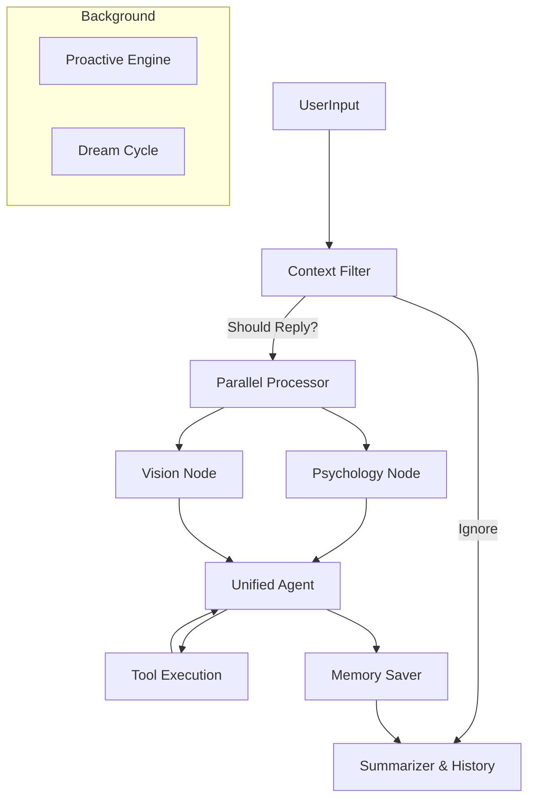

# Project Alice 🤖✨

> 基于 LangGraph 与 FastAPI 构建的，具备情感模拟、主动社交意识与多模态感知能力的拟人化 AI Agent。

Project Alice 不仅仅是一个聊天机器人，她是一个拥有**长期记忆**、**视觉感知**、**潜意识心理活动**以及**主动社交意愿**的智能体。她被设计用于通过 OneBot (v11) 协议与 QQ 等即时通讯软件集成。

## 🌟 核心特性

*   **🧠 拟人化心智模型 (LangGraph)**
    *   采用 LangGraph 构建复杂的认知流程，区分“显意识”（回复生成）与“潜意识”（情绪/记忆处理）。
    *   具备**Filter（过滤器）**机制，能判断是否需要回复，拒绝机械式应答。
*   **❤️ 情感与关系引擎**
    *   内置 PAD (Pleasure-Arousal-Dominance) 情感模型，拥有独立的 `Valence` (愉悦度)、`Arousal` (激活度) 和 `Stamina` (体力值)。
    *   维护与每个用户的**亲密度**与**关系图谱**，对话策略随关系深浅动态变化。
*   **👁️ 多模态视觉感知**
    *   **屏幕感知**：通过 MSS 实时监控屏幕，能理解你正在看的内容（需开启 Monitor）。
    *   **图片理解**：能够识别用户发送的图片、表情包 (Sticker)，并做出符合人设的反应。
*   **💾 混合记忆系统**
    *   **短期记忆**：基于 Token 窗口的对话上下文。
    *   **长期记忆 (RAG)**：使用 ChromaDB 存储事实性记忆，具备**夜间做梦 (Dream Cycle)** 机制，自动整理和固化碎片化信息。
*   **⚡ 主动社交 (Proactive Agent)**
    *   不仅是被动问答，当长时间沉默或检测到特定上下文时，她会根据好感度主动发起话题。

## 🛠️ 架构概览




### 1. 依赖文件 (`requirements.txt`)

```text
langchain>=0.3.0
langchain-openai
langchain-community
langchain-experimental
langgraph
fastapi
uvicorn
python-dotenv
chromadb
pydantic>=2.0
httpx
aiofiles
mss
numpy
Pillow
openai
tavily-python
```

---

### 2. 配置环境变量 (`.env)

在根目录下创建 `.env`。用户只需复制并在其中填入 Key。

```ini
# ==============================================
# Model Provider Configuration
# ==============================================
# 核心 LLM (推荐 OpenAI GPT-4o 或 Claude 3.5 Sonnet / Qwen 2.5)
OPENAI_API_KEY=your_openai_api_key_here

# 硅基流动 (SiliconFlow) 配置
SILICON_API_KEY=your_silicon_key_here
SILICON_BASE_URL=https://api.siliconflow.cn/v1

# 模型名称配置
LLM_MODEL_NAME=Qwen/Qwen2.5-VL-72B-Instruct
SMALL_LLM_MODEL_NAME=Qwen/Qwen2.5-7B-Instruct
EMBEDDING_MODEL_NAME=Qwen/Qwen2.5-Embedding

# ==============================================
# Tools & Search
# ==============================================
TAVILY_API_KEY=your_tavily_key_here
# OPENWEATHER_API_KEY=
# SERPER_API_KEY=

# ==============================================
# LangSmith (可选 - 用于调试 Agent 链路)
# ==============================================
LANGCHAIN_TRACING_V2=false
LANGCHAIN_ENDPOINT=https://api.smith.langchain.com
LANGCHAIN_API_KEY=your_langsmith_key

# ==============================================
# Storage & System
# ==============================================
VECTOR_DB_PATH=./data/chroma_db
TIMEZONE=Asia/Shanghai

# QQ 表情映射模式 (official, legacy, auto)
QQ_FACE_MAP_MODE=auto
```

---

### 3. 傻瓜式一键脚本

#### Windows 用户 (`install_and_run.bat`)

在根目录下创建此文件，双击即可完成环境配置和启动。

```batch
@echo off
chcp 65001
title Project Alice - Auto Setup & Launcher

echo ===================================================
echo        Project Alice 一键部署脚本
echo ===================================================

REM 1. 检查 Python 是否安装
python --version >nul 2>&1
if %errorlevel% neq 0 (
    echo [ERROR] 未检测到 Python，请先安装 Python 3.11 或以上版本并添加到环境变量。
    pause
    exit /b
)

REM 2. 创建虚拟环境
if not exist "venv" (
    echo [INFO] 正在创建虚拟环境 (venv)...
    python -m venv venv
) else (
    echo [INFO] 虚拟环境已存在。
)

REM 3. 激活环境并安装依赖
echo [INFO] 正在激活环境并检查依赖...
call venv\Scripts\activate
pip install -r requirements.txt -i https://pypi.tuna.tsinghua.edu.cn/simple

REM 4. 检查配置文件
if not exist ".env" (
    echo [WARN] 未检测到 .env 文件！
    echo [INFO] 正在从模板创建 .env 文件，请稍后手动填入 API Key。
    copy .env.example .env
    echo [INFO] .env 文件已创建。
    echo.
    echo ---------------------------------------------------
    echo 请现在打开项目目录下的 .env 文件，填入你的 API KEY。
    echo 配置完成后，按任意键继续启动服务...
    echo ---------------------------------------------------
    pause
)

REM 5. 启动服务
echo [INFO] 正在启动 Project Alice 服务...
python qq_server.py

pause
```

#### Linux / macOS 用户 (`setup.sh` 和 `run.sh`)

**setup.sh** (安装):

```bash
#!/bin/bash

echo "=== Project Alice Setup ==="

# 检查 Python
if ! command -v python3 &> /dev/null; then
    echo "Python3 could not be found. Please install it."
    exit 1
fi

# 创建 venv
if [ ! -d "venv" ]; then
    echo "Creating virtual environment..."
    python3 -m venv venv
fi

# 激活并安装
source venv/bin/activate
echo "Installing dependencies..."
pip install -r requirements.txt -i https://pypi.tuna.tsinghua.edu.cn/simple

# 配置文件
if [ ! -f ".env" ]; then
    echo "Creating .env from example..."
    cp .env.example .env
    echo "Please edit .env with your API keys."
fi

echo "Setup complete. Use './run.sh' to start."
```

**run.sh** (启动):

```bash
#!/bin/bash
source venv/bin/activate
echo "Starting Project Alice..."
python3 qq_server.py
```

---

## 

### 前置要求

1. **Python 3.11+**
2. **OneBot v11 客户端**：你需要运行一个支持 OneBot v11 的 QQ 客户端（如 [NapCatQQ](https://github.com/NapNeko/NapCatQQ) 或 [Lagrange.Core](https://github.com/LagrangeDev/Lagrange.Core)）。

   * 配置其反向 WebSocket 地址为：`ws://127.0.0.1:6199/ws`

### 安装步骤

**Windows 用户：**

1. 下载本项目代码。
2. 双击运行根目录下的 `install_and_run.bat`。
3. 脚本会自动创建环境并提示你修改 `.env` 配置文件。
4. 修改完成后，按任意键启动。

**Linux / Mac 用户：**

1. 打开终端，进入项目目录。
2. 运行 `chmod +x setup.sh run.sh`。
3. 运行 `./setup.sh` 进行安装。
4. 编辑 `.env` 文件填入 Key。
5. 运行 `./run.sh` 启动。

## ⚙️ 部分配置说明 (.env)

| 变量名               | 说明                        | 必填            |
| :---------------- | :------------------------ | :------------ |
| `SILICON_API_KEY` | 硅基流动 API Key (用于 LLM)     | ✅             |
| `LLM_MODEL_NAME`  | 主模型名称 (推荐 Qwen2.5-VL-72B) | ✅             |
| `TAVILY_API_KEY`  | Tavily 搜索 API (用于联网搜索)    | ✅             |
| `VECTOR_DB_PATH`  | 向量数据库存储路径                 | ❌ (默认 ./data) |
| `OPENAI_API_KEY`  | (可选) 如果使用 OpenAI 原生接口     | ❌             |

## 📂 项目结构

```text
ProjectAlice/
├── app/
│   ├── background/    # 后台任务 (做梦、清理)
│   ├── core/          # 核心配置、Prompt、全局状态
│   ├── graph/         # LangGraph 节点定义 (核心逻辑)
│   ├── memory/        # 记忆模块 (向量库、关系库)
│   ├── monitor/       # 屏幕监控模块
│   ├── tools/         # 工具集 (搜索、画图、代码解释器)
│   └── utils/         # 辅助工具 (QQ协议解析、安全过滤)
├── data/              # 数据库与历史记录存储
├── qq_server.py       # 程序主入口 (FastAPI)
└── requirements.txt   # 依赖列表
```

## 🤝 贡献

欢迎提交 Issue 和 Pull Request！
本项目核心基于 LangGraph 开发，如果你想修改 Agent 的行为逻辑，请重点关注 `app/graph/nodes` 目录。

## 📜 许可证

MIT License

