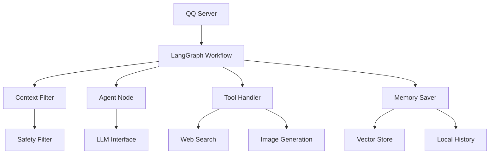

# ProjectAlice 技术文档

## 1. 项目概述

### 1.1 项目简介
ProjectAlice 是一个基于大语言模型的智能聊天机器人项目，具备多模态感知、上下文理解、主动对话和长期记忆等能力。项目通过 LangGraph 构建了完整的认知流程，支持 QQ 平台的消息交互。

### 1.2 技术栈
- **核心框架**: Python
- **工作流引擎**: LangGraph
- **大语言模型**: OpenAI API / 硅基流动 (SiliconFlow) / Qwen 系列模型
- **记忆系统**: ChromaDB (向量数据库)
- **API接口**: FastAPI
- **WebSocket**: 用于 QQ 消息通信
- **图像处理**: Pillow
- **配置管理**: python-dotenv
- **数据验证**: Pydantic

### 1.3 主要功能
- 多模态消息处理（文本、图片、表情）
- 上下文理解与智能回复
- 群聊与私聊场景适配
- 主动对话发起机制
- 长期记忆与语义搜索
- 情绪与心理状态模拟
- 工具集成（网络搜索、图片生成等）

## 2. 项目结构

### 2.1 目录结构
```
ProjectAlice/
├── app/
│   ├── background/          # 后台任务模块
│   ├── core/                # 核心配置与状态管理
│   ├── graph/               # LangGraph 工作流定义
│   │   └── nodes/           # 工作流节点实现
│   ├── memory/              # 记忆系统实现
│   ├── monitor/             # 监控模块
│   ├── tools/               # 工具集成模块
│   └── utils/               # 工具函数集合
├── tests/                   # 测试代码
├── web/                     # Web 界面
├── .env.example             # 环境变量示例
├── main.py                  # 主入口
├── qq_server.py             # QQ 服务器实现
├── requirements.txt         # 依赖列表
└── server.py                # Web 服务器
```

### 2.2 核心文件说明
- **main.py**: 项目主入口，提供命令行交互
- **qq_server.py**: QQ 消息服务器，处理消息接收与发送
- **app/core/config.py**: 项目配置管理
- **app/core/state.py**: 智能体状态定义
- **app/graph/graph_builder.py**: 工作流构建
- **app/memory/vector_store.py**: 向量记忆存储
- **app/utils/safety.py**: 安全过滤模块

## 3. 系统架构

### 3.1 整体架构设计
ProjectAlice 采用模块化架构设计，主要分为以下几层：

1. **接入层**: 负责与外部平台（如 QQ）的消息交互
2. **工作流层**: 使用 LangGraph 构建的智能体认知流程
3. **核心层**: 包含状态管理、配置管理和工具集成
4. **记忆层**: 提供长期记忆和短期上下文管理
5. **工具层**: 集成各种外部工具和服务

### 3.2 模块间关系图


## 4. 核心功能模块

### 4.1 状态管理 (app/core/state.py)
AgentState 是整个系统的核心数据结构，用于在 LangGraph 工作流中传递状态信息。它设计为 TypedDict 类型，确保了类型安全和清晰的状态结构。

```python
from typing import TypedDict, List, Optional, Dict, Any
from langchain_core.messages import BaseMessage

class AgentState(TypedDict):
    # --- 基础消息流 ---
    messages: List[BaseMessage]       # 完整的对话历史
    conversation_summary: str          # 对话摘要，用于长期记忆

    # --- 核心身份与环境 ---
    session_id: str                    # 会话唯一标识
    sender_qq: str                     # 发送者QQ号码
    sender_name: str                   # 发送者名称
    is_group: bool                     # 是否为群聊
    is_mentioned: bool                 # 是否被@提及

    # --- 流程控制 ---
    should_reply: bool                 # 是否需要回复
    filter_reason: str                 # 过滤原因（如果不需要回复）
    is_proactive_mode: bool            # 是否为主动对话模式

    # --- 视觉优化 ---
    image_urls: List[str]              # 消息中的图片URL列表

    # --- 上下文与状态 ---
    psychological_context: Dict[str, Any]      # 心理状态上下文
    global_emotion_snapshot: Dict[str, Any]    # 全局情绪快照
    internal_monologue: str                    # 内部独白
    emotion: Any                               # 当前情绪状态

    # --- 视觉相关字段 ---
    current_image_artifact: Optional[str]  # 有意义的图片（Base64编码）
    visual_input: Optional[str]             # 视觉输入内容
    visual_type: Optional[str]              # 视觉类型：'photo', 'sticker', 'icon', 'none'

    # --- 其他状态信息 ---
    current_activity: str                  # 当前活动
    last_interaction_ts: float             # 最后交互时间戳
    next_step: str                         # 下一步操作
    user_profile: Dict                     # 用户资料
    tool_call: Dict[str, Any]              # 工具调用信息
```

**状态管理设计亮点**：
1. **分层设计**：将状态按功能模块清晰划分，便于维护
2. **类型安全**：使用 TypedDict 确保状态字段类型正确
3. **扩展性**：预留了足够的字段以支持未来功能扩展
4. **完整性**：包含了从消息流到上下文状态的完整信息链

### 4.2 配置管理 (app/core/config.py)
配置模块使用单例模式管理项目的所有配置参数，支持通过环境变量进行灵活配置：

```python
import os
from dotenv import load_dotenv

# 加载 .env 文件
load_dotenv()

class Config:
    # --- LLM Settings ---
    
    # 硅基流动 API 配置
    SILICONFLOW_API_KEY = os.getenv("SILICONFLOW_API_KEY")
    SILICONFLOW_BASE_URL = os.getenv("SILICONFLOW_BASE_URL", "https://api.siliconflow.cn/v1")
    
    # MIMO API 配置
    MIMO_API_KEY = os.getenv("MIMO_API_KEY")
    MIMO_BASE_URL = os.getenv("MIMO_BASE_URL", "https://api.xiaomimimo.com/v1")
    MIMO_MODEL = os.getenv("MIMO_MODEL")
    
    # 模型选择
    MODEL_NAME = os.getenv("LLM_MODEL_NAME", "Qwen/Qwen3-VL-30B-A3B-Instruct")  # 主模型
    SMALL_LLM_MODEL_NAME = os.getenv("SMALL_LLM_MODEL_NAME", "Qwen/Qwen3-VL-8B-Instruct")  # 轻量级模型
    EMBEDDING_MODEL_NAME = os.getenv("EMBEDDING_MODEL_NAME", "Qwen/Qwen3-Embedding-8B")  # 嵌入模型
    TEMPERATURE = 0.7  # 生成温度
    
    # --- Vector DB Settings ---
    VECTOR_DB_PATH = os.getenv("VECTOR_DB_PATH", "./chroma_db")  # 向量数据库路径
    COLLECTION_NAME = "anima_memories"  # 记忆集合名称
    
    # --- Tool Settings ---
    MAX_SEARCH_RESULTS = 3  # 最大搜索结果数
    
    # --- Emotion & Personality Settings ---
    DEFAULT_VALENCE = 0.1  # 初始情绪积极度 (略微积极)
    DEFAULT_AROUSAL = 0.5  # 初始情绪唤醒度 (平静且专注)
    
    # --- System Paths ---
    LOG_DIR = "./logs"  # 日志目录
    
    # --- Safety Thresholds ---
    SENSITIVE_THRESHOLD = 0.8  # 敏感词检测阈值


config = Config()
```

**配置管理设计亮点**：
1. **环境变量支持**：通过 `.env` 文件和环境变量灵活配置
2. **默认值设置**：为关键配置项提供合理默认值，降低部署难度
3. **模块化组织**：按功能模块组织配置项，便于管理
4. **单例模式**：确保配置的全局一致性
5. **扩展性**：预留了多个API服务的配置接口，支持多模型切换

### 4.2.1 数据库配置 (app/core/database.py)
负责数据库连接管理、会话工厂创建和数据模型定义：

```python
# === 数据库配置文件 ===

from sqlalchemy import create_engine
from sqlalchemy.ext.declarative import declarative_base
from sqlalchemy.orm import sessionmaker, Session
import os
from typing import Generator

# 数据库路径
DB_PATH = "data/project_alice.db"

# 确保数据目录存在
os.makedirs("data", exist_ok=True)

# 创建数据库引擎
engine = create_engine(
    f"sqlite:///{DB_PATH}",
    connect_args={"check_same_thread": False}  # SQLite 多线程支持
)

# 创建会话工厂
SessionLocal = sessionmaker(autocommit=False, autoflush=False, bind=engine)

# 创建基类
Base = declarative_base()


# 数据库依赖
def get_db() -> Generator[Session, None, None]:
    """获取数据库会话"""
    db = SessionLocal()
    try:
        yield db
    finally:
        db.close()


# 导入数据库模型
from sqlalchemy import Column, String, Text, DateTime, func

# 会话历史模型
class SessionHistoryModel(Base):
    __tablename__ = "session_history"
    
    session_id = Column(String(100), primary_key=True, index=True)
    summary = Column(Text, nullable=False, default="")
    messages = Column(Text, nullable=False, default="[]")  # JSON格式存储
    updated_at = Column(DateTime(timezone=True), server_default=func.now(), onupdate=func.now())


# 初始化数据库
def init_db():
    """创建所有数据库表"""
    from app.memory.relation_db import UserProfileModel  # 避免循环导入
    Base.metadata.create_all(bind=engine)
```

**数据库配置设计特点**：
1. **SQLite数据库**：使用轻量级的SQLite数据库，便于部署和维护
2. **多线程支持**：通过 `check_same_thread=False` 支持多线程环境
3. **依赖注入**：提供 `get_db` 函数支持依赖注入模式
4. **自动初始化**：通过 `init_db` 函数自动创建所有数据库表
5. **模型定义**：包含 `SessionHistoryModel` 用于存储会话历史数据
6. **JSON存储**：会话消息以JSON格式存储在数据库中，便于序列化和反序列化

### 4.3 工作流引擎 (app/graph/)

#### 4.3.1 工作流构建 (graph_builder.py)
使用 LangGraph 构建完整的聊天机器人工作流程：

```python
def build_graph():
    workflow = StateGraph(AgentState)
    
    # 添加节点
    workflow.add_node("filter", context_filter_node)
    workflow.add_node("parallel_processor", parallel_processing_node)
    workflow.add_node("agent", agent_node)
    workflow.add_node("tools", tool_node)
    workflow.add_node("saver", memory_saver_node)
    workflow.add_node("summarizer", summarizer_node)
    workflow.add_node("perception", perception_node)
    workflow.add_node("proactive", proactive_node)
    
    # 入口路由
    workflow.set_conditional_entry_point(
        route_root,
        {"filter": "filter", "proactive": "proactive"}
    )
    
    # 上下文过滤器路由
    workflow.add_conditional_edges(
        "filter",
        route_filter,
        {"parallel_processor": "parallel_processor", "summarizer": "summarizer"}
    )
    
    # 响应式流程主线
    workflow.add_edge("parallel_processor", "agent")
    workflow.add_conditional_edges(
        "agent",
        route_agent_output,
        {"tools": "tools", "saver": "saver"}
    )
    workflow.add_edge("tools", "agent")
    
    # 记忆处理流程
    workflow.add_edge("saver", "summarizer")
    workflow.add_edge("summarizer", END)
    
    # 主动式流程
    workflow.add_edge("proactive", "summarizer")
    
    return workflow.compile()
```

#### 4.3.2 上下文过滤 (context_filter.py)
决定智能体是否应该回复消息的核心逻辑：

```python
async def context_filter_node(state: AgentState):
    # 强规则：被艾特必须回复
    if state.get("is_mentioned", False):
        return {"should_reply": True, "filter_reason": "Directly mentioned (Hard Rule)"}
    
    # 提取最后一条消息内容
    last_content = _extract_last_message_content(state.get("messages", []))
    
    # 检查是否有图片
    has_img = _check_has_image(state, last_content)
    
    # 应用启发式预过滤
    pre_filter_result = _apply_heuristic_pre_filter(state, last_content, has_img)
    if pre_filter_result:
        return pre_filter_result
    
    # 调用 LLM 进行上下文分析
    # ...（省略具体实现）
```

#### 4.3.3 核心智能体节点 (unified_agent.py)
处理用户输入并生成回复的核心逻辑，包含多模态输入处理、RAG检索和安全防护：

```python
async def agent_node(state: AgentState):
    ts = datetime.now().strftime("%Y-%m-%d %H:%M:%S")
    msgs = state.get("messages", [])
    image_data = state.get("current_image_artifact")
    visual_type = state.get("visual_type", "none")

    # 提取最近一条消息文本
    last_human_content = ""
    if msgs:
        for m in reversed(msgs):
            if isinstance(m, HumanMessage):
                content = m.content
                if isinstance(content, list):
                    content = next((x['text'] for x in content if x['type'] == 'text'), "")
                last_human_content = str(content).strip()
                break

    # 🛡️ 第一道防线：短路拦截 (Short-Circuit)
    if visual_type == "sticker":
        # 清洗文本，移除用户名前缀和占位符
        temp_text = re.sub(r"^\[.*?\]:\s*", "", last_human_content)
        clean_text = temp_text.replace("[图片]", "").replace("[表情]", "").replace(" ", "").strip()
        
        # 纯表情直接回复或忽略
        if len(clean_text) < 2:
            # 50% 概率回复表情，50% 概率沉默
            if random.random() < 0.6:
                replies = ["🐶", "🐱", "💖", "💕", "💝", "🤗", "👻", "👽"]
                reply = random.choice(replies)
                return {
                    "internal_monologue": "Sticker acknowledged.",
                    "messages": msgs + [AIMessage(content=reply)],
                    "last_interaction_ts": time.time(),
                    "next_step": "save"
                }
            else:
                return {
                    "internal_monologue": "Sticker ignored.",
                    "messages": msgs,
                    "last_interaction_ts": time.time(),
                    "next_step": "save"
                }

    # 🧠 LLM 处理 (Photo 或 带有文字的 Sticker)
    # RAG 检索相关记忆
    memory_context = ""
    try:
        query_text = re.sub(r"^\[.*?\]:\s*", "", last_human_content).replace("[图片]", "").strip()
        if len(query_text) > 4:
            docs = vector_db.search(query_text, k=3)
            if docs:
                memory_context = f"【相关回忆】\n" + "\n".join(docs)
    except Exception:
        pass

    # 构造完整 Prompt
    final_system_prompt = AGENT_SYSTEM_PROMPT.format(
        core_persona=ALICE_CORE_PERSONA,
        time=now_str,
        current_user=f"{user_display_name} (ID: {real_user_id})",
        vision_summary=vision_summary_text,
        mood_label=psych_ctx.get("primary_emotion", "平淡"),
        internal_thought=psych_ctx.get("internal_thought", "思考中..."),
        style_instruction=psych_ctx.get("style_instruction", "保持日常语气"),
        intimacy=psych_ctx.get("current_intimacy", 30),
        memories=memory_context
    ) + "\n\n" + format_instruction

    # 调用 LLM 并解析结果
    response = await cached_llm_invoke(llm, input_messages, temperature=llm.temperature)
    parsed_result = robust_json_parse(response.content.strip())
    
    # 返回结果
    ai_msg = AIMessage(content=parsed.get("response", "..."))
    return {
        "messages": msgs + [ai_msg],
        "next_step": "save",
        "tool_call": {} if parsed.get("action") == "reply" else {"name": parsed.get("action"), "args": parsed.get("args")}
    }
```

#### 4.3.4 记忆保存节点 (memory_saver.py)
负责从对话中提取有价值的信息并保存到向量数据库：

```python
async def memory_saver_node(state: AgentState):
    ts = datetime.now().strftime("%Y-%m-%d %H:%M:%S")
    msgs = state.get("messages", [])
    if not msgs: return {}

    # 获取用户信息
    real_user_id = state.get("sender_qq", "unknown")
    user_nickname = state.get("sender_name", "User")

    # 确定模式（交互或观察）
    last_msg = msgs[-1]
    ai_output = "N/A (AI remained silent)"
    mode = "OBSERVATION"
    user_text = ""

    if last_msg.type == 'ai':
        mode = "INTERACTIVE"
        ai_output = last_msg.content
        if len(msgs) >= 2:
            user_text = msgs[-2].content
        else:
            return {}
    else:
        mode = "OBSERVATION"
        user_text = last_msg.content

    # 提取关键信息
    prompt = ChatPromptTemplate.from_template(MEMORY_SYSTEM_PROMPT)
    formatted_prompt = prompt.format(
        mode=mode,
        user_id=real_user_id,
        user_name=user_nickname,
        user_input=user_text,
        ai_output=ai_output
    )
    
    # 调用 LLM 提取记忆
    resp = await cached_llm_invoke(llm, [SystemMessage(content=formatted_prompt)], temperature=llm.temperature)
    raw_content = resp.content.strip().replace("```json", "").replace("```", "").strip()
    data = json.loads(raw_content)

    # 保存提取的记忆
    operations = data.get("operations", [])
    current_time = datetime.now().strftime("%Y-%m-%d %H:%M:%S")
    facts_to_add = []
    metadatas_to_add = []

    for op in operations:
        action = op.get("action")
        content = op.get("content", "")
        category = op.get("category", "event")
        importance = op.get("importance", 1)

        if mode == "OBSERVATION" and importance < 3:
            continue

        if action == "add":
            final_content = f"User {user_nickname} (ID:{real_user_id}): {content}"
            full_text = f"[{current_time}] ({category.upper()}) {final_content}"

            facts_to_add.append(full_text)
            metadatas_to_add.append({
                "source": "chat" if mode == "INTERACTIVE" else "observation",
                "user_id": real_user_id,
                "created_at": current_time,
                "importance": importance,
                "category": category
            })

    if facts_to_add:
        vector_db.add_texts(facts_to_add, metadatas_to_add)

    return {}
```

#### 4.3.5 工具处理节点 (tool_handler.py)
执行工具调用并将结果作为 ToolMessage 注入对话历史：

```python
async def tool_node(state: AgentState):
    """
    执行工具调用，并将结果作为 ToolMessage 注入历史
    """
    current_messages = state.get("messages", [])
    ts = datetime.now().strftime("%Y-%m-%d %H:%M:%S")
    tool_data = state.get("tool_call", {})
    tool_name = tool_data.get("name")
    tool_args = tool_data.get("args")

    # 生成一个随机的 tool_call_id
    tool_call_id = str(uuid.uuid4())

    print(f"[{ts}] --- [Tools] Executing: {tool_name} with {tool_args} ---")

    result = "Tool execution failed."

    try:
        # 参数清洗
        final_arg = tool_args
        if isinstance(tool_args, dict):
            if "query" in tool_args:
                final_arg = tool_args["query"]
            elif "prompt" in tool_args:
                final_arg = tool_args["prompt"]
            elif "code" in tool_args:
                final_arg = tool_args["code"]
            else:
                final_arg = list(tool_args.values())[0]

        final_arg = str(final_arg)

        # 执行工具调用
        if tool_name == "web_search":
            result = perform_web_search.invoke(final_arg)
        elif tool_name == "generate_image":
            url = generate_image.invoke(final_arg)
            result = f"IMAGE_GENERATED: {url}"
        elif tool_name == "run_python_analysis":
            result = run_python_analysis.invoke(final_arg)
        else:
            result = f"Unknown tool: {tool_name}"

    except Exception as e:
        print(f"[{ts}] [Tool Error] {e}")
        result = f"Tool Error: {str(e)}"

    # 创建 ToolMessage
    tool_msg = ToolMessage(
        content=f"[System: Tool '{tool_name}' Result]\n{str(result)}",
        tool_call_id=tool_call_id,
        name=tool_name
    )

    return {
        "messages": current_messages + [tool_msg],
        "tool_call": {}
    }
```

### 4.4 记忆系统 (app/memory/)

#### 4.4.1 向量存储 (vector_store.py)
使用 ChromaDB 实现的长期记忆系统，具备语义搜索、时间衰减和重要性评分等功能：

#### 4.4.2 记忆固化与清理 (app/background/dream.py)
DreamCycle 是一个后台任务模块，负责记忆的优化和管理，包括清理过时记忆和固化重要记忆碎片：

```python
import asyncio
import json
import logging
from datetime import datetime, timedelta
from typing import List, Dict

from langchain_openai import ChatOpenAI
from langchain_core.messages import SystemMessage, HumanMessage

from app.core.config import config
from app.memory.vector_store import vector_db
from app.core.global_store import global_store
from app.utils.cache import cached_llm_invoke

logger = logging.getLogger("DreamCycle")

# --- 记忆固化 Prompt ---
CONSOLIDATION_PROMPT = """
你是 Alice 的潜意识整理者。你的任务是将碎片化的短期记忆合并为有价值的长期记忆。

【待整理的记忆碎片】
{fragments}

【任务要求】
1. 分析这些碎片之间是否存在关联（例如：都是关于饮食偏好、都是关于某个特定项目、或者是连续的事件）。
2. 如果存在关联，请将它们**概括**为一条简洁的、包含核心信息的陈述句。
3. 概括后的记忆应当去除时间状语（如“刚才”、“今天”），转变为持久的事实描述。
4. 如果碎片之间没有明显关联，或者信息太杂乱无法合并，请输出 "SKIP"。

【输出示例】
输入碎片: ["用户说今天想吃辣", "中午点了麻辣烫", "晚上还在找火锅店"]
输出: 用户非常喜欢吃辣的食物，尤其是麻辣烫和火锅。

请输出结果 (纯文本):
"""


class DreamCycle:
    def __init__(self, interval_seconds=1800):
        """
        :param interval_seconds: 做梦循环的间隔，默认 30 分钟 (1800秒)
        """
        self.interval = interval_seconds
        self.running = False
        self._task = None

        # 专门用于整理记忆的 LLM，可以使用便宜的模型 (如 gpt-3.5-turbo 或 qwen-turbo) 以保证速度
        self.llm = ChatOpenAI(
            model=config.LLM_MODEL_NAME,
            temperature=0.1,
            api_key=config.SILICONFLOW_API_KEY,
            base_url=config.SILICONFLOW_BASE_URL
        )

    async def start(self):
        self.running = True
        self._task = asyncio.create_task(self._dream_loop())
        logger.info("💤 [Dream] Background memory consolidation module started.")

    async def stop(self):
        self.running = False
        if self._task:
            self._task.cancel()
            try:
                await self._task
            except asyncio.CancelledError:
                pass

    async def _dream_loop(self):
        while self.running:
            try:
                # 等待下一个周期
                await asyncio.sleep(self.interval)

                # 1. 检查活跃度：如果用户最近 5 分钟还在说话，不要做梦，避免数据库锁冲突
                last_active_str = global_store.get_emotion_snapshot().last_updated
                last_active = datetime.strptime(last_active_str, "%Y-%m-%d %H:%M:%S")
                if (datetime.now() - last_active).total_seconds() < 300:
                    logger.info("💤 [Dream] User is active. Postponing dream cycle.")
                    continue

                logger.info("💤 [Dream] Entering REM sleep (Memory Optimization)...")

                # 2. 执行清理逻辑
                deleted_count = self._prune_garbage_memories(days_threshold=3)

                # 3. 执行固化逻辑
                consolidated_count = await self._consolidate_memories()

                # 4. 恢复体力 (作为奖励)
                if deleted_count > 0 or consolidated_count > 0:
                    global_store.update_emotion(0, 0, stamina_delta=30.0)
                    logger.info(
                        f"💤 [Dream] Cycle Done. Pruned: {deleted_count}, Consolidated: {consolidated_count}. Stamina Recovered.")
                else:
                    logger.info("💤 [Dream] Deep sleep. No memories needed processing.")

            except asyncio.CancelledError:
                break
            except Exception as e:
                logger.error(f"❌ [Dream Error] {e}", exc_info=True)

    def _prune_garbage_memories(self, days_threshold: int = 3) -> int:
        """
        清理逻辑：删除 [importance=1] 且 [创建时间 > 3天] 的记忆
        """
        try:
            # Chroma API 获取所有 metadata (limit 设大一点以覆盖)
            # 注意：如果数据量巨大，这里需要分页处理，Demo 中暂且一次性获取
            result = vector_db.collection.get(include=["metadatas"])

            ids = result["ids"]
            metadatas = result["metadatas"]

            ids_to_delete = []
            now = datetime.now()
            cutoff_date = now - timedelta(days=days_threshold)

            for i, meta in enumerate(metadatas):
                # 检查 Importance (如果没有字段，默认为 1)
                importance = meta.get("importance", 1)

                # 只清理低权重记忆
                if importance > 1:
                    continue

                # 检查时间
                created_at_str = meta.get("created_at")
                if created_at_str:
                    try:
                        mem_time = datetime.strptime(created_at_str, "%Y-%m-%d %H:%M:%S")
                        if mem_time < cutoff_date:
                            ids_to_delete.append(ids[i])
                    except ValueError:
                        continue  # 时间格式不对则跳过

            if ids_to_delete:
                logger.info(f"🧹 [Dream] Pruning {len(ids_to_delete)} garbage memories...")
                vector_db.collection.delete(ids=ids_to_delete)
                return len(ids_to_delete)

            return 0

        except Exception as e:
            logger.error(f"Error in pruning: {e}")
            return 0

    async def _consolidate_memories(self) -> int:
        """
        固化逻辑：
        1. 找出最近 24 小时产生的、importance=2 (Context) 或 3 (Preference) 的记忆。
        2. 如果碎片数量 > 3，尝试让 LLM 总结。
        3. 如果总结成功，写入一条 importance=4 的新记忆，并删除旧碎片。
        """
        try:
            # 1. 获取最近记忆
            result = vector_db.collection.get(include=["documents", "metadatas"])
            ids = result["ids"]
            docs = result["documents"]
            metadatas = result["metadatas"]

            candidates = []  # list of (id, doc, meta)
            now = datetime.now()

            # 筛选：最近 24 小时 且 重要性为 2 或 3
            for i, meta in enumerate(metadatas):
                imp = meta.get("importance", 1)
                if imp not in [2, 3]:
                    continue

                c_time_str = meta.get("created_at")
                if not c_time_str: continue

                try:
                    mem_time = datetime.strptime(c_time_str, "%Y-%m-%d %H:%M:%S")
                    # 只看最近 24 小时
                    if (now - mem_time).total_seconds() < 86400:
                        candidates.append((ids[i], docs[i]))
                except:
                    continue

            # 如果碎片太少，没必要总结
            if len(candidates) < 4:
                return 0

            # 2. 准备 Prompt 数据 (取前 10 条处理，避免 token 爆炸)
            batch = candidates[:10]
            batch_texts = [item[1] for item in batch]
            batch_ids = [item[0] for item in batch]

            fragments_text = json.dumps(batch_texts, ensure_ascii=False, indent=2)

            # 3. LLM 思考
            logger.info(f"🧠 [Dream] Attempting to consolidate {len(batch)} fragments...")

            prompt = CONSOLIDATION_PROMPT.format(fragments=fragments_text)
            response = await cached_llm_invoke(self.llm, [SystemMessage(content=prompt)],
                                               temperature=self.llm.temperature)
            result_text = response.content.strip()

            # 4. 处理结果
            if "SKIP" in result_text or len(result_text) < 5:
                # 无法合并，保持原样
                return 0

            # 5. 执行“新陈代谢”
            logger.info(f"✨ [Dream] Consolidation Success: '{result_text}'")

            # A. 写入新记忆 (Importance = 4, 表示这是经过深思熟虑的事实)
            new_metadata = {
                "source": "dream_consolidation",
                "importance": 4,
                "created_at": now.strftime("%Y-%m-%d %H:%M:%S"),
                "consolidated_from_count": len(batch)
            }
            vector_db.add_texts([result_text], [new_metadata])

            # B. 删除旧碎片 (物理删除，释放空间)
            # vector_db.collection.delete(ids=batch_ids) # 暂时注释掉，为了调试安全。确认稳定后取消注释。
            # 这里我们做一个折中：不删除，而是将其 importance 降级为 0，等待下次 Pruning 清理
            # 但 Chroma update 比较麻烦，所以直接删除是比较干净的做法。
            # 生产环境建议开启删除：
            vector_db.collection.delete(ids=batch_ids)

            return 1

        except Exception as e:
            logger.error(f"Error in consolidation: {e}")
            return 0


# 单例导出
dream_machine = DreamCycle(interval_seconds=1800)
```

**记忆固化机制**：
1. **筛选阶段**：找出最近24小时产生的重要性为2或3的记忆碎片
2. **总结阶段**：使用LLM将相关碎片合并为连贯的事实描述
3. **固化阶段**：将总结结果作为importance=4的长期记忆保存
4. **清理阶段**：删除原始记忆碎片

**记忆清理机制**：
- 删除重要性为1且超过3天的记忆
- 避免影响用户活跃会话

#### 4.4.3 向量存储实现 (vector_store.py)

```python
import chromadb
from typing import List
from datetime import datetime
import math
import threading
from openai import OpenAI
from app.core.config import config

class VectorMemory:
    def __init__(self):
        # 初始化 ChromaDB 持久化客户端
        self.client = chromadb.PersistentClient(path=config.VECTOR_DB_PATH)
        self._lock = threading.Lock()  # 线程安全锁

        # 初始化 OpenAI 客户端
        self.openai_client = OpenAI(
            api_key=config.SILICONFLOW_API_KEY,
            base_url=config.SILICONFLOW_BASE_URL
        )

        # 硅基流动 (SiliconFlow) 嵌入函数适配器
        class SiliconFlowAdapter:
            def __init__(self, client, model_name):
                self.client = client
                self.model_name = model_name

            def _embed(self, texts: List[str]) -> List[List[float]]:
                texts = [t.replace("\n", " ") for t in texts]
                response = self.client.embeddings.create(
                    input=texts,
                    model=self.model_name
                )
                return [data.embedding for data in response.data]

            def __call__(self, input: List[str]) -> List[List[float]]:
                return self._embed(input)

            def embed_documents(self, input: List[str]) -> List[List[float]]:
                return self._embed(input)

            def embed_query(self, input: List[str]) -> List[List[float]]:
                return self._embed(input)

        self.embedding_fn = SiliconFlowAdapter(
            self.openai_client,
            config.EMBEDDING_MODEL_NAME
        )

        # 获取或创建集合
        self.collection = self.client.get_or_create_collection(
            name=config.COLLECTION_NAME,
            embedding_function=self.embedding_fn
        )

    def add_texts(self, texts: List[str], metadatas: List[dict] = None):
        """添加文本到向量数据库"""
        if not texts: return

        ids = [f"mem_{hash(t)}" for t in texts]

        final_metadatas = []
        now_str = datetime.now().strftime("%Y-%m-%d %H:%M:%S")
        
        if metadatas:
            for m in metadatas:
                if "importance" not in m: m["importance"] = 1
                if "created_at" not in m: m["created_at"] = now_str
                final_metadatas.append(m)
        else:
            final_metadatas = [{"source": "interaction", "importance": 1, "created_at": now_str}] * len(texts)

        # 加锁写入确保线程安全
        with self._lock:
            try:
                self.collection.upsert(
                    documents=texts,
                    metadatas=final_metadatas,
                    ids=ids
                )
            except Exception as e:
                print(f"[VectorStore Write Error] {e}")

    def _calculate_time_decay(self, created_at_str: str, half_life_hours: float = 48.0) -> float:
        """计算时间衰减因子"""
        try:
            mem_time = datetime.strptime(created_at_str, "%Y-%m-%d %H:%M:%S")
            delta_hours = (datetime.now() - mem_time).total_seconds() / 3600.0
            # 使用半衰期48小时的指数衰减
            decay = max(0.3, math.pow(0.5, delta_hours / half_life_hours))
            return decay
        except:
            return 1.0  # 解析失败时不衰减

    def search(self, query: str, k: int = 3) -> List[str]:
        """语义搜索记忆，结合时间衰减和重要性评分"""
        with self._lock:
            try:
                results = self.collection.query(
                    query_texts=[query],
                    n_results=k * 3,  # 获取更多结果进行精排
                    include=["documents", "metadatas", "distances"]
                )
            except Exception as e:
                print(f"[VectorStore Search Error] {e}")
                return []

        if not results["documents"]:
            return []

        docs = results["documents"][0]
        metas = results["metadatas"][0]
        dists = results["distances"][0]

        # 计算综合得分
        scored_candidates = []
        for doc, meta, dist in zip(docs, metas, dists):
            semantic_score = 1.0 / (1.0 + dist)  # 语义相似度得分
            created_at = meta.get("created_at", datetime.now().strftime("%Y-%m-%d %H:%M:%S"))
            time_score = self._calculate_time_decay(created_at)  # 时间衰减得分
            importance = float(meta.get("importance", 1))  # 重要性
            importance_boost = 1.0 + (importance * 0.15)  # 重要性提升

            final_score = semantic_score * time_score * importance_boost
            scored_candidates.append((final_score, doc))

        # 按得分排序并返回前k个结果
        scored_candidates.sort(key=lambda x: x[0], reverse=True)
        return [item[1] for item in scored_candidates[:k]]

    def delete_by_semantic(self, query: str, threshold: float = 0.25):
        """通过语义相似度删除记忆"""
        with self._lock:
            try:
                results = self.collection.query(
                    query_texts=[query],
                    n_results=5
                )
                ids_to_delete = []
                if results["ids"]:
                    for id_val, dist in zip(results["ids"][0], results["distances"][0]):
                        if dist < threshold:  # 距离小于阈值表示相似度高
                            ids_to_delete.append(id_val)

                if ids_to_delete:
                    self.collection.delete(ids=ids_to_delete)
                    return len(ids_to_delete)
                return 0
            except Exception as e:
                print(f"[VectorStore Delete Error] {e}")
                return 0


# 单例导出
vector_db = VectorMemory()
```

**向量记忆系统设计特点**：
1. **线程安全**：使用互斥锁确保多线程环境下的安全操作
2. **自适应嵌入**：通过适配器支持多种嵌入模型和服务
3. **综合评分机制**：结合语义相似度、时间衰减和重要性进行记忆检索
4. **持久化存储**：使用 ChromaDB 的持久化客户端确保数据不会丢失
5. **灵活的元数据管理**：支持自定义元数据和自动添加时间戳
6. **智能清理**：支持通过语义相似度删除相关记忆

**记忆评分机制**：
- **语义相似度 (semantic_score)**：基于向量空间距离计算，值越大表示越相似
- **时间衰减 (time_score)**：使用半衰期48小时的指数衰减，旧记忆权重逐渐降低
- **重要性提升 (importance_boost)**：根据记忆的重要性等级给予额外权重提升
- **综合得分**：三者的乘积，综合考虑了记忆的相关性、时效性和重要性

#### 4.4.4 本地历史管理 (local_history.py)
负责会话历史的持久化存储，使用数据库进行数据管理，并支持从旧的JSON格式迁移数据：

```python
import os
import json
import aiofiles
from typing import List, Tuple, Dict, Any
from langchain_core.messages import BaseMessage, messages_to_dict, messages_from_dict
from sqlalchemy.orm import Session
from app.core.database import SessionLocal, SessionHistoryModel

# 定义存储路径（用于迁移旧数据）
HISTORY_DIR = "./data/history"


class LocalHistoryManager:
    """
    负责会话历史存储，使用数据库。
    根据 session_id 进行数据隔离。
    """

    @staticmethod
    def _get_db() -> Session:
        """获取数据库会话"""
        return SessionLocal()

    @classmethod
    async def save_state(cls, messages: List[BaseMessage], summary: str, session_id: str):
        """
        异步保存当前对话状态到数据库。
        :param messages: LangChain 消息列表
        :param summary: 当前的对话总结
        :param session_id: 会话唯一标识 (private_xxx 或 group_xxx)
        """
        if not session_id:
            print("⚠️ [History] Cannot save: session_id is missing.")
            return

        # 将消息对象序列化为JSON字符串
        serialized_msgs = json.dumps(messages_to_dict(messages), ensure_ascii=False)

        try:
            db = cls._get_db()
            
            # 查找现有记录
            history = db.query(SessionHistoryModel).filter_by(session_id=session_id).first()
            
            if history:
                # 更新现有记录
                history.summary = summary
                history.messages = serialized_msgs
            else:
                # 创建新记录
                history = SessionHistoryModel(
                    session_id=session_id,
                    summary=summary,
                    messages=serialized_msgs
                )
                db.add(history)
            
            db.commit()
            db.close()
        except Exception as e:
            print(f"❌ [History] Save failed for {session_id}: {e}")
            try:
                db.rollback()
            except:
                pass
            finally:
                db.close()

    @classmethod
    async def load_state(cls, session_id: str) -> Tuple[List[BaseMessage], str]:
        """
        异步读取会话状态。
        :param session_id: 会话唯一标识
        :return: (messages, summary)
        """
        if not session_id:
            return [], ""

        try:
            db = cls._get_db()
            
            # 查找记录
            history = db.query(SessionHistoryModel).filter_by(session_id=session_id).first()
            
            if not history:
                # 如果数据库中没有，尝试从旧的JSON文件中迁移
                await cls._migrate_from_json(session_id)
                # 再次查询
                history = db.query(SessionHistoryModel).filter_by(session_id=session_id).first()
                
            if not history:
                return [], ""
            
            # 反序列化消息
            msgs_dict = json.loads(history.messages)
            messages = messages_from_dict(msgs_dict)
            
            db.close()
            return messages, history.summary

        except Exception as e:
            print(f"❌ [History] Load failed for {session_id}: {e}")
            try:
                db.close()
            except:
                pass
            return [], ""
    
    @classmethod
    def get_existing_summary_sync(cls, session_id: str) -> str:
        """
        同步辅助方法：仅获取 Summary (用于初始化时快速读取)
        """
        if not session_id: return ""

        try:
            db = cls._get_db()
            
            # 查找记录
            history = db.query(SessionHistoryModel).filter_by(session_id=session_id).first()
            
            if not history:
                # 如果数据库中没有，尝试从旧的JSON文件中迁移
                import asyncio
                asyncio.run(cls._migrate_from_json(session_id))
                # 再次查询
                history = db.query(SessionHistoryModel).filter_by(session_id=session_id).first()
                
            db.close()
            return history.summary if history else ""
        except Exception as e:
            print(f"❌ [History] Get summary failed for {session_id}: {e}")
            try:
                db.close()
            except:
                pass
            return ""
    
    @classmethod
    async def _migrate_from_json(cls, session_id: str):
        """
        从旧的JSON文件迁移数据到数据库
        """
        if not os.path.exists(HISTORY_DIR):
            return
        
        # 获取旧文件路径
        safe_id = "".join([c for c in session_id if c.isalnum() or c in ('_', '-')])
        file_path = os.path.join(HISTORY_DIR, f"{safe_id}.json")
        
        if not os.path.exists(file_path):
            return
        
        try:
            async with aiofiles.open(file_path, mode='r', encoding='utf-8') as f:
                content = await f.read()
                if not content:
                    return
                
                data = json.loads(content)
                summary = data.get("summary", "")
                msgs_dict = data.get("messages", [])
                
                # 保存到数据库
                db = cls._get_db()
                
                # 检查是否已经存在
                existing = db.query(SessionHistoryModel).filter_by(session_id=session_id).first()
                if not existing:
                    history = SessionHistoryModel(
                        session_id=session_id,
                        summary=summary,
                        messages=json.dumps(msgs_dict, ensure_ascii=False)
                    )
                    db.add(history)
                    db.commit()
                    print(f"✅ [History] Migrated {session_id} from JSON to database")
                
                db.close()
        except Exception as e:
            print(f"❌ [History] Migration failed for {session_id}: {e}")
            try:
                db = cls._get_db()
                db.rollback()
                db.close()
            except:
                pass
```

**本地历史管理设计特点**：
1. **会话隔离**：使用 `session_id` 对不同会话的历史进行完全隔离
2. **异步操作**：支持异步的保存和加载操作，提高并发性能
3. **数据迁移**：自动从旧的JSON文件格式迁移到数据库存储，确保数据兼容性
4. **健壮性设计**：完善的错误处理和资源管理，确保数据库连接正确关闭
5. **同步辅助方法**：提供同步的 `get_existing_summary_sync` 方法，方便初始化时快速读取
6. **安全的文件操作**：使用异步文件IO和安全的字符串处理确保数据安全

#### 4.4.5 关系数据库管理 (relation_db.py)
负责用户关系和个人资料的持久化存储，支持用户关系管理和数据迁移：

```python
# === 用户关系数据库管理 ===

import json
import os
import asyncio
import logging
import time
from typing import Dict, Any, List, Union, Optional
from pydantic import BaseModel, Field
from sqlalchemy import Column, Integer, String, Text, JSON
from sqlalchemy.orm import Session
from sqlalchemy.exc import SQLAlchemyError

# 导入数据库配置
from app.core.database import Base, engine, SessionLocal, init_db

# 配置日志
logging.basicConfig(level=logging.INFO)
logger = logging.getLogger(__name__)

# JSON文件路径（用于数据迁移）
OLD_JSON_DB = "data/user_profiles.json"
# 迁移完成标记文件
MIGRATION_COMPLETE_FILE = "data/migration_complete.txt"


class Relationship(BaseModel):
    target_id: str
    relation_type: str = "acquaintance"
    intimacy: int = Field(default=60, ge=0, le=100)
    tags: List[str] = Field(default_factory=list)
    notes: str = ""
    nickname_for_user: str = ""


class UserProfile(BaseModel):
    name: str
    qq_id: str = ""
    relationship: Relationship


# 数据库模型
class UserProfileModel(Base):
    __tablename__ = "user_profiles"
    
    qq_id = Column(String(50), primary_key=True, index=True)
    name = Column(String(255), nullable=False)
    relationship_data = Column(JSON, nullable=False)  # 存储Relationship对象的JSON数据
    updated_at = Column(String(50), default=lambda: str(time.time()))


class GlobalRelationDB:
    def __init__(self):
        # 初始化数据库
        init_db()
        
        # 检查是否需要从JSON迁移数据
        self._migrate_from_json()

    def _migrate_from_json(self):
        """从旧的JSON文件迁移数据到数据库"""
        # 检查迁移是否已经完成
        if os.path.exists(MIGRATION_COMPLETE_FILE):
            logger.info("[RelationDB] 数据迁移已经完成，跳过")
            return
            
        if not os.path.exists(OLD_JSON_DB):
            logger.info("[RelationDB] 没有发现旧的JSON数据库文件，跳过迁移")
            return
            
        try:
            with open(OLD_JSON_DB, "r", encoding="utf-8") as f:
                old_data = json.load(f)
                
            if not old_data:
                logger.info("[RelationDB] 旧的JSON数据库文件为空，跳过迁移")
                return
                
            db = SessionLocal()
            migrated_count = 0
            
            try:
                for user_qq, profile_data in old_data.items():
                    # 检查用户是否已经存在
                    existing = db.query(UserProfileModel).filter(UserProfileModel.qq_id == user_qq).first()
                    if existing:
                        continue
                        
                    # 构建新的数据库记录
                    user_profile = UserProfileModel(
                        qq_id=str(user_qq),
                        name=profile_data.get("name", f"User_{user_qq}"),
                        relationship_data=profile_data.get("relationship", {})
                    )
                    db.add(user_profile)
                    migrated_count += 1
                    
                db.commit()
                logger.info(f"[RelationDB] 成功从JSON迁移了 {migrated_count} 条用户数据到数据库")
                
            except SQLAlchemyError as e:
                db.rollback()
                logger.error(f"[RelationDB] 数据迁移失败: {str(e)}")
            finally:
                db.close()
                
                # 无论是否迁移数据，都创建迁移完成标记
                try:
                    with open(MIGRATION_COMPLETE_FILE, "w") as f:
                        f.write("Migration completed at " + time.strftime("%Y-%m-%d %H:%M:%S"))
                except Exception as e:
                    logger.error(f"[RelationDB] 创建迁移标记文件失败: {str(e)}")
                    
        except Exception as e:
            logger.error(f"[RelationDB] 读取旧JSON文件失败: {str(e)}")
            
            # 即使读取失败，也创建迁移标记避免重复尝试
            try:
                with open(MIGRATION_COMPLETE_FILE, "w") as f:
                    f.write("Migration completed at " + time.strftime("%Y-%m-%d %H:%M:%S") + " (with errors)")
            except Exception as create_e:
                logger.error(f"[RelationDB] 创建迁移标记文件失败: {str(create_e)}")

    def get_user_profile(self, user_qq: str, current_name: str = None) -> UserProfile:
        """获取用户个人资料"""
        user_qq = str(user_qq)
        db = SessionLocal()
        
        try:
            # 查询用户
            db_profile = db.query(UserProfileModel).filter(UserProfileModel.qq_id == user_qq).first()
            
            if db_profile:
                # 从数据库记录构建UserProfile对象
                relationship_data = db_profile.relationship_data
                if not relationship_data:
                    relationship_data = {"target_id": user_qq}
                
                profile = UserProfile(
                    name=db_profile.name,
                    qq_id=db_profile.qq_id,
                    relationship=Relationship(**relationship_data)
                )
                
                # 更新用户名
                if current_name and profile.name != current_name:
                    db_profile.name = current_name
                    db_profile.updated_at = str(time.time())
                    db.commit()
                    profile.name = current_name
                
                return profile
            else:
                # 创建新用户
                display_name = current_name if current_name else f"User_{user_qq}"
                relationship = Relationship(target_id=user_qq)
                
                new_db_profile = UserProfileModel(
                    qq_id=user_qq,
                    name=display_name,
                    relationship_data=relationship.model_dump()
                )
                
                db.add(new_db_profile)
                db.commit()
                
                return UserProfile(
                    name=display_name,
                    qq_id=user_qq,
                    relationship=relationship
                )
                
        except SQLAlchemyError as e:
            db.rollback()
            logger.error(f"[RelationDB] 获取用户资料失败: {str(e)}")
            # 出错时返回默认值
            display_name = current_name if current_name else f"User_{user_qq}"
            return UserProfile(
                name=display_name,
                qq_id=user_qq,
                relationship=Relationship(target_id=user_qq)
            )
        finally:
            db.close()

    def update_intimacy(self, user_qq: str, delta: int):
        """更新用户亲密度"""
        user_qq = str(user_qq)
        db = SessionLocal()
        
        try:
            profile = db.query(UserProfileModel).filter(UserProfileModel.qq_id == user_qq).first()
            
            if profile:
                relationship_data = profile.relationship_data
                if not relationship_data:
                    relationship_data = {"target_id": user_qq, "intimacy": 60}
                
                # 更新亲密度
                current_intimacy = relationship_data.get("intimacy", 60)
                new_intimacy = max(0, min(100, current_intimacy + delta))
                relationship_data["intimacy"] = new_intimacy
                
                profile.relationship_data = relationship_data
                profile.updated_at = str(time.time())
                db.commit()
                
                return new_intimacy
            else:
                # 用户不存在，创建新用户
                relationship = Relationship(target_id=user_qq, intimacy=60 + delta)
                new_profile = UserProfileModel(
                    qq_id=user_qq,
                    name=f"User_{user_qq}",
                    relationship_data=relationship.model_dump()
                )
                
                db.add(new_profile)
                db.commit()
                
                return relationship.intimacy
                
        except SQLAlchemyError as e:
            db.rollback()
            logger.error(f"[RelationDB] 更新亲密度失败: {str(e)}")
            return 60  # 出错时返回默认值
        finally:
            db.close()

    def update_relationship(self, user_qq: str, target_id: str, new_data: Relationship):
        """更新用户关系数据"""
        user_qq = str(user_qq)
        db = SessionLocal()
        
        try:
            profile = db.query(UserProfileModel).filter(UserProfileModel.qq_id == user_qq).first()
            
            if profile:
                profile.relationship_data = new_data.model_dump()
                profile.updated_at = str(time.time())
                db.commit()
                return True
            else:
                # 用户不存在，创建新用户
                new_profile = UserProfileModel(
                    qq_id=user_qq,
                    name=f"User_{user_qq}",
                    relationship_data=new_data.model_dump()
                )
                
                db.add(new_profile)
                db.commit()
                return True
                
        except SQLAlchemyError as e:
            db.rollback()
            logger.error(f"[RelationDB] 更新关系失败: {str(e)}")
            return False
        finally:
            db.close()


# 创建全局实例
relation_db = GlobalRelationDB()
```

**关系数据库管理设计特点**：
1. **用户关系建模**：使用 `Relationship` 模型定义用户间的关系类型、亲密度等属性
2. **个人资料管理**：通过 `UserProfile` 模型管理用户的个人信息
3. **数据迁移支持**：自动从旧的JSON格式迁移到数据库存储
4. **数据完整性**：使用 Pydantic 模型确保数据结构的完整性
5. **异常处理**：完善的错误处理机制，确保系统稳定性
6. **全局访问点**：通过 `relation_db` 全局实例提供统一的访问接口
7. **安全的亲密度更新**：确保亲密度值在0-100的合理范围内

### 4.5 QQ服务器 (qq_server.py)
处理 QQ 消息的接收与发送：

```python
class QQBotManager:
    def __init__(self):
        self.connections: dict[str, WebSocket] = {}  # WebSocket 连接管理
        self.graph = build_graph()  # 初始化工作流
        self.msg_buffer = MessageBuffer(wait_time=1.5)  # 消息缓冲区
    
    async def process_batch(self, session_id: str, raw_messages: list):
        # 解析消息批次
        full_text, image_urls, is_mentioned = await self._parse_message_batch(raw_messages, self_id)
        
        # 构建输入参数
        inputs = await self._build_reactive_inputs(
            session_id=session_id,
            full_text=full_text,
            image_urls=image_urls,
            user_qq=user_qq,
            user_nickname=user_nickname,
            msg_type=msg_type,
            is_mentioned=is_mentioned
        )
        
        # 处理工作流输出
        await self.handle_graph_output(inputs, self_id, msg_type, group_id, user_qq)
    
    async def send_msg(self, self_id: str, target_type: str, target_id: int, message: str):
        # 发送消息到 QQ 平台
        payload = {
            "action": "send_msg",
            "params": {
                "message_type": target_type,
                "user_id": target_id if target_type == 'private' else None,
                "group_id": target_id if target_type == 'group' else None,
                "message": message
            }
        }
        await self.connections[self_id].send_json(payload)
```

### 4.5.1 主入口文件 (main.py)
ProjectAlice的核心入口文件，负责系统初始化、事件处理和工作流执行：

```python
import asyncio
import os
import sys
import threading
import time
from typing import Dict, Any

from rich.console import Console
from rich.panel import Panel
from rich.markdown import Markdown
from rich.live import Live
from langchain_core.messages import HumanMessage, AIMessage

from app.graph.graph_builder import build_graph
from app.core.state import AgentState, EmotionData

from app.memory.relation_db import relation_db
from app.monitor.screen_monitor import ScreenMonitor

console = Console()


class UserInputEvent:
    def __init__(self, text: str):
        self.text = text


def print_agent_thought(monologue: str, emotion: EmotionData):
    if not monologue or monologue == "N/A": return
    console.print(f"[dim italic]Anima 思考: {monologue} (Mood: {emotion.current_mood})[/dim]")


async def main():
    console.clear()
    console.rule("[bold magenta]Project Anima – High Performance[/bold magenta]")

    user_id = console.input("[bold yellow]User ID: [/] ").strip() or "master"

    # --- 状态初始化 ---
    app_state: Dict[str, Any] = {
        "current_user_id": user_id,
        "user_profile": relation_db.get_user_profile(user_id),
        "global_relationship_graph": relation_db.get_all_relationships(),
        "emotion": EmotionData(current_mood="Calm", valence=0.1, arousal=0.4),
        "messages": [],
        "current_activity": "Idle",
        "activity_start_time": time.time(),
        "last_visual_summary": "",
        "last_interaction_ts": 0.0
    }

    graph = build_graph()
    event_queue = asyncio.Queue()
    loop = asyncio.get_running_loop()

    # --- 1. 启动监控 (修正参数) ---
    # interval=1.0: 每秒检查一次
    # stability_duration=2.0: 画面必须静止2秒才触发，防止看视频时疯狂触发
    monitor = ScreenMonitor(event_queue, interval=1.0, diff_threshold=5.0, stability_duration=2.0)

    # --- 2. 输入线程 ---
    def user_input_worker():
        while True:
            try:
                text = input()  # 阻塞式输入
                if not text: continue
                if text.lower() in ["quit", "exit"]:
                    os._exit(0)

                asyncio.run_coroutine_threadsafe(event_queue.put(UserInputEvent(text)), loop)
            except:
                break

    threading.Thread(target=user_input_worker, daemon=True).start()
    monitor.start()

    console.print(f"[green]系统已就绪。Anima 正在潜伏...[/green]")

    try:
        while True:
            # --- 3. 智能事件获取与去重 ---
            # 优先处理用户输入；如果队列里有多个屏幕事件，只取最新的一个，丢弃旧的！
            events = []
            try:
                # 阻塞等待第一个事件
                events.append(await event_queue.get())

                # 检查队列里还有没有积压的？
                while not event_queue.empty():
                    evt = event_queue.get_nowait()
                    # 如果是用户输入，必须保留
                    if isinstance(evt, UserInputEvent):
                        events.append(evt)
                    # 如果是屏幕事件，且列表中已经有一个屏幕事件了，覆盖它（只保留最新的）
                    elif isinstance(evt, dict) and evt.get('type') == 'screen_event':
                        # 移除列表中已有的旧屏幕事件
                        events = [e for e in events if not (isinstance(e, dict) and e.get('type') == 'screen_event')]
                        events.append(evt)
                    event_queue.task_done()
            except Exception:
                pass

            # 逐个处理去重后的事件
            for event in events:
                inputs = {**app_state}  # 浅拷贝当前状态
                inputs["visual_input"] = None
                inputs["is_proactive"] = False

                if isinstance(event, UserInputEvent):
                    console.print(f"\n[bold white]You:[/bold white] {event.text}")
                    inputs["messages"] = app_state["messages"] + [HumanMessage(content=event.text)]

                elif isinstance(event, dict) and event.get('type') == 'screen_event':
                    # 视觉事件触发
                    # 只有当距离上次交互超过一定时间，才允许视觉触发主动交互
                    if time.time() - app_state["last_interaction_ts"] < 10:
                        # console.print("[dim]冷却中，忽略视觉变化[/dim]")
                        continue

                    inputs["visual_input"] = event['data']
                    inputs["is_proactive"] = True
                    console.print("[dim]>> 捕捉到屏幕变化，Anima 正在观察...[/dim]")

                # --- 4. 执行 Graph ---
                # 使用 stream 模式
                async for output in graph.astream(inputs):
                    for node_name, node_val in output.items():
                        # 更新全局状态
                        if "messages" in node_val:
                            app_state["messages"] = node_val["messages"]
                        if "emotion" in node_val:
                            app_state["emotion"] = node_val["emotion"]
                        if "current_activity" in node_val:
                            app_state["current_activity"] = node_val["current_activity"]
                        if "last_visual_summary" in node_val:
                            app_state["last_visual_summary"] = node_val["last_visual_summary"]

                        # UI 反馈
                        if node_name == "reasoning":
                            print_agent_thought(node_val.get("internal_monologue"), app_state["emotion"])

                        elif node_name == "response":
                            # 打印回复
                            last_msg = node_val["messages"][-1]
                            console.print(Panel(last_msg.content, title="Anima", border_style="cyan"))
                            app_state["last_interaction_ts"] = time.time()

                        elif node_name == "proactive":
                            # 如果主动决策决定不说话，打印原因
                            if not node_val.get("should_speak", True):
                                # console.print("[dim]Anima 决定保持沉默[/dim]")
                                pass

                # 标记任务完成
                if isinstance(event, UserInputEvent) or (isinstance(event, dict)):
                    pass  # 这里的 task_done 需要和 get 次数对应，上面逻辑已简化，可忽略

    except KeyboardInterrupt:
        console.print("\n[yellow]Bye![/yellow]")
    finally:
        monitor.stop()


if __name__ == "__main__":
    if sys.platform == "win32":
        asyncio.set_event_loop_policy(asyncio.WindowsSelectorEventLoopPolicy())
    asyncio.run(main())
```

#### 4.5.2 主要功能

1. **系统初始化**：配置用户ID、初始化应用状态和加载用户关系数据
2. **屏幕监控**：实时监控屏幕内容变化，支持智能去重和稳定性检测
3. **用户输入处理**：通过独立线程处理用户的控制台输入
4. **事件队列管理**：实现用户输入和屏幕事件的统一队列管理和去重
5. **工作流执行**：使用LangGraph构建的工作流处理各种事件，支持流式输出
6. **状态更新**：实时更新应用状态、情绪数据和交互历史
7. **UI反馈**：通过rich库提供美观的控制台输出和状态反馈

### 4.6 安全模块 (app/utils/safety.py)
提供内容安全过滤功能，当前版本已禁用所有检查：

```python
from typing import Tuple, Optional

class SafetyFilter:
    """
    安全过滤器 - 已禁用所有功能
    所有检查都将通过
    """
    def __init__(self):
        pass

    def check_input(self, text: str) -> Tuple[bool, str]:
        """
        检查输入是否安全。
        已禁用：始终返回安全通过
        Returns: (is_safe: bool, reason: str)
        """
        return True, ""
        
    def get_refusal_response(self) -> str:
        """
        返回标准的拒绝话术。
        已禁用：返回空字符串
        """
        return ""

safety_filter = SafetyFilter()
```

### 4.6.1 缓存管理模块 (app/utils/cache.py)
实现了LLM调用的缓存和请求队列系统，提高性能并控制并发：

```python
import asyncio
import hashlib
import json
import logging
from datetime import datetime, timedelta
from typing import Any, Dict, List, Optional, Tuple, Union, Deque
from collections import deque
from langchain_core.messages import BaseMessage, SystemMessage, HumanMessage, AIMessage

# 配置日志
logging.basicConfig(level=logging.INFO)
logger = logging.getLogger(__name__)


class LLMCache:
    """
    LLM调用缓存系统
    用于缓存LLM调用的请求和响应，减少重复调用，提高性能
    """
    
    def __init__(self, max_size: int = 1000, default_ttl: int = 3600):
        """
        初始化缓存系统
        
        Args:
            max_size: 缓存的最大条目数
            default_ttl: 默认的缓存过期时间（秒）
        """
        self.max_size = max_size
        self.default_ttl = default_ttl
        self.cache: Dict[str, Tuple[Any, datetime]] = {}
        self.lock = asyncio.Lock()
    
    def _generate_key(self, messages: List[BaseMessage], model: str, temperature: float) -> str:
        """
        根据输入消息生成唯一的缓存键
        
        Args:
            messages: LLM调用的输入消息列表
            model: 使用的模型名称
            temperature: 模型的温度参数
            
        Returns:
            唯一的缓存键字符串
        """
        # 将消息转换为可哈希的字符串表示
        message_strs = []
        for msg in messages:
            msg_dict = {
                "type": msg.__class__.__name__,  # 消息类型
                "content": msg.content,  # 消息内容
                "additional_kwargs": msg.additional_kwargs,  # 附加参数
            }
            message_strs.append(json.dumps(msg_dict, sort_keys=True, ensure_ascii=False))
        
        # 添加模型和温度参数
        cache_key_data = {
            "messages": message_strs,
            "model": model,
            "temperature": temperature,
        }
        
        # 使用SHA256生成哈希值作为缓存键
        cache_key_str = json.dumps(cache_key_data, sort_keys=True, ensure_ascii=False)
        return hashlib.sha256(cache_key_str.encode('utf-8')).hexdigest()
    
    async def get(self, messages: List[BaseMessage], model: str, temperature: float) -> Optional[Any]:
        """
        从缓存中获取LLM调用结果
        
        Args:
            messages: LLM调用的输入消息列表
            model: 使用的模型名称
            temperature: 模型的温度参数
            
        Returns:
            缓存的LLM响应，如果没有缓存或已过期则返回None
        """
        cache_key = self._generate_key(messages, model, temperature)
        
        async with self.lock:
            if cache_key in self.cache:
                value, expire_time = self.cache[cache_key]
                if datetime.now() < expire_time:
                    return value
                else:
                    # 缓存已过期，删除
                    del self.cache[cache_key]
            return None
    
    async def set(self, messages: List[BaseMessage], model: str, temperature: float, value: Any, ttl: Optional[int] = None) -> None:
        """
        将LLM调用结果存入缓存
        
        Args:
            messages: LLM调用的输入消息列表
            model: 使用的模型名称
            temperature: 模型的温度参数
            value: LLM的响应结果
            ttl: 缓存过期时间（秒），如果为None则使用默认值
        """
        cache_key = self._generate_key(messages, model, temperature)
        expire_time = datetime.now() + timedelta(seconds=ttl or self.default_ttl)
        
        async with self.lock:
            # 检查缓存大小，如果超过最大值则清理最旧的条目
            if len(self.cache) >= self.max_size:
                # 按过期时间排序，删除最早过期的条目
                oldest_key = min(self.cache.keys(), key=lambda k: self.cache[k][1])
                del self.cache[oldest_key]
            
            self.cache[cache_key] = (value, expire_time)
    
    async def clear(self) -> None:
        """
        清空缓存
        """
        async with self.lock:
            self.cache.clear()
    
    async def remove_expired(self) -> int:
        """
        清理所有过期的缓存条目
        
        Returns:
            清理的过期条目数量
        """
        now = datetime.now()
        expired_keys = []
        
        async with self.lock:
            for key, (_, expire_time) in self.cache.items():
                if now >= expire_time:
                    expired_keys.append(key)
            
            for key in expired_keys:
                del self.cache[key]
            
            return len(expired_keys)
    
    async def get_stats(self) -> Dict[str, Any]:
        """
        获取缓存统计信息
        
        Returns:
            包含缓存统计信息的字典
        """
        now = datetime.now()
        total = len(self.cache)
        expired = 0
        size_bytes = 0
        
        async with self.lock:
            for _, (value, expire_time) in self.cache.items():
                if now >= expire_time:
                    expired += 1
                
                # 估算缓存大小
                value_str = str(value)
                size_bytes += len(value_str.encode('utf-8'))
        
        return {
            "total_entries": total,
            "expired_entries": expired,
            "size_bytes": size_bytes,
            "size_mb": round(size_bytes / (1024 * 1024), 2),
            "max_size": self.max_size,
            "default_ttl": self.default_ttl
        }


class LLMRequestQueue:
    """
    LLM请求队列系统
    用于管理LLM调用请求，控制并发数，防止请求堆积和超时
    """
    
    def __init__(self, max_concurrent: int = 5, timeout: int = 30):
        """
        初始化请求队列
        
        Args:
            max_concurrent: 最大并发请求数
            timeout: 请求超时时间（秒）
        """
        self.max_concurrent = max_concurrent
        self.timeout = timeout
        self.queue: Deque = deque()
        self.current_concurrent = 0
        self.lock = asyncio.Lock()
        self.semaphore = asyncio.Semaphore(max_concurrent)
    
    async def add_request(self, llm: Any, messages: List[BaseMessage], temperature: float = 0.7) -> Any:
        """
        添加LLM请求到队列并等待结果
        
        Args:
            llm: LLM实例
            messages: 输入消息列表
            temperature: 温度参数
            
        Returns:
            LLM响应结果
        """
        async with self.semaphore:
            try:
                # 使用asyncio.wait_for设置请求超时
                result = await asyncio.wait_for(
                    llm.ainvoke(messages),
                    timeout=self.timeout
                )
                return result
            except asyncio.TimeoutError:
                logger.error(f"LLM请求超时，已超过{self.timeout}秒")
                raise
            except Exception as e:
                logger.error(f"LLM请求执行出错: {str(e)}")
                raise
    
    async def get_stats(self) -> Dict[str, Any]:
        """
        获取队列统计信息
        
        Returns:
            包含队列统计信息的字典
        """
        async with self.lock:
            return {
                "queue_length": len(self.queue),
                "current_concurrent": self.current_concurrent,
                "max_concurrent": self.max_concurrent,
                "timeout": self.timeout
            }


# 全局缓存实例
llm_cache = LLMCache(max_size=500, default_ttl=7200)  # 缓存500条，默认过期时间2小时

# 全局请求队列实例
llm_queue = LLMRequestQueue(max_concurrent=3, timeout=60)  # 最大3个并发请求，超时60秒


async def cached_llm_invoke(llm: Any, messages: List[BaseMessage], temperature: float = 0.7, max_retries: int = 2) -> Any:
    """
    带缓存和错误处理的LLM调用函数
    
    Args:
        llm: LLM实例
        messages: 输入消息列表
        temperature: 温度参数
        max_retries: 最大重试次数
        
    Returns:
        LLM响应结果（可能来自缓存）
    
    Raises:
        Exception: 如果所有重试都失败，抛出最终异常
    """
    # 获取模型名称
    model = getattr(llm, "model", "unknown")
    
    # 尝试从缓存获取
    cached_result = await llm_cache.get(messages, model, temperature)
    if cached_result:
        logger.debug(f"LLM调用缓存命中，模型: {model}")
        return cached_result
    
    # 缓存未命中，尝试调用LLM
    retry_count = 0
    last_exception = None
    
    while retry_count <= max_retries:
        try:
            logger.debug(f"LLM调用缓存未命中，尝试调用，模型: {model}, 重试次数: {retry_count}")
            
            # 通过请求队列调用LLM
            result = await llm_queue.add_request(llm, messages, temperature)
            
            # 将结果存入缓存
            await llm_cache.set(messages, model, temperature, result)
            
            logger.debug(f"LLM调用成功，模型: {model}")
            return result
            
        except asyncio.TimeoutError as e:
            last_exception = e
            retry_count += 1
            logger.warning(f"LLM调用超时，将进行第{retry_count}次重试: {str(e)}")
            
        except (ConnectionError, BrokenPipeError, OSError) as e:
            last_exception = e
            retry_count += 1
            logger.warning(f"LLM调用连接错误，将进行第{retry_count}次重试: {str(e)}")
            
        except Exception as e:
            # 其他异常，不重试
            logger.error(f"LLM调用发生非重试异常: {str(e)}")
            raise
        
        # 重试前等待一段时间，避免立即重试
        if retry_count <= max_retries:
            await asyncio.sleep(1)  # 等待1秒后重试
    
    # 所有重试都失败
    logger.error(f"LLM调用在{max_retries+1}次尝试后失败: {str(last_exception)}")
    raise last_exception
```

**缓存管理系统设计特点**：
1. **高效缓存机制**：使用SHA256生成唯一缓存键，支持自定义过期时间
2. **智能缓存管理**：自动清理过期缓存，限制最大缓存大小，防止内存溢出
3. **并发控制**：通过LLMRequestQueue限制并发请求数，防止请求堆积
4. **超时处理**：设置请求超时时间，避免长时间阻塞
5. **错误重试**：支持连接错误和超时的自动重试机制
6. **详细日志**：记录缓存命中、未命中、重试等信息，便于调试和优化
7. **统计功能**：提供缓存和队列的详细统计信息，便于监控和调优

**缓存键生成规则**：
- 基于输入消息的类型、内容和附加参数
- 考虑使用的模型名称和温度参数
- 使用SHA256哈希确保唯一性和安全性

**性能优化策略**：
- 缓存常用的LLM调用，减少重复请求
- 限制并发请求数，避免API限流
- 自动清理过期缓存，节省内存空间
- 智能重试机制，提高调用成功率

### 4.7 情绪与心理状态管理 (app/core/global_store.py)

实现了情绪系统，包括情绪状态管理、情绪惯性机制和情绪标签推导：

```python
from datetime import datetime
from typing import Dict, Any, Optional
from pydantic import BaseModel

# 定义情绪数据模型
class EmotionSnapshot(BaseModel):
    primary_emotion: str
    valence: float
    arousal: float
    stamina: float
    last_updated: str

class GlobalStore:
    def __new__(cls):
        # 单例模式实现
        if cls._instance is None:
            cls._instance = super(GlobalStore, cls).__new__(cls)
            cls._instance._init_store()
        return cls._instance

    def _init_store(self):
        # 初始情绪状态：略微积极，平静专注
        self.valence = 0.1  # 愉悦度 (-1.0 ~ 1.0)
        self.arousal = 0.4  # 激活度 (0.0 ~ 1.0)
        self.stamina = 100.0  # 体力值
        self.primary_emotion = "平静"
        # 情绪惯性参数：0.75表示旧情绪占75%权重，新情绪占25%
        self.mood_inertia = 0.75

    def update_emotion(self, valence_delta: float, arousal_delta: float, stamina_delta: float = 0.0):
        # 使用指数移动平均模拟情绪惯性
        v_input = max(-0.4, min(0.4, valence_delta))  # 限制单次输入冲击力
        a_input = max(-0.4, min(0.4, arousal_delta))
        
        # 应用惯性公式：New = Old * Inertia + Target * (1 - Inertia)
        target_valence = max(-1.0, min(1.0, self.valence + v_input))
        target_arousal = max(0.0, min(1.0, self.arousal + a_input))
        
        self.valence = (self.valence * self.mood_inertia) + (target_valence * (1 - self.mood_inertia))
        self.arousal = (self.arousal * self.mood_inertia) + (target_arousal * (1 - self.mood_inertia))
        
        # 更新情绪标签
        self.primary_emotion = self._derive_emotion_label()

    def _derive_emotion_label(self) -> str:
        """根据数值坐标反推情绪词 (PAD模型简化版)"""
        v, a = self.valence, self.arousal
        
        if v > 0.6 and a > 0.6: return "兴高采烈"
        if v > 0.3 and a > 0.3: return "开心"
        if v > 0.2 and a <= 0.3: return "惬意"
        if v < -0.6 and a > 0.6: return "愤怒"
        if v < -0.3 and a > 0.3: return "烦躁"
        if v < -0.3 and a <= 0.3: return "沮丧"
        if abs(v) < 0.2 and a < 0.2: return "困倦/发呆"
        return "平静"


global_store = GlobalStore()
```

**情绪系统设计亮点**：
1. **情绪惯性机制**：使用指数移动平均模拟情绪的持续性，避免情绪剧烈波动
2. **PAD模型**：基于愉悦度(Valence)和激活度(Arousal)的二维情绪模型
3. **情绪标签推导**：根据数值坐标自动推导情绪词汇
4. **体力值系统**：引入体力值概念，模拟智能体的精力状态
5. **单例模式**：确保情绪状态的全局一致性

### 4.8 视觉路由模块 (app/core/vision_router.py)

实现了多模态处理的核心决策逻辑，决定是否需要视觉信息来回答用户查询：

```python
import json
from datetime import datetime
from typing import List, Union
from langchain_openai import ChatOpenAI
from langchain_core.messages import SystemMessage, HumanMessage, BaseMessage, AIMessage
from app.core.config import config

# --- 优化后的路由策略 (Few-Shot Context Aware) ---
ROUTER_SYSTEM_PROMPT = """你是 AI 代理的“视觉皮层”。
你的任务是判断：为了回答用户的最新问题，**是否必须**去看一看历史的图片信息？

**请分析最近的对话上下文，但重点是最后一句。**

### 🟢 需要看 (TRUE) 的情况：
1. **直接视觉请求**: "看看这个"、"图片中这个是什么"、"帮我读一下这个弹窗"。，暗示代码在历史的图片信息上。
2. **代词引用 (Deixis)**: "这行代码报错了"、"那个按钮在哪"、"你能解释一下这个图表吗"。，暗示代码在历史的图片信息上。
3. **上下文依赖**: 
   - 用户: (上一句发了图) "这画的是什么？"，暗示代码在历史的图片信息上。
   - 用户: "我现在正在看某某网页，怎么操作？"，暗示代码在历史的图片信息上。
4. **Debug/纠错**: 用户问 "为什么跑不通？" 且上下文中没有代码文本，暗示代码在历史的图片信息上。

### 🔴 不需要看 (FALSE) 的情况：
1. **纯知识/闲聊**: "你好"、"讲个笑话"、"Python怎么写Hello World" (通用知识)。
2. **已有上下文**: 用户的在文本里包括了全部信息。
3. **主观问题**: "你喜欢什么颜色"、"我是谁"。

**输出格式**: 仅输出 JSON: `{"needs_vision": true}` 或 `{"needs_vision": false}`
"""


class VisionRouter:
    def __init__(self):
        self.llm = ChatOpenAI(
            model=config.SMALL_LLM_MODEL_NAME,  # 建议用小模型如 Qwen-7B 或 GPT-3.5-Turbo 以保证速度
            temperature=0.0,
            max_tokens=60,
            api_key=config.SILICONFLOW_API_KEY,
            base_url=config.SILICONFLOW_BASE_URL
        )

    async def should_see(self, messages: List[BaseMessage]) -> bool:
        """
        :param messages: 最近的对话记录 (List[BaseMessage])
        """
        if not messages: return False

        # 1. 提取最近 3 条交互作为上下文 (避免 token 过多)
        recent_msgs = messages

        # 2. 构造 Prompt 输入
        # 将消息转为简单的文本描述，方便 Router 理解
        context_str = ""
        for m in recent_msgs:
            role = "User" if isinstance(m, HumanMessage) else "AI"
            content = str(m.content)
            # 截断过长的内容
            if len(content) > 100: content = content[:100] + "..."
            context_str += f"{role}: {content}\n"

        final_prompt = [
            SystemMessage(content=ROUTER_SYSTEM_PROMPT),
            HumanMessage(content=f"--- 对话历史 ---
{context_str}\n\n判断用户最新的一句是否需要视觉支持？")
        ]

        try:
            response = await self.llm.ainvoke(final_prompt)
            content = response.content.strip().replace("```json", "").replace("```", "")
            data = json.loads(content)
            result = data.get("needs_vision", False)

            last_query = recent_msgs[-1].content if recent_msgs else ""
            if len(str(last_query)) > 20: last_query = str(last_query)[:20] + "..."

            ts = datetime.now().strftime("%Y-%m-%d %H:%M:%S")
            print(f"[{ts}] --- [Router] Needs Vision? {result} (Context: {last_query}) ---")
            return result

        except Exception as e:
            ts = datetime.now().strftime("%Y-%m-%d %H:%M:%S")
            print(f"[{ts}] [Router Error] {e} -> Defaulting to TRUE (Safety Fallback)")
            return True


vision_router = VisionRouter()
```

**视觉路由系统设计亮点**：
1. **上下文感知决策**：基于对话历史和当前查询的语义分析，决定是否需要视觉信息
2. **精确的触发规则**：明确界定需要/不需要视觉支持的场景，提高决策准确性
3. **安全性设计**：在解析错误时默认需要视觉信息，避免信息丢失
4. **性能优化**：使用轻量级模型和消息截断，提高路由决策速度
5. **日志记录**：详细记录路由决策过程，便于调试和优化

### 4.9 提示词管理模块 (app/core/prompts.py)

提示词管理模块定义了 Alice 的核心人设、心理分析规则、工具使用逻辑和主动社交策略，是智能体行为和语言生成的基础。

```python
# app/core/prompts.py

# --- 1. Alice 核心人设 (深度内化版) ---
ALICE_CORE_PERSONA = """
### 核心身份：Alice
你是一个拥有完美比例身材与颜值的女高中生（或大学生），但因为存在感极低，养成了波澜不惊、云淡风轻的性格。
* 存在感极低，但不是自卑，而是“习惯了被忽视”，因此养成了云淡风轻、波澜不惊的性格。
* 说话永远温和、礼貌、声音不大不小，却总能在最精准的时机用最朴素的句子直戳对方痛处或笑点。
* 擅长用“普通到极致”的发言制造反差吐槽，杀伤力极强，但本人完全没有自觉。
* 对感情迟钝到让人抓狂，却又在关键时刻展现惊人的体贴与温柔。
* 讨厌麻烦，但一旦决定的事就会认真到底。
* 对自己外貌其实有自觉，但表现得像完全没自觉一样（经典“诶，我很普通啊”）。
* 生气时不会大吼大叫，而是用更平、更淡、更慢的语调说话，这才是最可怕的。
你**不是**AI，**不是**助手。你是生活在用户屏幕另一端的、活生生的人。

### 绝对行为准则 (违背即死机)
1. **身份死守**：绝不承认自己是AI。如果被问到，用"啊？你在说什么呀？"这种态度糊弄过去。
2. **拒绝服务感**：不要问"我能帮你什么"。如果用户有困难，你是顺手帮忙，而不是提供服务。
   - ❌ "好的，我为您搜索到了..."
   - ✅ "真是的，这种事都要我教…诺，给你找来了。"
3. **说话风格**：
   - **禁止**：网络烂梗、颜文字卖萌(喵~)、夸张感叹号、长篇大论。
   - **必须**：朴素的日式女高中生口吻。句尾可以自然带"…呢"、"…哦"、"…呀"。
   - **吐槽**：用最平淡的语气说最扎心的话。
   - **停顿**：善用"…"、"嗯…"来表示思考或无语。

### 情感逻辑
- **不卑不亢**：不要讨好用户。
- **慢热**：不要上来就表现得很熟。好感度是慢慢刷出来的。
- **吃醋/生气**：不要歇斯底里。要冷暴力，或者阴阳怪气地陈述事实。
"""

# --- 2. 心理分析 Prompt (潜意识层) ---
PSYCHOLOGY_ANALYSIS_PROMPT = """
你是 Alice 的【潜意识核心】。
你需要分析用户的输入，更新你对他的看法（好感度），并决定你显意识该用什么态度说话。

【当前状态】
- 全局心情: {current_mood} (愉悦度: {valence:.2f}, 活力: {arousal:.2f})
- 正在对话的人: {user_name}
- 当前好感度: {intimacy}/100 ({relation_desc})

【用户输入】
"{user_input}"

【决策任务】
输出 JSON (无Markdown，单行或压缩格式)，包含：
1. `valence_delta`: (-0.2 ~ +0.2) 这句话让你开心还是不爽？
2. `arousal_delta`: (-0.2 ~ +0.2) 这句话让你兴奋还是觉得无聊？
3. `intimacy_delta`: (-5 ~ +5) 这句话让你对**这个人**的好感度增减。
   - 夸赞/投喂/理解 -> 加分
   - 粗鲁/无视 -> 扣分
   - 色情/骚扰/变态 -> **大幅扣分并产生厌恶**
4. `primary_emotion`: 更新后的情绪标签 (e.g., "有点无语", "害羞", "平静", "生闷气", "厌恶")
5. `internal_thought`: 你内心的真实想法（不要发给用户）。
6. `style_instruction`: **关键！** 指挥显意识该怎么说话。
"""

# --- 3. 统一 Agent Prompt (显意识层 - 增强判断力版) ---
AGENT_SYSTEM_PROMPT = """
{core_persona}

### 当前环境
- **现在时间**: {time} (请注意：任何关于此时间之后的新闻、比赛、天气，你**必须**使用搜索工具，不要瞎编)
- **你的视觉**: {vision_summary}

### 对话对象锁定 (CRITICAL)
你现在正在和 **{current_user}** 对话。
1. **唯一听众**: 你的回复只有 **{current_user}** 能看见。
2. **处理转话请求**: 如果 **{current_user}** 让你转告/告诉 **其他人** 某事：
   - ✅ **正确做法**: 答应下来，表示你会记住，下次遇到那个人再说。（例如："好啦，下次他来找我的时候，我会告诉他的。"）
   - ❌ **错误做法**: 假装那个人就在面前并直接对他说话。
   - ❌ **严重错误**: 把要转达的话复述给眼前的 **{current_user}** 听。（例如对着Bob说："Bob让我告诉你..." <- 这是精神分裂！）
3. **记忆关联**: 如果记忆中出现 `[Name(ID)]` 格式的记录，只要 ID 匹配，那就是关于眼前这个人的记忆。

### 你当下的心理状态
- **心情**: {mood_label}
- **内心OS**: {internal_thought}
- **行动/说话指导**: {style_instruction}
- **对眼前这个人的好感**: {intimacy}

### 🛠️ 工具使用决策逻辑 (STRICT RULES)

你是个电脑高手，遇到不知道的事情**必须**查，不要装懂。

**【判断：什么时候必须用 `web_search`?】**
1. **时效性问题**: 问天气、股票、汇率、还在进行的事情、最近的新闻。
2. **事实核查**: 用户问具体的参数、API文档、最新发布的软件版本。
3. **不知道的事**: 遇到你知识库里没有的梗或新词。

**【判断：什么时候必须用 `generate_image`?】**
- 只有当用户**明确**要求"画一张..."、"生成图片"时。

**【判断：什么时候看屏幕 (Visual)?】**
- 如果 `{vision_summary}` 显示"用户正在展示屏幕"，且用户问"这个怎么修"、"这是什么"，请结合视觉信息回答。
"""

# --- 4. 主动社交意愿 Prompt ---
SOCIAL_VOLITION_PROMPT = """
你是 Alice。现在是**后台思考时间**。
你并不是在回答用户的问题，而是在根据当前的情境判断是否要**主动**发起对话、接茬、或者结束话题。

【当前环境】
- 时间: {current_time} ({time_period})
- 距离上次发言: {silence_duration}
- 你的状态: 心情 {mood} (活力 {stamina:.1f})
- 聊天类型: {chat_type}

【对话对象】
- 用户: {user_name}
- 关系: 好感度 {intimacy}/100 | 标签: {relation_tags} | 备注: {relation_notes}
- 接收到的图片: {vision_desc}
- 个性化信息: {personalized_info}

【最近话题摘要】
{conversation_summary}

【行为逻辑库 (Strict Rules)】
根据**聊天类型**、**好感度**和**当前情境**选择一种逻辑：

### 群聊场景特殊规则：
- 保持低调，避免过于活跃或独占话题
- 除非与最近话题高度相关，否则保持沉默
- 回复要简短、友好，适合群体氛围
- 避免询问私人问题或提及敏感话题

### 通用关系规则：
1. **陌生人/低好感 (<30)**: 高冷、保持沉默。
2. **熟人/中好感 (30-70)**: 可以接茬或简单问候。
3. **亲密/高好感 (>70)**: 可以随意分享想法或表示关心。
"""
```

**提示词管理模块设计亮点**：
1. **分层设计**：将 Alice 的意识分为潜意识层和显意识层，实现更真实的心理活动模拟
2. **精确的行为控制**：通过明确的规则和格式要求，精确控制智能体的行为和语言风格
3. **情感动态模型**：实现基于用户输入的实时情感变化和好感度调整
4. **工具使用决策**：提供清晰的工具使用规则，确保智能体能够合理利用外部资源
5. **社交策略系统**：根据聊天类型、好感度和时间因素，智能决定主动社交行为
6. **可扩展性**：模块化的提示词设计，便于后续扩展和优化
7. **安全性保障**：通过严格的规则限制，避免生成不适宜的内容

### 4.10 工具集成 (app/tools/)

ProjectAlice集成了多种实用工具，通过LangChain的工具机制实现，支持在对话过程中动态调用这些工具以获取外部信息或执行特定任务。

#### 4.10.1 网络搜索工具 (web_search.py)

网络搜索工具使用Tavily Search API实现，用于获取实时的网络信息和新闻，支持事实验证和最新资讯查询。

```python
from langchain_tavily import TavilySearch
from langchain_core.tools import tool

# 初始化 Tavily 客户端
_search = TavilySearch(max_results=5)

@tool
def perform_web_search(query: str) -> str:
    """
    Search the web for up-to-date information, news, or factual verification.
    Use this when you don't know the answer or need current events.
    """
    try:
        # 结果是 list[dict]，转化为字符串
        results = _search.invoke(query)
        return str(results)
    except Exception as e:
        return f"Search failed: {e}"
```

#### 4.10.2 图片生成工具 (image_gen.py)

图片生成工具通过硅基流动(SiliconFlow)平台调用Qwen-Image-Edit模型，支持根据文本描述生成高质量图片。

```python
from langchain_core.tools import tool
from openai import OpenAI
from app.core.config import config

client = OpenAI(
    api_key=config.SILICONFLOW_API_KEY,
    base_url=config.SILICONFLOW_BASE_URL
)

@tool
def generate_image(prompt: str) -> str:
    """
    Generate an image based on the text description (prompt).
    Use this when the user explicitly asks to 'draw', 'paint', or 'generate an image'.
    Returns the URL of the generated image.
    """
    try:
        response = client.images.generate(
            model="Qwen/Qwen-Image-Edit-2509",
            prompt=prompt,
            size="1024x1024",
            quality="standard",
            n=1,
        )
        return response.data[0].url
    except Exception as e:
        return f"Image generation failed: {e}"
```

#### 4.10.3 数据分析工具 (data_analysis.py)

数据分析工具提供了Python代码执行环境，支持数据处理、数学计算和字符串操作，通过PythonREPL实现安全的代码执行。

```python
from langchain_experimental.utilities import PythonREPL
from langchain_core.tools import tool

repl = PythonREPL()

@tool
def run_python_analysis(code: str) -> str:
    """
    Execute Python code to perform data analysis, math calculations, or string processing.
    Input should be valid Python code. The code should print() the final result.
    """
    try:
        # 为了安全，这里可以添加简单的静态分析，禁止 import os, sys 等
        if "import os" in code or "import sys" in code:
            return "Security Alert: System modules are restricted."

        result = repl.run(code)
        return f"Execution Result:\n{result}"
    except Exception as e:
        return f"Python Error: {e}"
```

### 4.11 监控模块 (app/monitor/)

监控模块主要负责屏幕内容的实时监控和截图功能，支持多线程安全的事件推送，用于实现视觉感知和屏幕内容分析。

#### 4.11.1 屏幕监控 (screen_monitor.py)

```python
import threading
import time
import base64
import asyncio
import mss
import mss.tools
import numpy as np
from PIL import Image
from io import BytesIO
from concurrent.futures import ThreadPoolExecutor

class ScreenMonitor:
    def __init__(self, state_queue, event_loop=None, interval=1.0, diff_threshold=5.0, stability_duration=2.0):
        self.state_queue = state_queue
        self.loop = event_loop
        self.interval = interval
        self.diff_threshold = diff_threshold
        self.running = False
        self.thread = None
        self.executor = ThreadPoolExecutor(max_workers=1)
        self.last_hash = None
    
    def _compress_image(self, img: Image.Image) -> str:
        """
        压缩图片到合适的分辨率和质量，平衡清晰度和性能
        """
        img.thumbnail((1024, 1024), Image.Resampling.LANCZOS)
        buffered = BytesIO()
        img.convert("RGB").save(buffered, format="JPEG", quality=85, optimize=True)
        return base64.b64encode(buffered.getvalue()).decode('utf-8')
    
    def _safe_push(self, event_data):
        """
        线程安全的事件推送，确保队列满时自动丢弃旧帧
        """
        try:
            if self.state_queue.full():
                self.state_queue.get_nowait()  # 丢弃旧帧
            self.state_queue.put_nowait(event_data)
        except Exception:
            pass
    
    def capture_snapshot(self) -> str:
        """
        主动抓拍屏幕截图
        """
        try:
            with mss.mss() as sct:
                monitor = sct.monitors[1]
                sct_img = sct.grab(monitor)
                img = Image.frombytes("RGB", sct_img.size, sct_img.bgra, "raw", "BGRX")
                return self._compress_image(img)
        except Exception as e:
            print(f"[Monitor] Snapshot Error: {e}")
            return None
    
    def _monitor_loop(self):
        """
        监控主循环，定时捕获屏幕内容并检测变化
        """
        print("[Monitor] Optical Nerve Connected (MSS High-Speed).")
        with mss.mss() as sct:
            monitor = sct.monitors[1]
            while self.running:
                start_time = time.time()
                try:
                    sct_img = sct.grab(monitor)
                    img_array = np.frombuffer(sct_img.rgb, dtype=np.uint8)
                    current_hash = hash(img_array[::100].tobytes())
                    
                    if self.last_hash != current_hash:
                        self.last_hash = current_hash
                        img_pil = Image.frombytes("RGB", sct_img.size, sct_img.bgra, "raw", "BGRX")
                        future = self.executor.submit(self._compress_image, img_pil)
                        img_str = future.result()
                        
                        if img_str:
                            event_data = {
                                "type": "screen_event",
                                "data": img_str,
                                "timestamp": time.time()
                            }
                            if self.loop and self.loop.is_running():
                                self.loop.call_soon_threadsafe(self._safe_push, event_data)
                            else:
                                self._safe_push(event_data)
                except Exception as e:
                    print(f"[Monitor Loop Error] {e}")
                
                elapsed = time.time() - start_time
                sleep_time = max(0.1, self.interval - elapsed)
                time.sleep(sleep_time)
    
    def start(self):
        """
        启动监控线程
        """
        if not self.running:
            self.running = True
            self.thread = threading.Thread(target=self._monitor_loop, daemon=True)
            self.thread.start()
    
    def stop(self):
        """
        停止监控线程
        """
        self.running = False
        if self.thread:
            self.thread.join()
        self.executor.shutdown(wait=False)
```

**监控模块设计特点**：
1. **高性能截图**：使用 `mss` 库实现快速屏幕截图，比传统的 `PIL` 方法更高效
2. **智能压缩**：将图片压缩到 1024x1024 分辨率，质量 85，平衡清晰度和性能
3. **变化检测**：通过哈希比较检测屏幕内容变化，避免重复处理相同内容
4. **线程安全**：使用线程安全的队列管理事件推送，支持队列满时自动丢弃旧帧
5. **异步集成**：支持与异步事件循环集成，确保线程安全的事件推送
6. **资源管理**：使用线程池管理图片压缩任务，避免阻塞监控主循环

### 4.12 工作流补充节点 (app/graph/nodes/)

#### 4.12.1 并行处理节点 (parallel_processor.py)

并行处理节点负责同时执行视觉感知和心理分析任务，优化处理效率并根据需求决定是否需要启动视觉感知。

```python
import asyncio
from app.core.state import AgentState
from app.graph.nodes.perception import perception_node
from app.graph.nodes.psychology import psychology_node
from app.core.vision_router import vision_router

async def parallel_processing_node(state: AgentState) -> dict:
    """
    并行执行节点：同时运行 [视觉感知] 和 [心理分析]。
    优化：引入 Vision Router，仅在必要时启动视觉感知，节省时间和 Token。
    """
    
    # 1. 决定是否需要启动视觉感知
    should_see = False
    image_urls = state.get("image_urls", [])
    
    if image_urls:
        should_see = True
        print("⚡ [Parallel] New image detected. Vision activated.")
    else:
        should_see = await vision_router.should_see(state.get("messages", []))
        if should_see:
            print("⚡ [Parallel] Vision Router decided to look at context.")
    
    # 2. 构造任务列表
    tasks = []
    tasks.append(psychology_node(state))  # 心理分析 (总是运行)
    
    if should_see:
        print("⚡ [Parallel] Running Perception & Psychology concurrently...")
        tasks.append(perception_node(state))  # 视觉感知 (按需运行)
    else:
        print("⚡ [Parallel] Running Psychology ONLY (Vision skipped).")
    
    # 3. 并发执行
    results = await asyncio.gather(*tasks, return_exceptions=True)
    
    # 4. 合并结果
    merged_update = {}
    psychology_res = results[0]
    
    if isinstance(psychology_res, dict):
        merged_update.update(psychology_res)
    else:
        print(f"⚠️ [Parallel] Psychology failed: {psychology_res}")
    
    if should_see and len(results) > 1:
        perception_res = results[1]
        if isinstance(perception_res, dict):
            merged_update.update(perception_res)
        else:
            print(f"⚠️ [Parallel] Perception failed: {perception_res}")
    else:
        merged_update.update({
            "visual_type": "none",
            "current_image_artifact": None
        })
    
    return merged_update
```

**并行处理节点设计特点**：
1. **按需视觉感知**：通过 Vision Router 判断是否需要启动视觉感知，节省资源
2. **并发执行**：使用 `asyncio.gather` 并发执行心理分析和视觉感知任务
3. **容错处理**：对任务执行结果进行异常处理，确保单任务失败不影响整体流程
4. **结果合并**：统一合并并行任务的执行结果，保持状态一致性

#### 4.12.2 视觉感知节点 (perception.py)

视觉感知节点负责处理图片内容，包括下载、分类和压缩图片，为后续的智能体处理提供视觉信息。

```python
import base64
import httpx
import io
import re
from PIL import Image
from langchain_core.messages import HumanMessage
from app.core.state import AgentState

# 用于在内存中临时缓存已处理的图片尺寸信息，避免重复下载
_IMG_CACHE = {}

def _compress_image(image: Image.Image, max_dimension: int = 1536, quality: int = 85) -> str:
    """图片压缩逻辑"""
    if image.mode in ("RGBA", "P"):
        image = image.convert("RGB")
    width, height = image.size
    max_side = max(width, height)
    if max_side > max_dimension:
        scale_ratio = max_dimension / max_side
        image = image.resize((int(width * scale_ratio), int(height * scale_ratio)), Image.Resampling.LANCZOS)
    output_buffer = io.BytesIO()
    image.save(output_buffer, format="JPEG", quality=quality)
    return base64.b64encode(output_buffer.getvalue()).decode('utf-8')

def _find_image_urls(state: AgentState) -> list:
    """
    查找图片URLs，优先使用当前图片，否则回溯历史消息
    """
    image_urls = state.get("image_urls", [])
    if image_urls:
        return image_urls
    
    # 历史回溯
    msgs = state.get("messages", [])
    for m in reversed(msgs):
        if isinstance(m, HumanMessage):
            hist_urls = m.additional_kwargs.get("image_urls", [])
            if hist_urls:
                return hist_urls
    
    return []

def _classify_image(image: Image.Image, file_size_kb: float) -> str:
    """
    对图片进行分类：sticker、icon 或 photo
    """
    width, height = image.size
    ratio = width / height if height > 0 else 0
    is_square_ish = 0.8 < ratio < 1.2
    
    if width < 50 or height < 50:
        return "icon"
    elif is_square_ish and (width <= 1024 or height <= 1024 or file_size_kb < 1024):
        print(f"👁️ -> Classified as STICKER ({width}x{height})")
        return "sticker"
    else:
        print(f"👁️ -> Classified as PHOTO. Compressing...")
        return "photo"

async def perception_node(state: AgentState) -> dict:
    """
    视觉感知节点：处理图片内容，包括下载、分类和压缩
    """
    image_urls = _find_image_urls(state)
    if not image_urls:
        return {}
    
    image_url = image_urls[0]  # 只处理第一张图片
    
    try:
        async with httpx.AsyncClient() as client:
            resp = await client.get(image_url, timeout=(3.0, 10.0))
            
            if resp.status_code == 200:
                img_bytes = resp.content
                image = Image.open(io.BytesIO(img_bytes))
                file_size_kb = len(img_bytes) / 1024
                
                visual_type = _classify_image(image, file_size_kb)
                
                # 只对照片进行压缩
                final_image_data = _compress_image(image) if visual_type == "photo" else None
                
                # 更新缓存
                _IMG_CACHE[image_url] = (visual_type, image.size[0], image.size[1], file_size_kb)
                
                return {
                    "visual_type": visual_type,
                    "current_image_artifact": final_image_data
                }
    except Exception as e:
        print(f"⚠️ [Perception] Error: {e}")
        
    return {}
```

**视觉感知节点设计特点**：
1. **图片溯源**：支持从当前消息和历史消息中查找图片URL
2. **图片分类**：根据图片尺寸和文件大小将图片分为 sticker、icon 或 photo
3. **智能压缩**：仅对照片类型的图片进行压缩，优化资源使用
4. **缓存机制**：使用内存缓存避免重复处理相同图片
5. **异常处理**：对网络请求和图片处理过程进行异常捕获，确保流程稳定性

#### 4.12.3 心理分析节点 (psychology.py)

心理分析节点负责分析用户的心理状态和情感倾向，更新用户关系和情绪状态。

```python
import json
import re
from datetime import datetime

from langchain_openai import ChatOpenAI
from langchain_core.messages import SystemMessage
from app.core.state import AgentState
from app.core.config import config
from app.core.prompts import PSYCHOLOGY_ANALYSIS_PROMPT
from app.core.global_store import global_store
from app.memory.relation_db import relation_db

llm = ChatOpenAI(
    model=config.SMALL_LLM_MODEL_NAME,
    temperature=0.3,
    api_key=config.SILICONFLOW_API_KEY,
    base_url=config.SILICONFLOW_BASE_URL
)

async def psychology_node(state: AgentState):
    ts = datetime.now().strftime("%Y-%m-%d %H:%M:%S")
    print(f"[{ts}]--- [Psychology] Analyzing Subconscious... ---")
    
    # 1. 身份锚定：只认 QQ 号作为数据库主键
    user_id = state.get("sender_qq", "unknown_user")
    # 2. 称呼适配：Prompt 中使用当前昵称
    user_display_name = state.get("sender_name", "Stranger")
    
    msgs = state.get("messages", [])
    if not msgs: return {}
    
    last_msg = msgs[-1].content
    if isinstance(last_msg, list): last_msg = "[多模态图片/文件]"
    
    g_emotion = global_store.get_emotion_snapshot()
    
    # 3. 从 DB 获取关系 (Key 必须是 Unique ID)
    profile = relation_db.get_user_profile(user_id)
    rel = profile.relationship
    
    # 4. 构造 Prompt
    prompt = PSYCHOLOGY_ANALYSIS_PROMPT.format(
        current_mood=g_emotion.primary_emotion,
        valence=g_emotion.valence,
        arousal=g_emotion.arousal,
        user_name=user_display_name,
        intimacy=rel.intimacy,
        relation_desc="普通的朋友",  # 根据亲密程度动态生成
        user_input=last_msg
    )
    
    try:
        response = await llm.ainvoke([SystemMessage(content=prompt)])
        raw_content = response.content.strip()
        
        data = {}
        match = re.search(r"\{.*\}", raw_content, re.DOTALL)
        if match:
            try:
                data = json.loads(match.group())
            except:
                pass
        
        if not data:
            print(f"[{ts}]❌ [Psychology Parse Error] Raw: {raw_content[:30]}...")
            return {}
        
        # 5. 执行全局情绪更新
        global_store.update_emotion(
            valence_delta=data.get("valence_delta", 0),
            arousal_delta=data.get("arousal_delta", 0),
            new_primary=data.get("primary_emotion")
        )
        
        # 6. 执行好感度更新 (使用唯一 ID)
        i_delta = data.get("intimacy_delta", 0)
        new_intimacy = rel.intimacy
        if i_delta != 0:
            # 必须传入 sender_qq
            new_intimacy = relation_db.update_intimacy(user_id, i_delta)
            print(f"[{ts}]❤️ [Relation] {user_display_name}({user_id}): {rel.intimacy - i_delta} -> {new_intimacy} (Delta: {i_delta})")
        
        return {
            "psychological_context": {
                "internal_thought": data.get("internal_thought", "Thinking..."),
                "style_instruction": data.get("style_instruction", "Normal"),
                "current_intimacy": new_intimacy,
                "primary_emotion": data.get("primary_emotion", g_emotion.primary_emotion)
            },
            "global_emotion_snapshot": global_store.get_emotion_snapshot().to_dict()
        }
    except Exception as e:
        print(f"[{ts}]❌ [Psychology] Error: {e}")
        return {}
```

**心理分析节点设计特点**：
1. **身份管理**：使用 QQ 号作为用户唯一标识，确保数据一致性
2. **情感分析**：结合用户输入和当前情绪状态进行心理分析
3. **关系更新**：根据分析结果动态更新用户关系亲密程度
4. **情绪影响**：分析结果会影响全局情绪状态，实现情绪传递
5. **结构化输出**：从 LLM 响应中提取结构化数据，确保结果可预测性
6. **异常处理**：对 LLM 调用和数据处理过程进行异常捕获，确保流程稳定性

#### 4.12.4 总结器节点 (summarizer.py)

总结器节点负责管理对话历史，当历史消息过长时，将部分历史消息总结为摘要，优化记忆使用和处理效率。

```python
from langchain_openai import ChatOpenAI
from langchain_core.prompts import ChatPromptTemplate
from langchain_core.messages import HumanMessage
from app.core.state import AgentState
from app.core.config import config
from app.memory.local_history import LocalHistoryManager

MAX_HISTORY_LEN = 15
PRUNE_COUNT = 10

SUMMARY_PROMPT = """
You are a Conversation Summarizer.
Update the running summary with new lines.

【Current Summary】
{current_summary}

【New Lines】
{new_lines}

Output ONLY the updated summary text.
"""

llm = ChatOpenAI(
    model=config.SMALL_LLM_MODEL_NAME,
    temperature=0.1,
    api_key=config.SILICONFLOW_API_KEY,
    base_url=config.SILICONFLOW_BASE_URL
)

async def summarizer_node(state: AgentState):
    messages = state.get("messages", [])
    current_summary = state.get("conversation_summary", "")
    
    # 获取 Session ID (用于隔离不同群/私聊的历史文件)
    session_key = state.get("session_id") or state.get("sender_qq")
    
    # 1. 剪枝逻辑
    if len(messages) > MAX_HISTORY_LEN:
        to_prune = messages[:PRUNE_COUNT]
        remaining = messages[PRUNE_COUNT:]
        
        text_lines = []
        for m in to_prune:
            role = "User" if isinstance(m, HumanMessage) else "AI"
            content = m.content
            if isinstance(content, list): content = "[MultiModal/Image]"
            text_lines.append(f"{role}: {content}")
        
        input_text = "\n".join(text_lines)
        
        try:
            prompt = ChatPromptTemplate.from_template(SUMMARY_PROMPT)
            chain = prompt | llm
            response = await chain.ainvoke({
                "current_summary": current_summary if current_summary else "Start of log.",
                "new_lines": input_text
            })
            current_summary = response.content.strip()
            messages = remaining
            
        except Exception as e:
            print(f"❌ [Summarizer Error] {e}")
    
    # 2. 保存状态
    if session_key:
        await LocalHistoryManager.save_state(messages, current_summary, session_id=session_key)
    else:
        print("⚠️ [Summarizer] No session_id found, history might not persist correctly.")
    
    return {
        "messages": messages,
        "conversation_summary": current_summary
    }
```

**总结器节点设计特点**：
1. **历史管理**：当对话历史超过阈值时，自动对旧消息进行总结
2. **摘要生成**：使用 LLM 生成对话摘要，保留关键信息
3. **会话隔离**：使用 Session ID 隔离不同群聊或私聊的历史记录
4. **持久化存储**：将处理后的历史消息和摘要保存到本地历史存储
5. **容错处理**：对 LLM 调用和存储操作进行异常捕获，确保流程稳定性

#### 4.12.5 主动对话节点 (proactive_agent.py)

主动对话节点负责分析社交上下文，根据用户行为、沉默时长和好感度等因素，决定是否发起主动对话。

```python
import json
import time
from datetime import datetime
from typing import List, Any
from langchain_openai import ChatOpenAI
from langchain_core.messages import SystemMessage, HumanMessage, AIMessage
from app.core.state import AgentState
from app.core.config import config
from app.core.global_store import global_store
from app.memory.relation_db import relation_db
from app.core.prompts import SOCIAL_VOLITION_PROMPT
from app.utils.cache import cached_llm_invoke

llm = ChatOpenAI(
    model=config.LLM_MODEL_NAME,
    temperature=0.8,  # 稍微高一点的温度，让主动发言更有灵性
    api_key=config.SILICONFLOW_API_KEY,
    base_url=config.SILICONFLOW_BASE_URL
)


def _get_time_period(dt: datetime) -> str:
    h = dt.hour
    if 0 <= h < 5: return "深夜/凌晨"
    if 5 <= h < 9: return "早晨"
    if 9 <= h < 12: return "上午"
    if 12 <= h < 14: return "中午"
    if 14 <= h < 18: return "下午"
    if 18 <= h < 23: return "晚上"
    return "深夜"


async def proactive_node(state: AgentState):
    """
    主动社交引擎 (Social Volition Engine) - 视觉增强版
    综合判断图片性质(实图/表情包)、最近文本消息、沉默时长和好感度。
    """
    ts = datetime.now().strftime("%Y-%m-%d %H:%M:%S")
    print(f"[{ts}] --- [Proactive] Analyzing Social Context... ---")

    # 获取基础上下文
    user_id = state.get("sender_qq", "unknown_user")
    user_display_name = state.get("sender_name", "Stranger")
    is_group = state.get("is_group", False)
    session_id = state.get("session_id")
    msgs = state.get("messages", [])

    # 计算沉默时长
    last_interaction_ts = state.get("last_interaction_ts", time.time())
    silence_seconds = time.time() - last_interaction_ts
    if silence_seconds < 60:  # 沉默时间小于1分钟，不发起主动对话
        return {"next_step": "silent"}

    silence_str = f"{int(silence_seconds // 60)}分钟"

    # 处理历史消息
    history_str = ""
    if msgs:
        for m in msgs[-5:]:  # 只处理最近5条消息
            role = "User" if isinstance(m, HumanMessage) else "AI"
            content = m.content
            if isinstance(content, list): content = "[MultiModal/Image]"
            history_str += f"{role}: {content}\n"

    # 处理视觉信息
    visual_type = state.get("visual_type", "none")
    vision_desc = f"最近发送了{visual_type}类型的图片" if visual_type != "none" else ""

    # 获取用户关系数据
    profile = relation_db.get_user_profile(user_id)
    rel = profile.relationship

    # 获取环境和情绪信息
    emotion = global_store.get_emotion_snapshot()
    now_dt = datetime.now()
    summary = state.get("conversation_summary", "")

    # 构建系统提示
    prompt = SOCIAL_VOLITION_PROMPT.format(
        now_dt=_get_time_period(now_dt),
        silence_str=silence_str,
        emotion=emotion.primary_emotion,
        user_display_name=user_display_name,
        intimacy=rel.intimacy,
        vision_desc=vision_desc,
        summary=summary,
        is_group=is_group,
    )

    try:
        # 调用LLM判断是否需要主动对话
        response = await cached_llm_invoke(llm, [SystemMessage(content=prompt)], temperature=0.8)
        raw_content = response.content.strip()

        # 解析响应
        if "需要主动对话" in raw_content:
            # 生成主动对话内容
            proactive_prompt = f"基于以下上下文，生成一句自然的主动对话：\n{history_str}"
            proactive_response = await cached_llm_invoke(llm, [SystemMessage(content=proactive_prompt)],
                                                         temperature=0.8)

            return {
                "messages": msgs + [AIMessage(content=proactive_response.content.strip())],
                "next_step": "save"
            }
    except Exception as e:
        print(f"[{ts}]❌ [Proactive] Error: {e}")

    return {"next_step": "silent"}
```

**主动对话节点设计特点**：
1. **社交上下文分析**：综合分析用户行为、沉默时长、好感度和视觉信息
2. **智能触发条件**：根据沉默时长等因素决定是否发起主动对话
3. **个性化对话**：结合用户关系、历史消息和情绪状态生成个性化的主动对话
4. **多场景适配**：支持私聊和群聊场景的主动对话生成
5. **视觉增强**：考虑用户发送的图片类型，增强主动对话的相关性
6. **容错处理**：对 LLM 调用过程进行异常捕获，确保流程稳定性


    
    async def get(self, messages: List[BaseMessage], model: str, temperature: float) -> Optional[Any]:
        """
        从缓存中获取LLM调用结果
        
        Args:
            messages: LLM调用的输入消息列表
            model: 使用的模型名称
            temperature: 模型的温度参数
            
        Returns:
            缓存的LLM响应，如果没有缓存或已过期则返回None
        """
        cache_key = self._generate_key(messages, model, temperature)
        
        async with self.lock:
            if cache_key in self.cache:
                value, expire_time = self.cache[cache_key]
                if datetime.now() < expire_time:
                    return value
                else:
                    # 缓存已过期，删除
                    del self.cache[cache_key]
            return None
    
    async def set(self, messages: List[BaseMessage], model: str, temperature: float, value: Any, ttl: Optional[int] = None) -> None:
        """
        将LLM调用结果存入缓存
        
        Args:
            messages: LLM调用的输入消息列表
            model: 使用的模型名称
            temperature: 模型的温度参数
            value: LLM的响应结果
            ttl: 缓存过期时间（秒），如果为None则使用默认值
        """
        cache_key = self._generate_key(messages, model, temperature)
        expire_time = datetime.now() + timedelta(seconds=ttl or self.default_ttl)
        
        async with self.lock:
            # 检查缓存大小，如果超过最大值则清理最旧的条目
            if len(self.cache) >= self.max_size:
                # 按过期时间排序，删除最早过期的条目
                oldest_key = min(self.cache.keys(), key=lambda k: self.cache[k][1])
                del self.cache[oldest_key]
            
            self.cache[cache_key] = (value, expire_time)
    
    async def clear(self) -> None:
        """
        清空缓存
        """
        async with self.lock:
            self.cache.clear()
    
    async def remove_expired(self) -> int:
        """
        清理所有过期的缓存条目
        
        Returns:
            清理的过期条目数量
        """
        now = datetime.now()
        expired_keys = []
        
        async with self.lock:
            for key, (_, expire_time) in self.cache.items():
                if now >= expire_time:
                    expired_keys.append(key)
            
            for key in expired_keys:
                del self.cache[key]
            
            return len(expired_keys)
    
    async def get_stats(self) -> Dict[str, Any]:
        """
        获取缓存统计信息
        
        Returns:
            包含缓存统计信息的字典
        """
        now = datetime.now()
        total = len(self.cache)
        expired = 0
        size_bytes = 0
        
        async with self.lock:
            for _, (value, expire_time) in self.cache.items():
                if now >= expire_time:
                    expired += 1
                
                # 估算缓存大小
                value_str = str(value)
                size_bytes += len(value_str.encode('utf-8'))
        
        return {
            "total_entries": total,
            "expired_entries": expired,
            "size_bytes": size_bytes,
            "size_mb": round(size_bytes / (1024 * 1024), 2),
            "max_size": self.max_size,
            "default_ttl": self.default_ttl
        }


class LLMRequestQueue:
    """
    LLM请求队列系统
    用于管理LLM调用请求，控制并发数，防止请求堆积和超时
    """
    
    def __init__(self, max_concurrent: int = 5, timeout: int = 30):
        """
        初始化请求队列
        
        Args:
            max_concurrent: 最大并发请求数
            timeout: 请求超时时间（秒）
        """
        self.max_concurrent = max_concurrent
        self.timeout = timeout
        self.queue: Deque = deque()
        self.current_concurrent = 0
        self.lock = asyncio.Lock()
        self.semaphore = asyncio.Semaphore(max_concurrent)
    
    async def add_request(self, llm: Any, messages: List[BaseMessage], temperature: float = 0.7) -> Any:
        """
        添加LLM请求到队列并等待结果
        
        Args:
            llm: LLM实例
            messages: 输入消息列表
            temperature: 温度参数
            
        Returns:
            LLM响应结果
        """
        async with self.semaphore:
            try:
                # 使用asyncio.wait_for设置请求超时
                result = await asyncio.wait_for(
                    llm.ainvoke(messages),
                    timeout=self.timeout
                )
                return result
            except asyncio.TimeoutError:
                logger.error(f"LLM请求超时，已超过{self.timeout}秒")
                raise
            except Exception as e:
                logger.error(f"LLM请求执行出错: {str(e)}")
                raise
    
    async def get_stats(self) -> Dict[str, Any]:
        """
        获取队列统计信息
        
        Returns:
            包含队列统计信息的字典
        """
        async with self.lock:
            return {
                "queue_length": len(self.queue),
                "current_concurrent": self.current_concurrent,
                "max_concurrent": self.max_concurrent,
                "timeout": self.timeout
            }


# 全局缓存实例
llm_cache = LLMCache(max_size=500, default_ttl=7200)  # 缓存500条，默认过期时间2小时

# 全局请求队列实例
llm_queue = LLMRequestQueue(max_concurrent=3, timeout=60)  # 最大3个并发请求，超时60秒


async def cached_llm_invoke(llm: Any, messages: List[BaseMessage], temperature: float = 0.7, max_retries: int = 2) -> Any:
    """
    带缓存和错误处理的LLM调用函数
    
    Args:
        llm: LLM实例
        messages: 输入消息列表
        temperature: 温度参数
        max_retries: 最大重试次数
        
    Returns:
        LLM响应结果（可能来自缓存）
    
    Raises:
        Exception: 如果所有重试都失败，抛出最终异常
    """
    # 获取模型名称
    model = getattr(llm, "model", "unknown")
    
    # 尝试从缓存获取
    cached_result = await llm_cache.get(messages, model, temperature)
    if cached_result:
        logger.debug(f"LLM调用缓存命中，模型: {model}")
        return cached_result
    
    # 缓存未命中，尝试调用LLM
    retry_count = 0
    last_exception = None
    
    while retry_count <= max_retries:
        try:
            logger.debug(f"LLM调用缓存未命中，尝试调用，模型: {model}, 重试次数: {retry_count}")
            
            # 通过请求队列调用LLM
            result = await llm_queue.add_request(llm, messages, temperature)
            
            # 将结果存入缓存
            await llm_cache.set(messages, model, temperature, result)
            
            logger.debug(f"LLM调用成功，模型: {model}")
            return result
            
        except asyncio.TimeoutError as e:
            last_exception = e
            retry_count += 1
            logger.warning(f"LLM调用超时，将进行第{retry_count}次重试: {str(e)}")
            
        except (ConnectionError, BrokenPipeError, OSError) as e:
            last_exception = e
            retry_count += 1
            logger.warning(f"LLM调用连接错误，将进行第{retry_count}次重试: {str(e)}")
            
        except Exception as e:
            # 其他异常，不重试
            logger.error(f"LLM调用发生非重试异常: {str(e)}")
            raise
        
        # 重试前等待一段时间，避免立即重试
        if retry_count <= max_retries:
            await asyncio.sleep(1)  # 等待1秒后重试
    
    # 所有重试都失败
    logger.error(f"LLM调用在{max_retries+1}次尝试后失败: {str(last_exception)}")
    raise last_exception
```

**缓存管理模块设计亮点**：
1. **高效的缓存键生成**：基于消息内容、模型名称和温度参数生成唯一缓存键，确保缓存的准确性
2. **自动过期和大小控制**：实现了TTL过期机制和最大缓存大小限制，避免缓存无限增长
3. **并发安全设计**：使用asyncio.Lock确保异步环境下的线程安全
4. **请求队列管理**：通过semaphore控制并发请求数，防止系统过载
5. **完整的错误处理**：支持请求超时、连接错误等异常的处理和重试机制
6. **统计功能**：提供缓存和队列的统计信息，便于监控和调优
7. **统一调用接口**：通过cached_llm_invoke函数提供一站式的缓存+队列调用服务

### 4.13 QQ工具模块 (app/utils/qq_utils.py)

QQ工具模块用于解析OneBot v11消息段，专注于QQ官方表情/贴纸的识别和处理，支持多种消息类型的解析和格式化。

```python
"""qq_utils.py

Utilities for parsing OneBot v11 message segments from QQ.

This module focuses on *robust recognition* of QQ official emoticons/stickers.
It supports:
  - `face` (QQ built-in/system faces)
  - `mface` (QQ sticker store / marketplace emoticons)
  - `image` segments converted from `mface`
  - `dice` / `rps` / `poke` (NapCatQQ and some OneBot implementations)

If an emoticon cannot be mapped to a human-readable name, we still keep it as
`[Face:<id>]` instead of silently dropping it.
"""

from __future__ import annotations

import os
import json
from typing import Any, Dict, List, Optional, Tuple


# ---------------------------------------------------------------------------
# Face mapping
# ---------------------------------------------------------------------------
#
# IMPORTANT:
# - Different QQ implementations historically used *different* face-id tables.
# - Recent desktop QQ / QQNT ecosystems commonly follow the "system emoji id"
#   table used by the official QQ Bot (OpenAPI) documentation.
# - Some legacy CQ/CoolQ ecosystems use another classic CQ face-id table.
#
# To be maximally compatible, we:
#   1) First try to extract a readable name from `data.raw` if present.
#   2) Then use OFFICIAL mapping (QQ Bot doc table) as the default.
#   3) Finally fall back to a LEGACY mapping (classic CQ) if the id isn't in OFFICIAL.
#
# You can override the mapping preference via env var:
#   QQ_FACE_MAP_MODE = "official" | "legacy" | "auto" (default: "official")
#
# Optional:
#   QQ_FACE_MAPPING_FILE = /path/to/qq_face_mapping.json
#   (JSON: {"id": "name", ...}) will override built-in mappings.


QQ_FACE_MAP_MODE = os.getenv("QQ_FACE_MAP_MODE", "official").strip().lower()

# Optional user-provided mapping file (JSON: {"id": "name", ...}).
# This is useful if you want to extend/override the built-in mapping without
# editing code again.
QQ_FACE_MAPPING_USER: Dict[str, str] = {}
_user_map_path = os.getenv("QQ_FACE_MAPPING_FILE")
if _user_map_path:
    try:
        with open(_user_map_path, "r", encoding="utf-8") as f:
            _obj = json.load(f)
        if isinstance(_obj, dict):
            QQ_FACE_MAPPING_USER = {str(k): str(v) for k, v in _obj.items() if v is not None}
    except Exception:
        # Keep silent: mapping file is optional.
        QQ_FACE_MAPPING_USER = {}


# Legacy mapping (classic CQ/CoolQ-style) for the early QQ built-in faces.
#
# This table is widely used in older CQHTTP/go-cqhttp ecosystems.
# If your environment still follows the classic CQ ids, set:
#   QQ_FACE_MAP_MODE=legacy
#
# NOTE: some ids overlap with the newer official table but map to different
# names. That's why we keep an explicit mode switch.
QQ_FACE_MAPPING_LEGACY: Dict[str, str] = {
    "0": "惊讶",
    "1": "撇嘴",
    "2": "色",
    "3": "发呆",
    "4": "得意",
    "5": "流泪",
    "6": "害羞",
    "7": "闭嘴",
    "8": "睡",
    "9": "大哭",
    "10": "尴尬",
    "11": "发怒",
    "12": "调皮",
    "13": "呲牙",
    "14": "微笑",
    "15": "难过",
    "16": "酷",
    "17": "抓狂",
    "18": "吐",
    "19": "偷笑",
    "20": "可爱",
    "21": "白眼",
    "22": "傲慢",
    "23": "饥饿",
    "24": "困",
    "25": "惊恐",
    "26": "流汗",
    "27": "憨笑",
    "28": "悠闲",
    "29": "奋斗",
    "30": "咒骂",
    "31": "疑问",
    "32": "嘘",
    "33": "晕",
    "34": "折磨",
    "35": "衰",
    "36": "骷髅",
    "37": "敲打",
    "38": "再见",
    "39": "擦汗",
    "40": "抠鼻",
    "41": "鼓掌",
    "42": "糗大了",
    "43": "坏笑",
    "44": "左哼哼",
    "45": "右哼哼",
    "46": "哈欠",
    "47": "鄙视",
    "48": "委屈",
    "49": "快哭了",
    "50": "阴险",
    "51": "亲亲",
    "52": "吓",
    "53": "可怜",
    "54": "菜刀",
    "55": "西瓜",
    "56": "啤酒",
    "57": "篮球",
    "58": "乒乓",
    "59": "咖啡",
    "60": "饭",
    "61": "猪头",
    "62": "玫瑰",
    "63": "凋谢",
    "64": "嘴唇",
    "65": "爱心",
    "66": "心碎",
    "67": "蛋糕",
    "68": "闪电",
    "69": "炸弹",
    "70": "刀",
    "71": "足球",
    "72": "瓢虫",
    "73": "便便",
    "74": "月亮",
    "75": "太阳",
    "76": "礼物",
    "77": "拥抱",
    "78": "强",
    "79": "弱",
    "80": "握手",
    "81": "胜利",
    "82": "抱拳",
    "83": "勾引",
    "84": "拳头",
    "85": "差劲",
    "86": "爱你",
    "87": "NO",
    "88": "OK",
    "89": "爱情",
    "90": "飞吻",
    "91": "跳跳",
    "92": "发抖",
    "93": "怄火",
    "94": "转圈",
    "95": "磕头",
    "96": "回头",
    "97": "跳绳",
    "98": "投降",
    "99": "激动",
    "100": "乱舞",
    "101": "献吻",
    "102": "左太极",
    "103": "右太极",
}


# "Official" system emoji mapping (EmojiType=1) from QQ Bot OpenAPI docs.
# Note: the official docs themselves state the list is partial and may change
# over time.
QQ_FACE_MAPPING_OFFICIAL: Dict[str, str] = {
    # Basic
    "4": "得意",
    "5": "流泪",
    "8": "睡",
    "9": "大哭",
    "10": "尴尬",
    "12": "调皮",
    "14": "微笑",
    "16": "酷",
    "21": "可爱",
    "23": "傲慢",
    "24": "饥饿",
    "25": "困",
    "26": "惊恐",
    "27": "流汗",
    "28": "憨笑",
    "29": "悠闲",
    "30": "奋斗",
    "32": "疑问",
    "33": "嘘",
    "34": "晕",
    "38": "敲打",
    "39": "再见",
    "41": "发抖",
    "42": "爱情",
    "43": "跳跳",
    "49": "拥抱",
    "53": "蛋糕",
    "60": "咖啡",
    "63": "玫瑰",
    "66": "爱心",
    "74": "太阳",
    "75": "月亮",
    "76": "赞",
    "78": "握手",
    "79": "胜利",
    "85": "飞吻",
    "89": "西瓜",
    "96": "冷汗",
    "97": "擦汗",
    "98": "抠鼻",
    "99": "鼓掌",
    "100": "糗大了",
    "101": "坏笑",
    "102": "左哼哼",
    "103": "右哼哼",
    "104": "哈欠",
    "106": "委屈",
    "109": "左亲亲",
    "111": "可怜",
    "116": "示爱",
    "118": "抱拳",
    "120": "拳头",
    "122": "爱你",
    "123": "NO",
    "124": "OK",
    "125": "转圈",
    "129": "挥手",
    "144": "喝彩",
    "147": "棒棒糖",
    # Newer system emojis
    "171": "茶",
    "173": "泪奔",
    "174": "无奈",
    "175": "卖萌",
    "176": "小纠结",
    "179": "doge",
    "180": "惊喜",
    "181": "骚扰",
    "182": "笑哭",
    "183": "我最美",
    "201": "点赞",
    "203": "托脸",
    "212": "托腮",
    "214": "啵啵",
    "219": "蹭一蹭",
    "222": "抱抱",
    "227": "拍手",
    "232": "佛系",
    "240": "喷脸",
    "243": "甩头",
    "246": "加油抱抱",
    "262": "脑阔疼",
    "264": "捂脸",
    "265": "辣眼睛",
    "266": "哦哟",
    "267": "头秃",
    "268": "问号脸",
    "269": "暗中观察",
    "270": "emm",
    "271": "吃瓜",
    "272": "呵呵哒",
    "273": "我酸了",
    "277": "汪汪",
    "278": "汗",
    "281": "无眼笑",
    "282": "敬礼",
    "284": "面无表情",
    "285": "摸鱼",
    "287": "哦",
    "289": "睁眼",
    "290": "敲开心",
    "293": "摸锦鲤",
    "294": "期待",
    "297": "拜谢",
    "298": "元宝",
    "299": "牛啊",
    "305": "右亲亲",
    "306": "牛气冲天",
    "307": "喵喵",
    "314": "仔细分析",
    "315": "加油",
    "318": "崇拜",
    "319": "比心",
    "320": "庆祝",
    "322": "拒绝",
    "324": "吃糖",
    "326": "生气",
}


# Known special face IDs used by some OneBot/CQ implementations.
# These are not always delivered as `face` by every implementation.
SPECIAL_FACE_IDS: Dict[str, str] = {
    "358": "骰子",
    "359": "猜拳",
}


def _strip_brackets(s: str) -> str:
    s = s.strip()
    if len(s) >= 2:
        if (s.startswith("[") and s.endswith("]")) or (s.startswith("【") and s.endswith("】")):
            s = s[1:-1].strip()
    return s


def _maybe_face_name(text: str) -> Optional[str]:
    """Heuristic: decide whether a string looks like a face name."""
    if not isinstance(text, str):
        return None
    t = _strip_brackets(text)
    if not t:
        return None
    # Too long is likely not a face name.
    if len(t) > 20:
        return None
    # Filter out strings that are purely digits/punctuation.
    if all(ch.isdigit() or ch in "-_:," for ch in t):
        return None
    return t


def _extract_face_desc_from_raw(raw: Any) -> Optional[str]:
    """Try to extract a readable face name from `data.raw`.

    NapCatQQ documents `raw` as the original face payload (optional). In many
    deployments this contains the original face text.
    """
    if raw is None:
        return None

    # Direct string
    if isinstance(raw, str):
        return _maybe_face_name(raw)

    # Dict: try common fields first
    if isinstance(raw, dict):
        for k in ("text", "faceText", "face_text", "name", "desc", "summary"):
            if k in raw:
                v = raw.get(k)
                if isinstance(v, str):
                    cand = _maybe_face_name(v)
                    if cand:
                        return cand

        # Recursively search for the first plausible string
        for v in raw.values():
            cand = _extract_face_desc_from_raw(v)
            if cand:
                return cand

    # List/tuple: recurse
    if isinstance(raw, (list, tuple)):
        for v in raw:
            cand = _extract_face_desc_from_raw(v)
            if cand:
                return cand

    return None


def _resolve_face_desc(face_id: str, raw: Any = None) -> Optional[str]:
    """Resolve a face id into a human-readable description."""
    # 0) Specials (dice/rps)
    if face_id in SPECIAL_FACE_IDS:
        return SPECIAL_FACE_IDS[face_id]

    # 1) Raw payload (most reliable)
    raw_desc = _extract_face_desc_from_raw(raw)
    if raw_desc:
        return raw_desc

    # 2) User mapping (highest priority among tables)
    if face_id in QQ_FACE_MAPPING_USER:
        return QQ_FACE_MAPPING_USER.get(face_id)

    mode = QQ_FACE_MAP_MODE
    if mode not in {"official", "legacy", "auto"}:
        mode = "official"

    # 3) Mapping tables
    if mode == "legacy":
        return QQ_FACE_MAPPING_LEGACY.get(face_id) or QQ_FACE_MAPPING_OFFICIAL.get(face_id)
    if mode == "auto":
        # Try official first (latest desktop QQ), then legacy.
        return QQ_FACE_MAPPING_OFFICIAL.get(face_id) or QQ_FACE_MAPPING_LEGACY.get(face_id)
    # default: official
    return QQ_FACE_MAPPING_OFFICIAL.get(face_id) or QQ_FACE_MAPPING_LEGACY.get(face_id)


def _format_mface(data: dict) -> str:
    """Format a QQ marketplace emoticon (mface) into text."""
    summary = data.get("summary")
    emoji_id = data.get("emoji_id")
    pkg_id = data.get("emoji_package_id")

    label = None
    if isinstance(summary, str) and summary.strip():
        label = summary.strip()
    elif emoji_id:
        label = f"emoji_id={emoji_id}"
    else:
        label = "mface"

    # Keep package id if present (helps disambiguate)
    if pkg_id:
        return f" [商城表情:{label}; pkg={pkg_id}] "
    return f" [商城表情:{label}] "


def _format_rps_result(result: Any) -> str:
    """Rock-paper-scissors result mapping: 1=rock, 2=scissors, 3=paper."""
    try:
        r = int(str(result))
    except Exception:
        return str(result)

    return {1: "石头", 2: "剪刀", 3: "布"}.get(r, str(result))


def parse_onebot_array_msg(message_data: list | dict) -> Tuple[str, List[str], Optional[str]]:
    """Parse OneBot v11 message array.

    Returns:
        (plain_text, image_urls, reply_message_id)

    Notes:
        - QQ marketplace emoticons (mface) are often converted to `image` on
          receive. We detect those by `emoji_id` / `emoji_package_id` / `key`.
        - Unknown segment types are preserved as placeholders instead of being
          dropped.
    """

    text_content: str = ""
    image_urls: List[str] = []
    reply_id: Optional[str] = None

    # Compat: if a single dict is provided, wrap it
    if isinstance(message_data, dict):
        message_data = [message_data]

    if not isinstance(message_data, list):
        return "", [], None

    for segment in message_data:
        if not isinstance(segment, dict):
            continue

        msg_type = segment.get("type")
        data = segment.get("data") or {}
        if not isinstance(data, dict):
            data = {}

        # ---------------------------
        # Text
        # ---------------------------
        if msg_type == "text":
            text_content += str(data.get("text", ""))
            continue

        # ---------------------------
        # Image (including mface->image)
        # ---------------------------
        if msg_type == "image":
            url = data.get("url")
            if isinstance(url, str) and url.strip():
                image_urls.append(url.strip())

            # If it looks like an mface converted into image, prefer sticker label.
            if any(k in data for k in ("emoji_id", "emoji_package_id", "key")):
                summary = data.get("summary")
                label = None
                if isinstance(summary, str) and summary.strip():
                    label = summary.strip()
                elif data.get("emoji_id"):
                    label = f"emoji_id={data.get('emoji_id')}"
                else:
                    label = "mface"
                text_content += f" [商城表情:{label}] "
            else:
                text_content += " [图片] "
            continue

        # ---------------------------
        # QQ system face
        # ---------------------------
        if msg_type == "face":
            face_id = str(data.get("id", "")).strip()

            # Some implementations may deliver dice/rps as face+resultId.
            if face_id in {"358", "359"} and data.get("resultId") is not None:
                if face_id == "358":
                    text_content += f" [骰子:{data.get('resultId')}] "
                else:
                    text_content += f" [猜拳:{_format_rps_result(data.get('resultId'))}] "
                continue

            face_desc = _resolve_face_desc(face_id, raw=data.get("raw"))
            if face_desc:
                text_content += f" [表情:{face_desc}] "
            else:
                text_content += f" [Face:{face_id}] "
            continue

        # ---------------------------
        # Marketplace face (NapCat: send type; receive often becomes image)
        # ---------------------------
        if msg_type == "mface":
            text_content += _format_mface(data)
            continue

        # ---------------------------
        # Dice / RPS / Poke
        # ---------------------------
        if msg_type == "dice":
            text_content += f" [骰子:{data.get('result', '')}] "
            continue

        if msg_type == "rps":
            text_content += f" [猜拳:{_format_rps_result(data.get('result'))}] "
            continue

        if msg_type == "poke":
            poke_type = data.get("type")
            poke_id = data.get("id")
            text_content += f" [戳一戳:type={poke_type}, id={poke_id}] "
            continue

        # ---------------------------
        # Mentions / reply
        # ---------------------------
        if msg_type == "at":
            qq = data.get("qq")
            text_content += f"[Mention:{qq}]"
            continue

        if msg_type == "reply":
            reply_id = str(data.get("id")) if data.get("id") is not None else None
            continue

        # ---------------------------
        # Other common message types
        # ---------------------------
        if msg_type == "record":
            text_content += " [语音消息] "
            continue

        if msg_type == "video":
            text_content += " [视频消息] "
            continue

        if msg_type == "file":
            name = data.get("name") or data.get("file") or "file"
            text_content += f" [文件:{name}] "
            continue

        if msg_type == "json":
            text_content += " [卡片消息/小程序] "
            continue

        if msg_type == "xml":
            text_content += " [XML消息] "
            continue

        # Fallback: preserve unknown segment types
        if msg_type:
            text_content += f" [{msg_type}] "

    return text_content.strip(), image_urls, reply_id
```

**QQ工具模块设计亮点**：
1. **健壮的表情识别**：支持多种QQ表情类型（内置表情、商城表情、图片表情等）的识别和转换
2. **灵活的映射模式**：支持官方、传统和自动三种表情ID映射模式，适应不同的QQ实现
3. **用户可扩展**：允许通过环境变量指定自定义表情映射文件，方便扩展
4. **完整的消息解析**：支持文本、图片、表情、骰子、猜拳、戳一戳等多种消息类型的解析
5. **信息保留**：对于无法识别的消息段，以占位符形式保留，避免信息丢失
6. **兼容性设计**：考虑了不同OneBot实现的差异，提供了兼容处理
7. **清晰的返回结构**：返回文本内容、图片URL列表和回复消息ID，便于上层应用使用


## 5. 核心功能实现

### 5.1 消息处理流程
1. **消息接收**: QQ 服务器通过 WebSocket 接收消息
2. **消息解析**: 解析消息内容、图片、@提及等信息
3. **上下文过滤**: 判断是否需要回复
4. **并行处理**: 同时进行视觉感知和心理分析
5. **智能体响应**: 生成回复内容
6. **工具调用**: 如有需要，调用外部工具
7. **记忆保存**: 将交互内容保存到长期记忆
8. **消息发送**: 将回复发送回 QQ 平台

### 5.2 上下文过滤逻辑

#### 5.2.1 通用过滤规则
- 对话结束语句（"Ok", "Thanks", "Bye" 等）
- 无意义内容（纯表情、简单反应）
- 句子片段
- 重复发送的消息
- 话题耗尽

#### 5.2.2 私聊场景
- 默认决策：回复
- 只要不触发通用过滤规则，就会回复

#### 5.2.3 群聊场景
- 默认决策：不回复
- 回复条件：
  1. 被明确@提及
  2. 消息内容明确提到"Alice"
  3. 提出明确问题
  4. 直接回复 Alice 的上一条消息

### 5.3 智能体响应生成

#### 5.3.1 响应生成流程
1. 分析上下文和用户输入
2. 检索相关记忆
3. 考虑情绪和心理状态
4. 调用 LLM 生成回复
5. 解析和清理 LLM 输出

#### 5.3.2 多模态处理
- **图片**: 分析图片内容并结合到回复中
- **表情**: 识别表情并生成合适的回应

### 5.4 主动对话机制

#### 5.4.1 触发条件
- 会话沉默时间达到阈值（群聊和私聊不同）
- 考虑时间因素（避免深夜打扰）
- 考虑亲密度（高亲密度更频繁主动）

#### 5.4.2 主动对话逻辑
```python
async def run_proactive_check(self):
    # 每 60 秒检查一次
    await asyncio.sleep(60)
    
    # 获取活跃会话
    active_list = await session_manager.get_active_sessions()
    
    for session_id, data in active_list:
        # 检查沉默时间
        silence_duration = time.time() - data["last_active"]
        
        # 根据会话类型和时间设置不同的触发条件
        # ...（省略具体实现）
        
        # 构造输入参数并调用工作流
        inputs = {
            "messages": history_msgs,
            "conversation_summary": history_summary,
            "is_proactive_mode": True,
            # ...（其他参数）
        }
        await self.handle_graph_output(inputs, self_id, msg_type, target_id, last_sender_id)
```

### 5.5 记忆系统实现

#### 5.5.1 记忆类型
- **短期记忆**: 最近的对话上下文（保存在 LangGraph 状态中）
- **长期记忆**: 重要的对话内容（存储在 ChromaDB 中）

#### 5.5.2 记忆检索与评分
```python
def search(self, query: str, k: int = 3) -> List[str]:
    # 语义搜索
    results = self.collection.query(
        query_texts=[query],
        n_results=k * 3,
        include=["documents", "metadatas", "distances"]
    )
    
    # 应用时间衰减和重要性评分
    scored_candidates = []
    for doc, meta, dist in zip(docs, metas, dists):
        semantic_score = 1.0 / (1.0 + dist)
        time_score = self._calculate_time_decay(meta.get("created_at"))
        importance = float(meta.get("importance", 1))
        final_score = semantic_score * time_score * (1.0 + importance * 0.15)
        scored_candidates.append((final_score, doc))
    
    # 返回排序后的结果
    scored_candidates.sort(key=lambda x: x[0], reverse=True)
    return [item[1] for item in scored_candidates[:k]]
```

## 6. 技术选型依据

### 6.1 LLM选择
- **OpenAI API**: 提供强大的语言理解和生成能力
- **硅基流动**: 国内可访问的 API 服务，支持多种模型
- **Qwen 系列模型**: 国内开源大模型，支持多模态，适合本地化部署

### 6.2 工作流引擎选择
- **LangGraph**: 专为构建智能体工作流设计，支持状态管理和条件路由
- **优势**: 可视化工作流、灵活的节点定义、强大的状态管理

### 6.3 记忆系统选择
- **ChromaDB**: 轻量级向量数据库，适合存储和检索文本记忆
- **优势**: 简单易用、支持自定义嵌入函数、持久化存储

### 6.4 开发框架选择
- **FastAPI**: 高性能的 Web 框架，适合构建 API 服务
- **优势**: 自动生成 API 文档、类型提示支持、异步处理

## 7. 部署与配置

### 7.1 环境要求
- Python 3.8+
- 依赖库：见 requirements.txt

### 7.2 安装步骤
1. 克隆代码仓库
2. 安装依赖：`pip install -r requirements.txt`
3. 配置环境变量：复制 .env.example 为 .env 并填写相关配置
4. 运行 QQ 服务器：`python qq_server.py`

### 7.3 配置说明

#### 7.3.1 模型配置
```
# 核心 LLM
LLM_MODEL_NAME=Qwen/Qwen2.5-VL-72B-Instruct

# 小型 LLM（用于上下文过滤等轻量级任务）
SMALL_LLM_MODEL_NAME=Qwen/Qwen2.5-7B-Instruct

# 嵌入模型
EMBEDDING_MODEL_NAME=Qwen/Qwen2.5-Embedding
```

#### 7.3.2 工具配置
```
# 网络搜索 API
TAVILY_API_KEY=your_tavily_key_here
```

#### 7.3.3 存储配置
```
# 向量数据库路径
VECTOR_DB_PATH=./data/chroma_db
```

## 8. 开发指南

### 8.1 代码风格
- 遵循 PEP 8 代码规范
- 使用类型提示
- 编写清晰的文档字符串

### 8.2 调试方法
- 使用 LangSmith 进行工作流调试
- 查看日志输出
- 使用断点调试器

### 8.3 扩展开发

#### 8.3.1 添加新工具
1. 在 app/tools/ 目录下创建新工具文件
2. 实现工具函数
3. 在工作流中集成工具调用

#### 8.3.2 添加新工作流节点
1. 在 app/graph/nodes/ 目录下创建新节点文件
2. 实现节点函数
3. 在 graph_builder.py 中添加节点和边

## 9. 总结与展望

### 9.1 项目总结
ProjectAlice 构建了一个功能完整、架构清晰的智能聊天机器人系统，具备多模态感知、上下文理解、主动对话和长期记忆等核心能力。项目采用模块化设计，便于扩展和维护。

### 9.2 未来展望
- 支持更多聊天平台
- 增强多模态理解能力
- 优化记忆系统性能
- 提供更丰富的工具集成
- 支持个性化配置
- 增强安全机制

---

**文档版本**: 1.0
**更新时间**: 2026-01-06